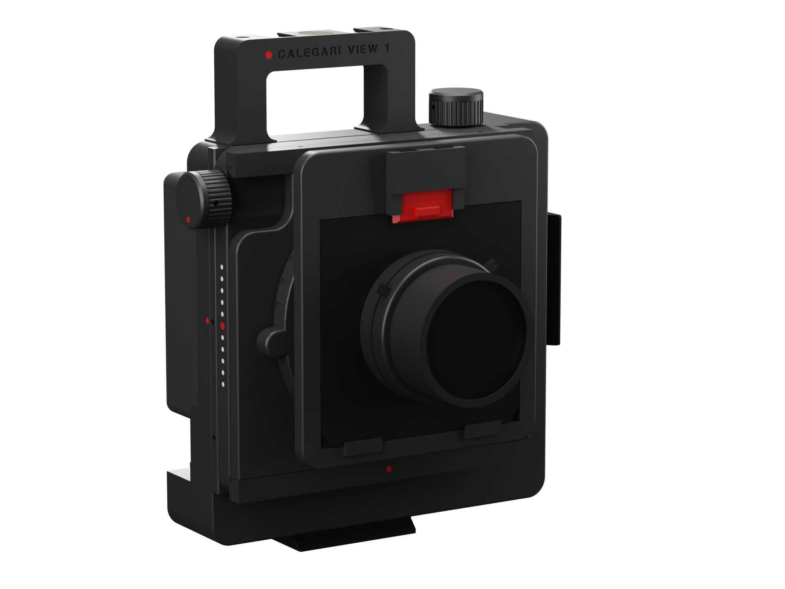
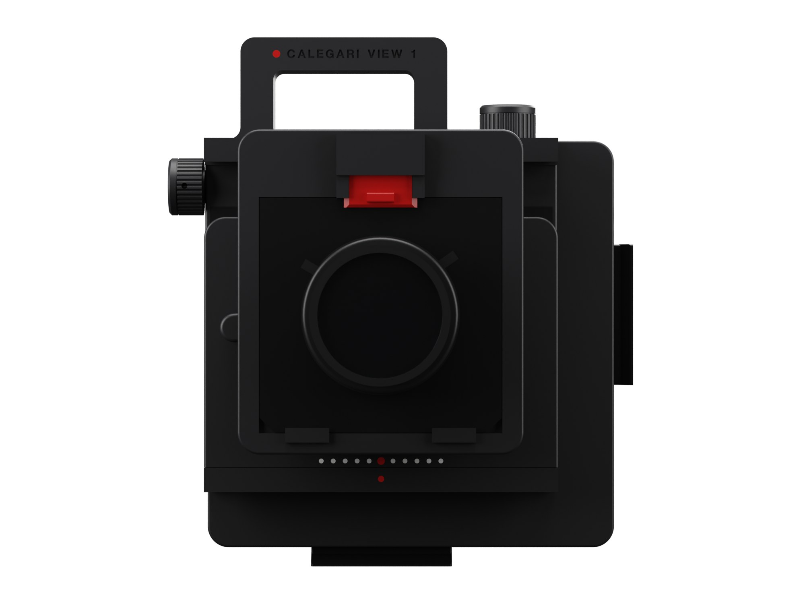
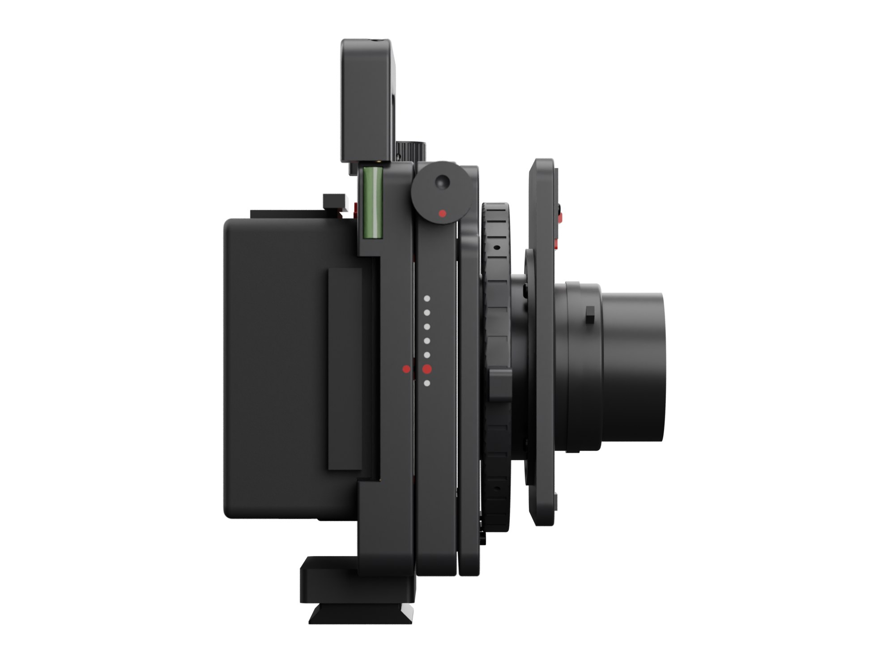
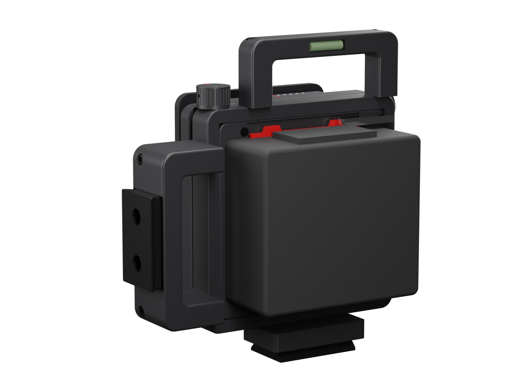
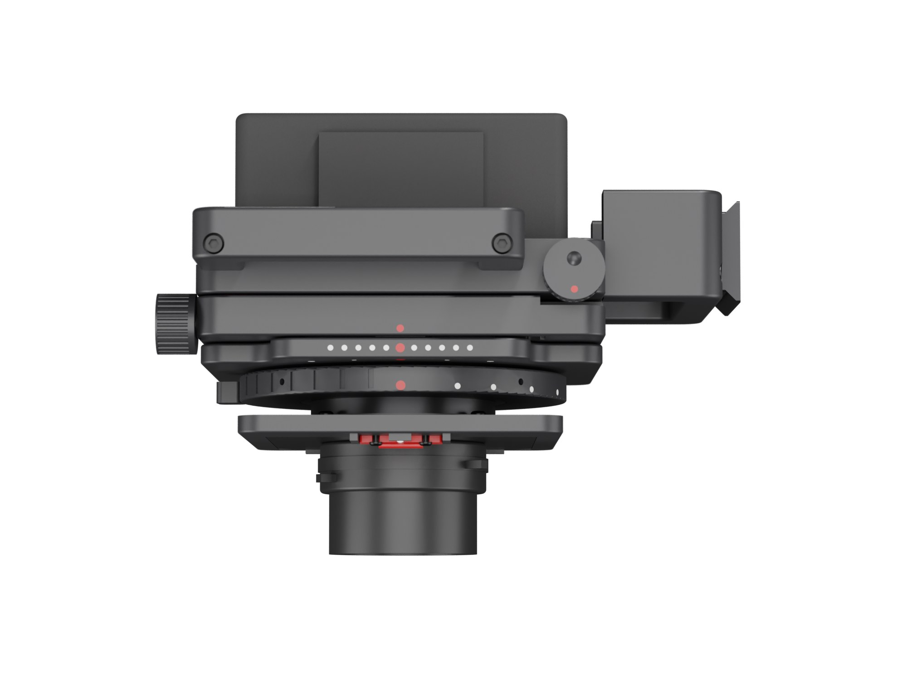
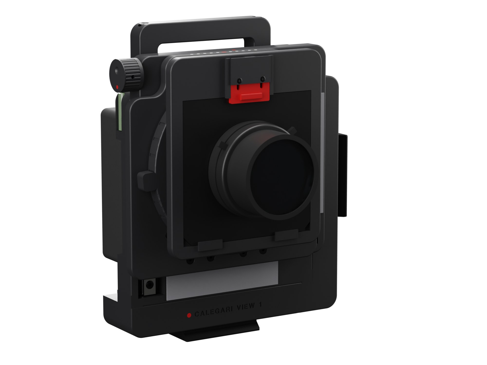
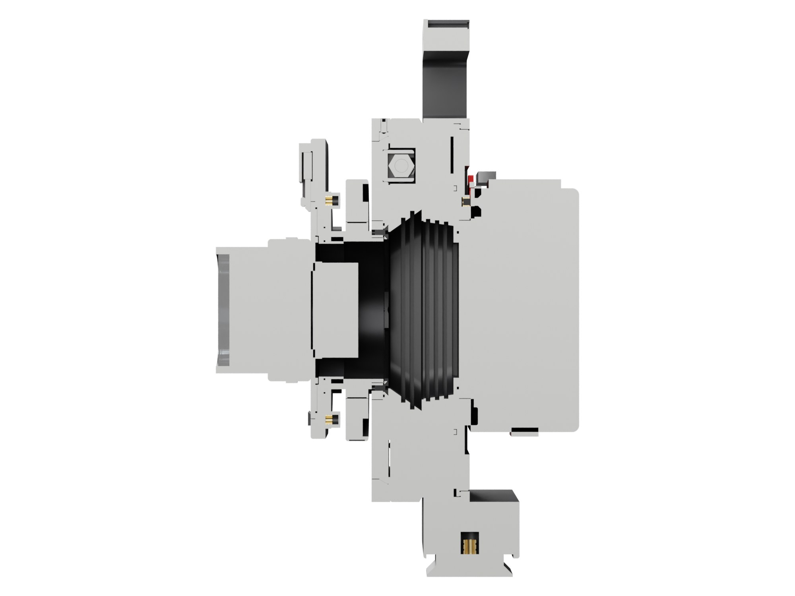
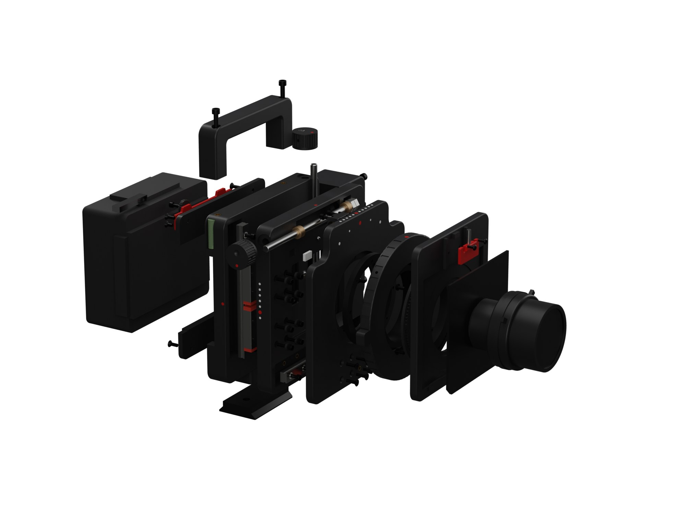

# Calegari View 1



A rigid 6x7 architecture camera you can print at home. Screw-driven rise and shift on two axes, helicoid focusing, Mamiya RB67 film backs, large-format wide-angle lenses on Linhof Technika boards.

**[Project page](https://achillecalegari.github.io/calegari-view-1/)** · [Shopping list](docs/bom.md) · [Printing](docs/printing.md) · [Assembly](docs/assembly.md) · [Calibration and tests](docs/calibration.md) · [Using the camera](docs/using.md) · [Design notes](docs/design.md)

## Why I made it

I have wanted a view camera for years. The rigid kind, compact, built for architecture: you put it on the tripod, raise the lens a couple of centimetres and the verticals stay vertical, straight on the negative, with nothing to fix afterwards.

The problem is the price. A new Arca-Swiss or Silvestri costs thousands before you add a lens, and the used market is not much kinder. So I designed my own, around what I already had: a Bambu Lab P1S, the Mamiya RB67 backs you can find everywhere for little money, and a used large-format wide angle.

This repository is the whole camera: the files to print, the parametric model they come from, the shopping list with links, and step-by-step instructions written for someone who has never held a view camera. Every hole of every printed part is shown in a picture with a letter, and a table says what goes into it. Without back and lens, the parts cost about 350 EUR, much of it in packs of screws and inserts that will outlast the camera.

## What it is

| | |
|---|---|
| Format | 6x7 (56 x 69.5 mm); the gate also clears 6x8 |
| Back | Mamiya RB67 Pro, Pro-S, Pro-SD on a Graflok-type interface; Mercury Works Graflok 23 ground glass. The back turns a quarter turn for portrait, with a click at both positions |
| Lens | 65 mm large-format wide angle in Copal 0 (Super-Angulon 65/8, Nikkor-SW 65/4, Grandagon-N 65/4.5) on a Linhof Technika 99 x 96 board |
| Movements | rise and fall +/-25 mm, lateral shift +/-25 mm, on printed dovetail ways with gibs; M6 lead screws, 1 mm per turn, hard stops, zero detents |
| Focus | M65 helicoid 17-31 on a metal flange, 116 mm focus ring with a tab and a hidden infinity stop, infinity to 0.47 m |
| Tripod | one Arca-Swiss plate under the body; the camera stays upright for portrait, only the back turns |
| Lens change | every lens on its own board: a spring latch, no tools, ten seconds; printed shims put every lens at infinity on the same stop |
| Handle | one top handle with the engraved name, two ISO 518 accessory shoes and a bull's-eye level; the rise knob sits on the body top beside it |
| Size | 185 x 247 mm front (170 mm body, handle and knobs included), 161 mm deep with back and lens |
| Weight | about 1.2 kg without back and lens (about 830 g of printed ASA, 360 g of metal); about 2.1 kg ready to shoot (estimate) |

The body, the Y plate and the lens panel are flat slabs that slide face to face on printed dovetail ways, like the standards of a technical camera. Every plate covers the opening of the one behind it with at least 13 mm of black velvet at every shift position: that is how it stays light-tight without a bellows. The back sits on a round rotator that turns in the body's rear face, sealed by a labyrinth and a ring of velvet: for vertical pictures you turn the back, and the tripod, the level and the knobs stay where they are. No screw head shows on the front or the sides.

| | | |
|---|---|---|
|  |  |  |
|  |  |  |



## Status

The design is complete and checked in software, not yet proven in the hand.

- `cad/check.py`: no interference between any of the components, screws against the bottom of their holes included, at home and at the four shift extremes, with the Graflok blade and the board latch both closed and open, with the back in landscape, in portrait and halfway between. Every printed part is a single solid.
- `cad/seal_check.py`: the velvet seal is at least 13 mm wide at both sliding interfaces, at every shift position in 5 mm steps.
- `cad/optics_check.py`: a ray trace from the lens to the corners of the frame, with the back in landscape and in portrait. Single movements up to 25 mm are clean at f/22 and f/8 at infinity. Combined rise and shift are clean up to 19 + 19 mm at infinity at f/22, 17 + 17 at f/8, 13 + 13 at 0.7 m and 9 + 9 at the closest focus (0.47 m): the 61 mm bore of the helicoid's rear stub is the limit.
- `print/PRINTABILITY.txt`: overhangs and bridges of every part in its print orientation. No part needs supports.
- Before the first print the design went through three rounds of independent review: mechanics, light and optics, printability, assembly and use. What changed is in the [design notes](docs/design.md).

What only the first physical build can prove is listed in [calibration and tests](docs/calibration.md). It starts with about four hours of test prints: the shrinkage of your ASA, the rotator on your RB67 back, and slices of the dovetail ways to slide by hand. They come before the body.

## The model

Everything is generated from Python with [build123d](https://github.com/gumyr/build123d). All dimensions live in `cad/params.py`: change a value (a lens with a different flange distance, a helicoid that turns a different angle, a tighter or looser fit) and rebuild the whole camera.

```bash
python -m venv .venv && .venv/bin/pip install -r requirements.txt
cd cad
../.venv/bin/python check.py          # interference, single-solid and clamp checks
../.venv/bin/python seal_check.py     # velvet seal widths over the whole shift range
../.venv/bin/python optics_check.py   # ray trace: vignetting at shift, aperture and focus (about 15 minutes)
../.venv/bin/python export.py         # STEP, oriented STL, AMS inlays, P1S plates, test prints
../render/gen_all.sh                  # product and overview images in docs/img (needs Blender)
../render/figures.sh                  # figures for every guide, docs/img/asm, cal, use and bom (needs Blender)
../.venv/bin/python plate_figs.py && ../render/figures.sh $(ls ../out/figs | grep ^p_)   # the print plates
../.venv/bin/python ../render/diagrams.py   # the flat calibration diagrams
```

The STEP files in `print/step` open in Fusion, FreeCAD or any CAD.

## Credits

The RB67 interface was measured from two open designs that take the same backs: [Super-67](https://github.com/DamienHazard/Super-67) by Damien Hazard, and the [RB67 pinhole body](https://www.thingiverse.com/thing:7270507) by bogdanbogvzyan, tested with Pro-S and Pro-SD backs. Lens data come from the Schneider, Nikon, Rodenstock and Fujinon catalogues and the Mercury lens database; Graflok 23 figures from Mercury Camera's guide.

## License

[CC BY-NC-SA 4.0](LICENSE). Build it, change it, share it with credit; do not sell it.
