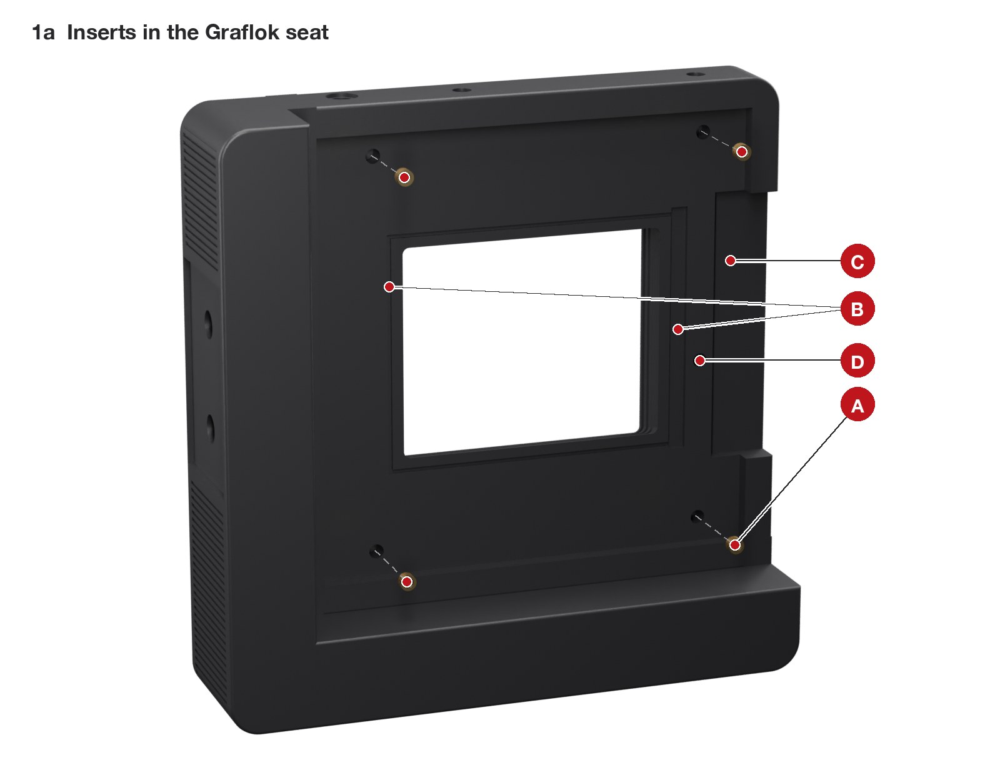
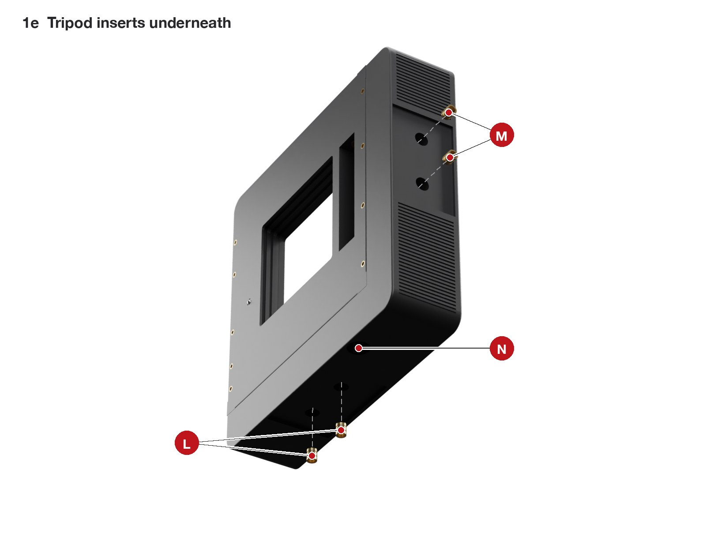
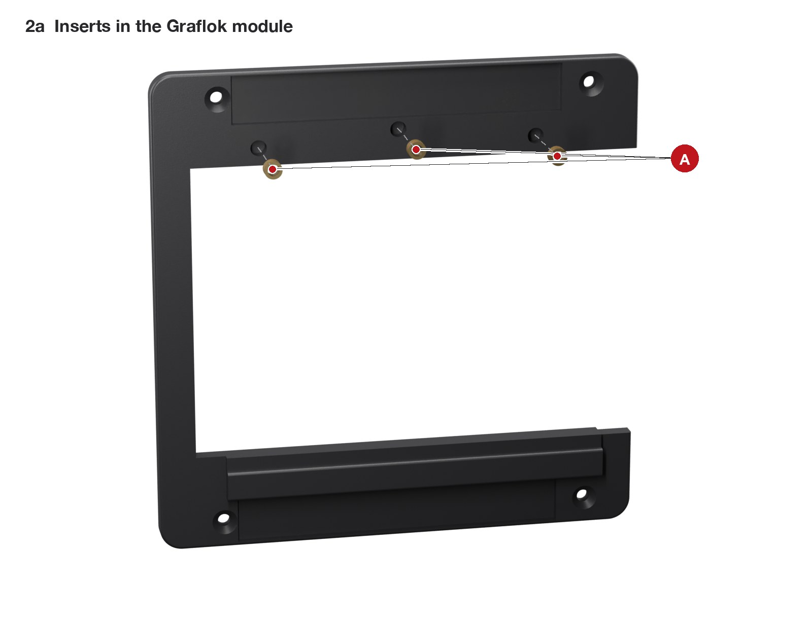
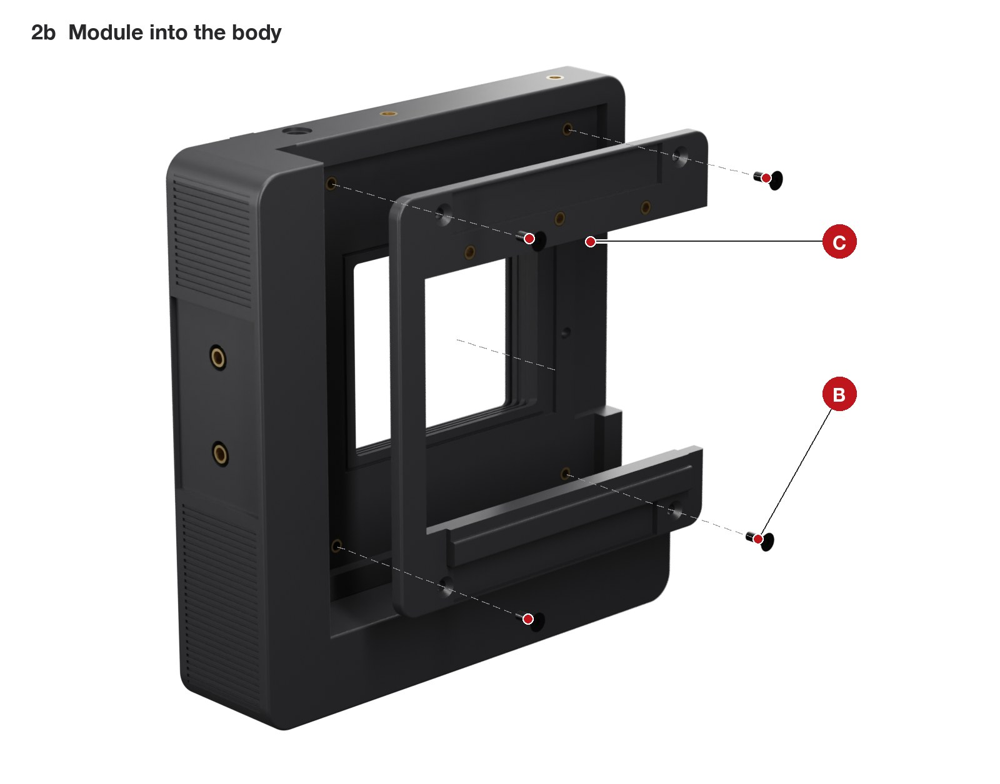
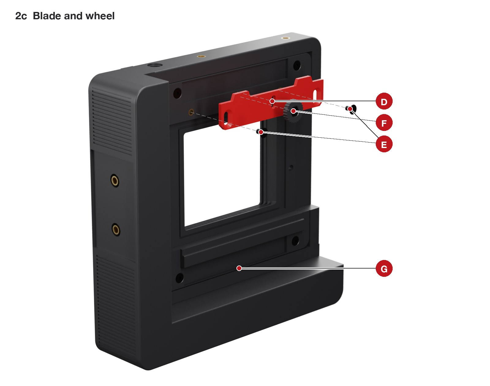
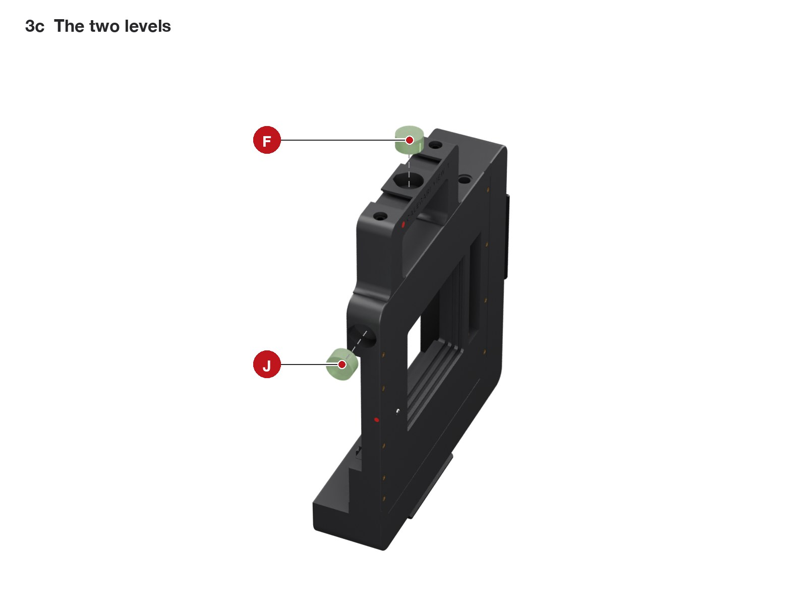
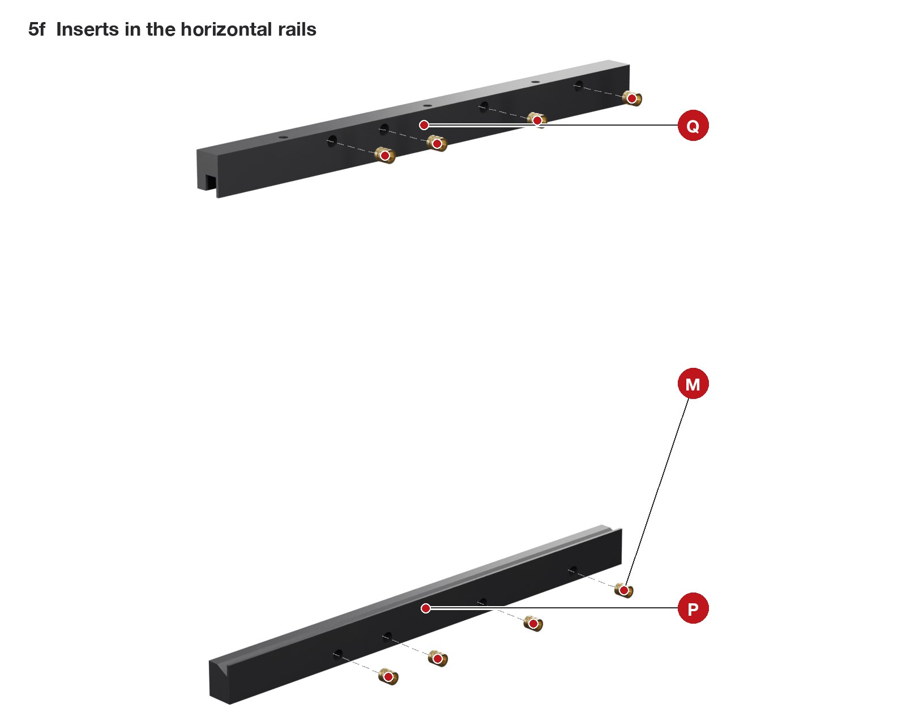

# Assembly

[Back to the project](../README.md)

This guide assumes you have never built anything like it. Each of the nine steps is split into short sub-steps. Every picture shows what is already built in place and only the parts of that sub-step pulled out along the way they go in, with a dashed line to where they go; the red letters match the table under the picture. Follow the steps in order: the order was checked part by part, and some screws cannot be reached later.

Allow a day for the first build: about five hours of work, plus waiting for epoxy and threadlocker to cure.

## Words used in this guide

- **Front** is the lens side, **rear** is the film side.
- **Photographer's left and right** are as you stand behind the camera looking at the ground glass. A picture taken from the front shows them mirrored: the photographer's left is on the right of the picture.
- **Insert** means a brass heat-set insert: a small threaded sleeve melted into the plastic so a metal screw has metal threads to bite. Sizes are written M3 x 3 (thread x length).
- **Proud** means sticking out above a surface; **flush** means level with it.
- The **Y plate** moves up and down (rise and fall). The **lens panel** moves left and right (shift) and carries the lens. Together they are the **front standard**.
- A **dovetail way** is a printed rail with a slanted edge; the plate's slanted edge (its **lip**) slides under it. One rail of each pair is fixed; the other holds a **gib strip**, a thin printed bar pushed by three grub screws to take up the play.

## Before you start

1. **Print and check the parts.** Everything in [printing](printing.md), including the checks under *After printing*.
2. **Do the tests first.** Section 1 of [calibration](calibration.md) tells you whether your RB67 back fits and whether the dovetails slide, before you spend a day assembling.
3. **Sort the hardware.** Put a strip of masking tape on the table and lay out the screws by size. Every step starts with a *You need* list.
4. **Clean the holes.** Pull out any stringing with a hook or a drill turned by hand.

### Tools

| Tool | Used for |
|---|---|
| Soldering iron with heat-set tips for M2.5, M3, M4 and 1/4" | inserts |
| Hex keys 1.5, 2, 2.5 and 3 mm | grub screws, M2.5, M3 and M4 screws |
| M3 and M5 taps with a small tap wrench | threads cut into the plastic |
| 8 mm drill bit (turned by hand) | reaming the bushing seats |
| 10 mm spanner | the knob nuts and cap nuts |
| A small vice or a clamp, a flat piece of wood | pressing bushings and nuts |
| Steel ruler or straightedge, caliper | flatness and heights |
| Feeler gauge 1.0 mm (or ten sheets of 80 g printer paper) | ball plunger height |
| Sharp scissors, a new craft blade | velvet and felt |
| Loctite 243 and 222, two-part epoxy, isopropyl alcohol, cotton buds, black acrylic paint | as listed in the steps |

### Five techniques you will use

**1. Heat-set inserts.** This is most of the work, so practise on a test coupon first.

1. Set the iron to 230 C (ASA). Put the right tip on and let it heat for a minute.
2. Drop the insert into the hole with its **narrow end down**. It sits on the rim of the hole.
3. Put the tip into the insert and let it sink under its own weight plus a light push, straight down, for 5 to 10 seconds. Do not force it: if it does not move, wait.
4. Stop when the insert is 0.2 mm below the surface. Pull the tip straight out.
5. While the plastic is still soft, press a cold flat steel part (the side of a spanner) on the insert for five seconds: it comes out square and never proud.
6. Check: lay the straightedge across the hole. It must rock on nothing. An insert standing proud of a sliding face or of the back's seat leaks light or tilts the back.

The camera has 18 M3 inserts, 17 M2.5, 2 M4 and 4 of 1/4". The bigger ones take 15 to 20 seconds: go slowly and keep the iron vertical.

**2. Tapping a thread into the plastic.** Used for the two ball plungers (M5) and for the small grub-screw holes (M3). The holes are printed at the right size.

1. Put the tap in the wrench and start it straight, looking from two sides.
2. Turn half a turn in, a quarter turn back, and repeat. The plastic chips must break off.
3. Go only as deep as the hole. Blow the chips out.

**3. Pressing.** Bushings and the knob nuts are press fits. Use the vice or a clamp, never a hammer: ASA cracks. Put a flat piece of wood on the printed side.

**4. Threadlocker.** Anaerobic threadlockers attack ASA and can crack it. Use them only where metal meets metal: Loctite 243 on the rise cap nut and the shift thrust nut (steel on the rod), Loctite 222 on the helicoid thread and on the Graflok blade screws (steel into brass inserts). One small drop, never on the plastic.

**5. Velvet and felt.** The camera has no bellows: light is kept out by sliding faces 0.8 mm apart with self-adhesive velvet between them. The pieces are V1, V2 (with two small discs) and the felt rings V3 and V4.

1. Print the templates in `print/templates/` at 100 %. Measure the 100 mm bar on the sheet: if it is not 100 mm, fix the printer scaling first.
2. Tape the template on the back of the velvet (the paper side), and cut through both with scissors for the outer edge and a craft blade against a ruler for the window.
3. Measure the velvet thickness with the caliper, pressing lightly: it must be 0.9 to 1.2 mm.
4. Degrease the plastic with alcohol. Peel off the backing, align one edge, and lay the velvet down from that edge like a screen protector. Press it all over with your thumb.
5. The velvet must never cover a ball plunger, a rail, or a hole a screw still has to reach (except where this guide says so).

---

## 1. Body

**You need:** the body, 4 M3 x 3 inserts, 9 M2.5 inserts, 2 M4 inserts, 4 inserts 1/4"-20, one M5 ball plunger, two 6 x 8 x 6 bushings, the M5 tap, epoxy.

### 1a. Inserts in the Graflok seat

| | What | Qty | How |
|---|---|---|---|
| **A** | M3 x 3 insert | 4 | in the floor of the big rear recess (the Graflok seat), pressed from behind |
| **B** | nothing | | light-trap grooves in the seat: keep them clean |
| **C** | nothing | | passage for the dark-slide handle |
| **D** | the back of the rise plunger | | you set its height from here in 1c |

Lay the body front face down on a towel and press the four inserts A. Check with the straightedge: this floor is where the film sits, so no insert may stand proud.

### 1b. Inserts along the front edges

| | What | Qty | How |
|---|---|---|---|
| **E** | M2.5 insert | 9 | along the two side edges of the front face: 5 on the photographer's right (left in the picture), 4 on the left |

Turn the body over and press the nine inserts E. They carry the vertical rails in step 4.

### 1c. Rise plunger and bushings

| | What | Qty | How |
|---|---|---|---|
| **F** | M5 ball plunger | 1 | tap M5 through, screw in from the front, set from behind (D) |
| **G** | bronze bushing 6 x 8 x 6 | 2 | one in each end wall of the screw channel |

1. **F.** Tap M5 through the small hole beside the window. Screw the plunger in from the front, ball toward you, until its hex is inside. From behind (D), turn it with a hex key until the ball stands **1.0 mm** proud of the front face: lay the feeler gauge on the face next to it and a ruler across both, and stop when the ball touches the ruler. A small drop of epoxy on the thread at the back, scraped flush with the seat, locks the plunger and seals the hole.
2. **G.** Ream the two bushing seats with the 8 mm drill turned by hand. Drop a bushing into the screw channel and push it sideways into the round seat in the end wall until it is flush; a 6 mm bolt through its bore keeps it square. Do the other one the same way.

### 1d. Handle inserts on top

| | What | Qty | How |
|---|---|---|---|
| **H** | M4 insert (Ruthex M4 x 8.1) | 2 | in the top face, for the top handle |
| **J** | nothing yet | | the pocket of the portrait level (3c) |
| **K** | nothing yet | | the rise rod comes out here (6f) |

### 1e. Tripod inserts underneath

| | What | Qty | How |
|---|---|---|---|
| **L** | 1/4"-20 insert | 2 | in the floor of the bottom Arca pocket |
| **M** | 1/4"-20 insert | 2 | in the floor of the side leg's Arca pocket |
| **N** | nothing yet | | the recess of the rise rod's cap nut (6b) |

The 1/4" inserts take 15 to 20 seconds each: go slowly and keep the iron vertical.

**Check.** No insert is proud on any face. Press the plunger ball with a fingertip: it springs back.

## 2. Graflok module, clamp blade and wheel

**You need:** the Graflok module, the blade, the wheel, 3 M3 x 3 inserts, 4 M3 x 8 countersunk, 2 M3 x 5 countersunk, 1 M3 x 6 hex-head bolt, Loctite 222, epoxy.

If the module from the test plate fitted your back, use that one.

### 2a. Inserts in the module

| | What | Qty | How |
|---|---|---|---|
| **A** | M3 x 3 insert | 3 | in the shallow recess along the top of the rear face: two for the blade, the middle one for the wheel |

### 2b. Module into the body

| | What | Qty | How |
|---|---|---|---|
| **B** | M3 x 8 countersunk | 4 | through the module into the body inserts A of 1a |
| **C** | the open side of the module | | goes over the body's dark-slide passage, on the photographer's right |

Drop the module into the rear recess, open side over the passage C, and fix it with the four screws B: snug, not tight.

### 2c. Blade and wheel

| | What | Qty | How |
|---|---|---|---|
| **D** | the red blade | 1 | in the recess, tongues pointing up |
| **E** | M3 x 5 countersunk | 2 | through the blade slots into the outer inserts, with Loctite 222 |
| **F** | wheel with an M3 x 6 hex-head bolt | 1 | into the middle insert |
| **G** | nothing | | the fixed bottom rail: the back hooks under it |

1. **D and E.** Lay the blade in the recess. Put a small drop of Loctite 222 on the two screws E, screw them through the blade slots until they just touch, then back them off a quarter turn: the blade must slide up and down under its own weight. Leave the threadlocker to set for an hour: the screws then stay where they are.
2. **F.** Put a drop of epoxy in the wheel's hex pocket and press the bolt head into it, so the bolt cannot fall out. Once it has set, put the wheel over the U-slot of the blade and screw it in. Clockwise clamps the blade; anticlockwise frees it.

**Check.** With the wheel loose, the blade slides the full length of its slots. With the wheel tight, it does not move.

## 3. Arca plates, top handle and levels

**You need:** the two Arca plates, 4 screws 1/4"-20 x 1/2", the top handle, 2 M4 x 45 socket heads, two 15 mm bull's-eye levels, epoxy.

### 3a. Arca plates

| | What | Qty | How |
|---|---|---|---|
| **A** | Arca plate, bottom | 1 | two 1/4"-20 x 1/2" screws into the inserts L |
| **B** | Arca plate, side leg | 1 | two 1/4"-20 x 1/2" screws into the inserts M |

Remove any rubber pad from the plates. Each plate's slot must be at least 40 mm long.

### 3b. Top handle

| | What | Qty | How |
|---|---|---|---|
| **C** | top handle | 1 | its two feet on the top face, over the inserts H |
| **D** | M4 x 45 socket head | 2 | from the top of the bar, down through the posts into H |
| **E** | nothing | | two accessory shoes: slide a viewfinder, a meter or a level in from the back |

Tighten firmly: this handle carries the camera. A strap attaches to the bar between the posts (Peak Design Anchors, or any cord).

### 3c. The two levels

| | What | Qty | How |
|---|---|---|---|
| **F** | 15 mm bull's-eye level | 1 | glued in the pocket on top of the handle |
| **J** | 15 mm bull's-eye level | 1 | glued in the pocket on the photographer's right side |

1. **F, landscape.** Put the camera on a tripod on its bottom plate and level it with a phone level laid on top of the body, in both directions. Put a drop of epoxy in the pocket on top of the handle, press the bull's-eye in, and let the glue set without touching the camera.
2. **J, portrait.** Move the camera to the side plate, level it again with the phone, and glue the second bull's-eye in the pocket J the same way.

## 4. Vertical ways and body velvet

**You need:** the two vertical rails (the fixed one is plain; the gib one has three small holes on its outer face and a pocket along its inside), 9 M2.5 x 10 countersunk, the M3 tap, velvet piece V1.

### 4a. Vertical rails

| | What | Qty | How |
|---|---|---|---|
| **P** | fixed rail | 1 | on the photographer's **left** edge (right in the picture), slanted side inward |
| **Q** | gib rail | 1 | on the photographer's **right** edge, its three small holes facing outward |
| **T** | M2.5 x 10 countersunk | 9 | through the rails into the inserts E: 4 in P, 5 in Q |

Tap M3 into the three small holes of Q first. The rails' round ends go to the top, where the body corner is round.

### 4b. Velvet V1 on the body front

| | What | Qty | How |
|---|---|---|---|
| **V1** | velvet, cut from its template | 1 | around the window, between the rails |
| **F** | the plunger ball | | stays uncovered: the side of V1 marked *ball plunger side* goes toward it |

The velvet window is 0.3 mm larger than the body's window all round.

**Check.** Run a fingernail along the inside of both rails: no step, no burr.

## 5. Front standard, on the bench

**You need:** the Y plate, the lens panel, the two horizontal rails, the X gib strip, the shift nut turret, the metal M65 flange, 8 M2.5 inserts, 1 M3 x 3 insert, 1 brass M6 nut, 2 bushings, 1 M5 ball plunger, 4 M3 x 6 countersunk, 8 M2.5 x 16 socket heads, 4 M3 x 6 cone-point grubs, the 127 mm rod, an M6 washer and a stainless M6 nut (the thrust nut), O-ring, knob with its M6 nut, velvet V2, epoxy, Loctite 243, black paint.

The front standard is built as one unit on a clean flat table, then slides into the body in step 6.

### 5a. Y plate: bushings and shift plunger

| | What | Qty | How |
|---|---|---|---|
| **A** | bronze bushing 6 x 8 x 6 | 2 | one in each end wall of the top screw channel |
| **B** | M5 ball plunger | 1 | tap M5 through, screw in from the front, set from behind (C) |
| **H** | nothing yet | | the shift rod goes in here, and the knob sits here (5k) |

Ream and press the bushings as in 1c. The left seat is blind: nothing of the rod will show on that edge.

### 5b. Y plate from behind

| | What | Qty | How |
|---|---|---|---|
| **C** | the back of the shift plunger | | set the ball 1.0 mm proud from here, then a drop of epoxy scraped flush |
| **D** | nothing | | the dimple of the rise detent |

### 5c. Velvet V2 on the Y plate

| | What | Qty | How |
|---|---|---|---|
| **V2** | velvet, cut from its template | 1 | on the Y plate front around the window |
| **E** | the two holes of V2 | | over the rise-turret screw holes; keep the two 7 mm discs for 6d |

### 5d. Lens panel: flange and stop insert

| | What | Qty | How |
|---|---|---|---|
| **F** | RafCamera M65 flange | 1 | dropped into the round pocket, flush |
| **K** | M3 x 3 insert | 1 | the infinity stop pin screws into it in 7a |

Turn the flange until its four threaded M3 holes sit over the four countersunk holes of the panel. Fill the flange's four unused holes with black paint: light would otherwise shine through them.

### 5e. Lens panel from behind: screws and turret

| | What | Qty | How |
|---|---|---|---|
| **G** | M3 x 6 countersunk | 4 | from behind into the flange's M3 holes |
| **J** | shift nut turret | 1 | bonded with epoxy into its pocket, pegs into their holes |
| **L** | nothing | | the dimple of the shift detent |

Put a thin layer of epoxy on the top of the turret J, press it into its pocket and let it cure. The brass nut does not go in the turret: it goes on the rod in 5g. Look at the small conical dimple L: if the first printed layer closed it, open it with a 2.5 mm drill turned by hand, 0.4 mm deep.

### 5f. Inserts in the horizontal rails

| | What | Qty | How |
|---|---|---|---|
| **M** | M2.5 insert | 8 | four in the base of each rail |
| **P** | fixed rail | | the one with the red index dot |
| **Q** | gib rail | | tap M3 into its three small holes |

### 5g. Shift rod, thrust nut and drive nut

| | What | Qty | How |
|---|---|---|---|
| **T** | 127 mm rod | 1 | pushed in from the Y plate's **right** edge (photographer's right, H) |
| **U** | M6 washer | 1 | onto the rod inside the channel, first |
| **W** | stainless M6 nut (thrust nut) | 1 | next, with Loctite 243 |
| **X** | brass M6 nut (drive nut) | 1 | last |

Lay the Y plate front up. Push the rod in from the right edge, through the edge hole and the right bushing, into the channel. In the channel, thread onto its tip, one after the other, the washer U, the thrust nut W and the brass nut X: hold each one and turn the rod to feed it through. Push on until the tip stops at the bottom of the left seat, then pull the rod back 1 mm. Put a drop of Loctite 243 on the rod just inside the right bushing, run the thrust nut back until it presses the washer against the bushing, and let it set for an hour.

### 5h. Lens panel onto the Y plate

| | What | Qty | How |
|---|---|---|---|
| **J** | the turret under the lens panel | | drops into the channel, over the brass nut |
| **X** | brass nut | | in the middle of the channel, flats parallel to the channel sides |

Turn the brass nut to the middle of the channel. Lay the lens panel on the Y plate front, face up, its edges over the Y plate's edges: the turret drops into the channel and over the nut. Hold the two plates together and turn them over, Y plate rear up.

### 5i. Horizontal rails, screwed from behind

| | What | Qty | How |
|---|---|---|---|
| **P** | fixed rail | 1 | along the **bottom** edge, red index dot to the front |
| **Q** | gib rail | 1 | along the **top** edge, three small holes facing up |
| **N** | M2.5 x 16 socket head | 8 | from the Y plate rear into the inserts M |

Slide each rail in from its edge, between the two plates, until its holes line up with the Y plate's, and screw it from the rear.

### 5j. Gib strip and grub screws

| | What | Qty | How |
|---|---|---|---|
| **R** | gib strip | 1 | slid into the pocket of Q from one end, dimples outward |
| **S** | M3 x 6 cone-point grub | 3 | through the top of Q, onto the dimples |
| **0** | nothing | | the shift index on the bottom rail |

Turn the stack face up. Tighten each grub a little at a time until the lens panel no longer rocks when you press its corners, then back each off an eighth of a turn. The panel must slide with an even, light drag over its whole travel. Give the dovetails a light spray of dry PTFE and slide the panel end to end a few times.

### 5k. Shift knob

| | What | Qty | How |
|---|---|---|---|
| **Y** | O-ring 6 x 1.5 | 1 | in its seat around the rod at H |
| **Z** | knob with its M6 nut and grub | 1 | screwed onto the rod, locked with the grub |

Press a stainless M6 nut into the knob's hex pocket with the vice and tap M3 into the knob's small radial hole. Screw the knob onto the rod until it presses the O-ring lightly, and lock it with a cone-point grub. The right end wall of the Y plate is now held between the knob outside and the thrust nut inside.

**Check.** Turn the shift knob: 1 mm per turn, a click at zero, hard stops at 25 mm each side (on the right, the turret meets the thrust nut). The panel moves with an even drag and never rocks.

## 6. Front standard into the body, rise screw and knob

**You need:** the body from step 4, the front standard from step 5, the rise nut turret, 2 M3 x 3 inserts, 1 brass M6 nut, 2 M3 x 14 socket heads, the two 7 mm velvet discs, the Y gib strip, 3 M3 x 6 cone-point grubs, the 156 mm rod with a cap nut, O-ring, knob with its M6 nut and grub, Loctite 243, dry PTFE.

### 6a. Rise nut turret

| | What | Qty | How |
|---|---|---|---|
| **A** | brass M6 nut | 1 | slid into the slot from the side, flats vertical |
| **B** | M3 x 3 insert | 2 | in the top face |

### 6b. Turret and rise rod into the body

| | What | Qty | How |
|---|---|---|---|
| **C** | the turret | 1 | into the screw channel on the body front |
| **D** | 156 mm rod with its cap nut | 1 | pushed up from below, through the bushings and the turret nut |
| **N** | the cap nut | | sits in its recess under the body |

On the bench, fix the cap nut on one end of the rod with Loctite 243 and let it set. Stand the body on its bottom plate, put the turret in the channel, and push the rod up from below through the bottom bushing, the turret nut (turn the rod to thread it through) and the top bushing, until the cap nut sits in its recess. Turn the rod until the turret is in the middle of the channel.

### 6c. The front standard slides in from the top

| | What | Qty | How |
|---|---|---|---|
| **V1** | the body velvet | | press its top edge flat with a finger as the plate passes |

Spray the vertical dovetails with dry PTFE. Hold the front standard upright above the body and lower it into the two vertical rails from the top: its slanted edges go under the rails. Slide it down slowly and stop when the Y plate is centred on the body.

### 6d. Turret screws and velvet discs

| | What | Qty | How |
|---|---|---|---|
| **E** | M3 x 14 socket head | 2 | through the Y plate into the turret inserts B |
| **V2d** | 7 mm velvet disc | 2 | over each screw head: it closes the hole to light |

Shift the lens panel fully to the photographer's right: the two holes are now uncovered. Turn the rise rod until the turret's inserts are under them, then screw the turret to the Y plate.

### 6e. Gib strip and grub screws

| | What | Qty | How |
|---|---|---|---|
| **R** | gib strip | 1 | slid into the pocket of the rail on the photographer's right, from the top, dimples outward |
| **S** | M3 x 6 cone-point grub | 3 | through the outer face of the rail |

Set it as in 5j: no rocking, an even light drag. The top grub sits behind the shift knob when the plate is near the middle: reach it with the plate at full fall.

### 6f. Rise knob

| | What | Qty | How |
|---|---|---|---|
| **Y** | O-ring 6 x 1.5 | 1 | in its seat on the top face, around the rod (K) |
| **Z** | knob with its M6 nut and grub | 1 | screwed onto the rod, locked with the grub |

Prepare the knob as in 5k. The rod turns with the knob until the plate reaches a hard stop: keep turning, and the knob then threads down onto the rod. Stop when it presses the O-ring lightly and lock it with the grub.

**Check.** Turn the rise knob: 1 mm per turn, a click at zero, hard stops at +25 and -25 mm. The plate stays where you leave it and never rocks.

## 7. Helicoid and focus ring

**You need:** the M65 helicoid, the focus ring, 4 M3 x 4 nylon-tip grub screws, the M3 x 4 socket head (stop pin), the M3 tap, Loctite 222.

### 7a. Stop pin and helicoid

| | What | Qty | How |
|---|---|---|---|
| **F** | M3 x 4 socket head: the stop pin | 1 | into the insert K of 5d, all the way down |
| **H** | helicoid | 1 | its rear thread into the metal flange, one drop of Loctite 222 |

Screw the helicoid in until its shoulder seats. Hold its rear part and turn its focusing grip: the **front must not rotate**, it only moves in and out.

### 7b. Focus ring

| | What | Qty | How |
|---|---|---|---|
| **A** | M3 x 4 nylon-tip grub | 4 | tap M3 into the four radial holes; they clamp the ring on the helicoid |
| **C** | nothing | | the focusing tab |

Slide the ring over the helicoid's grip, groove side toward the camera, so the stop pin runs in the groove. Screw in the four grubs until they just touch: the ring is set during [calibration](calibration.md#3-infinity-teach-the-camera-where-infinity-is).

### 7c. The hidden stop

| | What | Qty | How |
|---|---|---|---|
| **B** | nothing | | the groove under the ring and its one solid block: at infinity the block rests on the pin |
| **F** | the stop pin | | runs in the groove |
| **D** | nothing | | the red infinity dot on the rim |

## 8. Adapter ring, board holder, lens board and lens

**You need:** the adapter ring, the board holder, the latch, 8 M3 x 3 inserts, 4 M3 x 6 button heads, 2 M2.5 x 6 button heads, the 4 x 15 mm spring, felt pieces V3 and V4, the lens board and the lens.

### 8a. Inserts in the adapter ring

| | What | Qty | How |
|---|---|---|---|
| **A** | M3 x 3 insert | 8 | in the bosses, pressed from the front face |

### 8b. Felt V3 behind the board holder

| | What | Qty | How |
|---|---|---|---|
| **V3** | felt ring, cut from its template | 1 | in the round groove around the hole |

### 8c. Felt V4 and the spring

| | What | Qty | How |
|---|---|---|---|
| **V4** | felt ring | 1 | in the shallow round seat under the board |
| **B** | spring 4 x 15 | 1 | in its channel under the hood |

### 8d. Latch, held by two screws from behind

| | What | Qty | How |
|---|---|---|---|
| **C** | red latch | 1 | slid up into the dovetail between the rails, from below, flat face against the holder |
| **D** | M2.5 x 6 button head | 2 | from the back of the holder: the tips stand 1 mm proud and run in two grooves under the latch |

Slide the latch up until it presses the spring. Hold it there, turn the holder over and drive the two screws D until the heads sit flush in their counterbores: the groove ends now stop the latch both ways. Pull the latch up with a thumbnail and let go: it snaps back down by itself. No screw shows on the front.

### 8e. Adapter and board holder onto the helicoid

| | What | Qty | How |
|---|---|---|---|
| **G** | adapter ring | 1 | its male thread into the front of the helicoid, by hand, until its flange seats |
| **H** | board holder | 1 | laid on the adapter |
| **E** | M3 x 6 button head | 4 | through the holder's arc slots into whichever adapter inserts are under them |

Leave the screws E loose, turn the holder until its edges are square with the lens panel, then tighten. They are under the board: you can reach them whenever the board is out.

### 8f. Lens board

| | What | Qty | How |
|---|---|---|---|
| **J** | the two bottom lips | | the board's bottom edge goes under them |
| **C** | the latch | | the board pushes it up, and it snaps down over the board |

Screw the lens onto the board with its retaining ring, from behind. Hook the board's bottom edge under the lips J and press the top in.

**Check.** The board sits flat and does not rattle; the latch covers its top edge by 4 mm.

## 9. Film back

| | What | Qty | How |
|---|---|---|---|
| **G** | the fixed bottom rail | | the back's bottom lip hooks under it; it also releases the Pro-S dark-slide interlock |
| **D** | the blade | | slides up into the two slots on top of the back |
| **F** | the wheel | | anticlockwise frees the blade, clockwise locks it |

1. **Loosen and lower.** Turn the wheel anticlockwise and slide the blade down.
2. **Hook the bottom.** Hook the back's bottom lip under the rail G.
3. **Seat the back.** Swing the back onto the seat: its nose goes into the recess.
4. **Lock.** Slide the blade up so its two tongues enter the slots in the top of the back, then tighten the wheel.
5. **Dark slide.** It comes out toward the photographer's right, through the passage C of the body.
6. **Advance after each frame.** Press the back's own wind-stop release lever by hand: the camera has no automatic coupling (see [design notes](design.md#open-points)).

The ground glass goes on the same way. Now go to [calibration](calibration.md), then [using the camera](using.md).

## Hardware by step

| Step | Inserts | Screws | Other |
|---|---|---|---|
| 1 | M3 x 4, M2.5 x 9, M4 x 2, 1/4" x 4 | | M5 plunger, 2 bushings, epoxy |
| 2 | M3 x 3 | M3 x 8 countersunk x 4, M3 x 5 countersunk x 2, M3 x 6 hex bolt x 1 | Loctite 222, epoxy |
| 3 | | M4 x 45 x 2, 1/4"-20 x 1/2" x 4 | 2 bull's-eye levels, epoxy |
| 4 | | M2.5 x 10 countersunk x 9 | V1 |
| 5 | M2.5 x 8, M3 x 1 | M3 x 6 countersunk x 4, M2.5 x 16 x 8, M3 x 6 cone-point grub x 4 | flange, brass nut, 2 bushings, M5 plunger, rod 127 + M6 washer + thrust nut, O-ring, knob + nut, V2, epoxy, Loctite 243, paint |
| 6 | M3 x 2 | M3 x 14 x 2, M3 x 6 cone-point grub x 4 | brass nut, rod 156 + cap nut, O-ring, knob + nut, 2 velvet discs, Loctite 243 |
| 7 | | M3 x 4 x 1, M3 x 4 nylon-tip grub x 4 | helicoid, Loctite 222 |
| 8 | M3 x 8 | M3 x 6 button x 4, M2.5 x 6 button x 2 | spring, V3, V4 |
