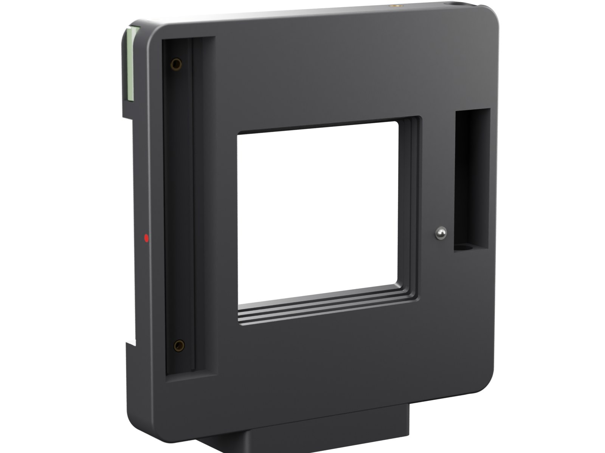
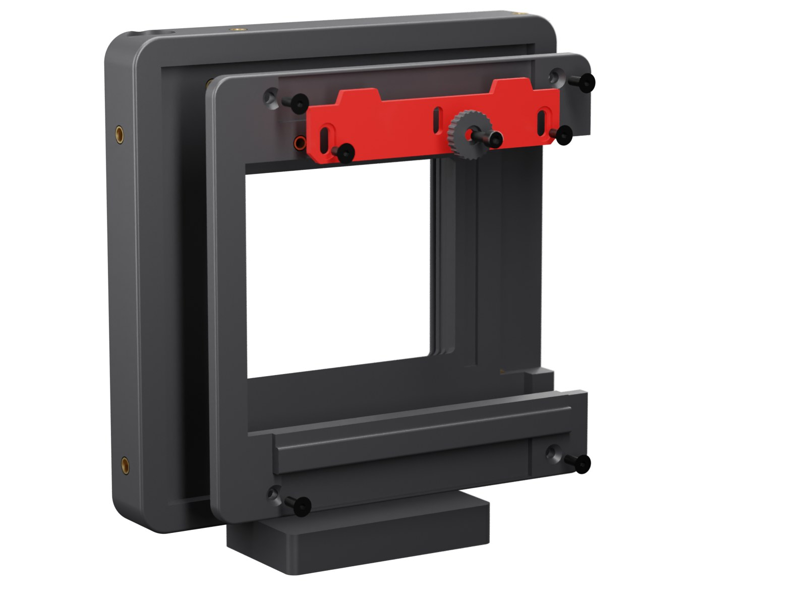
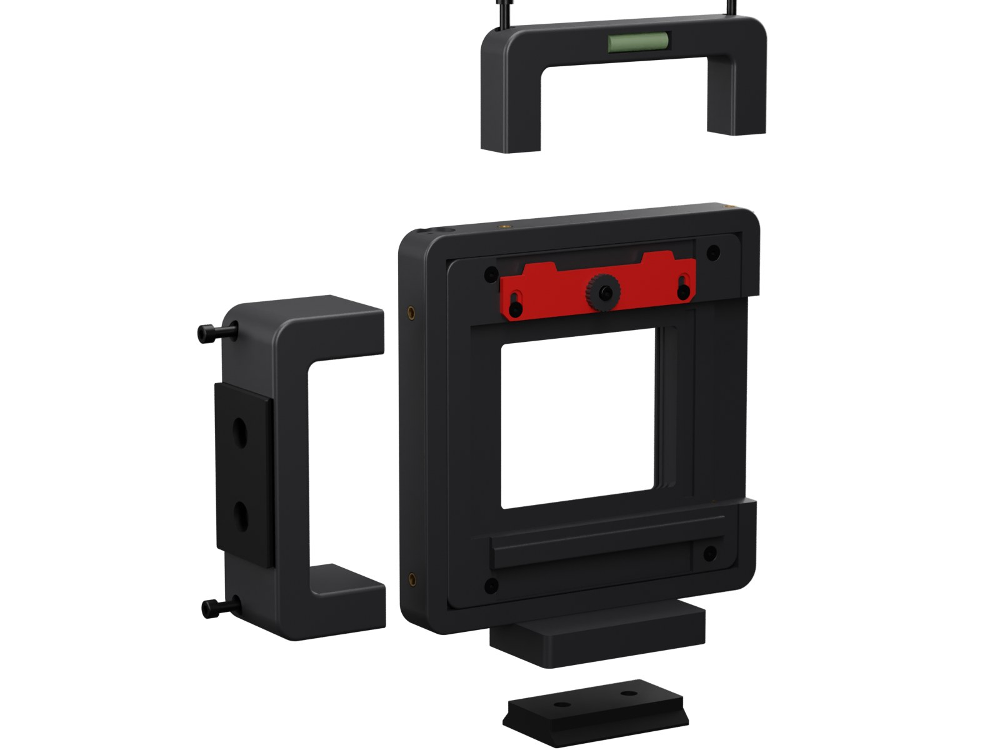
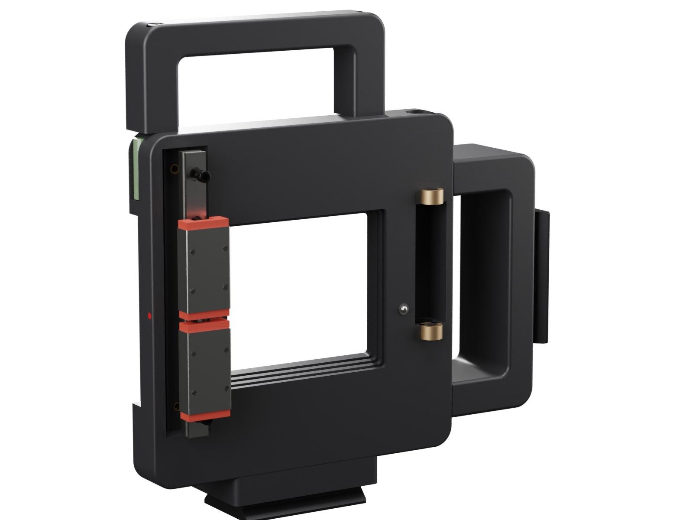
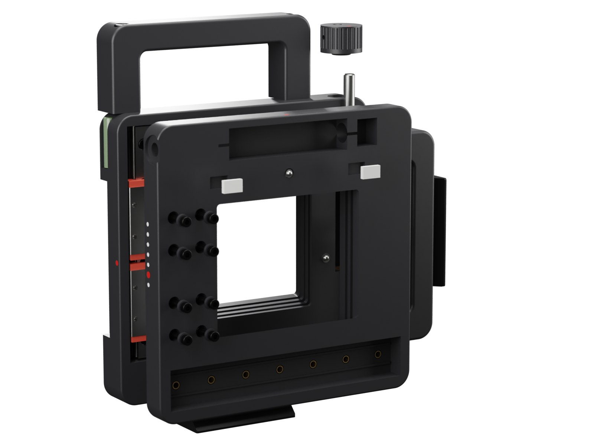
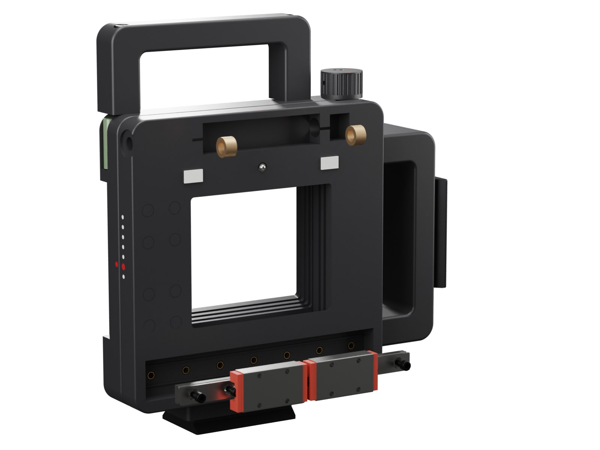
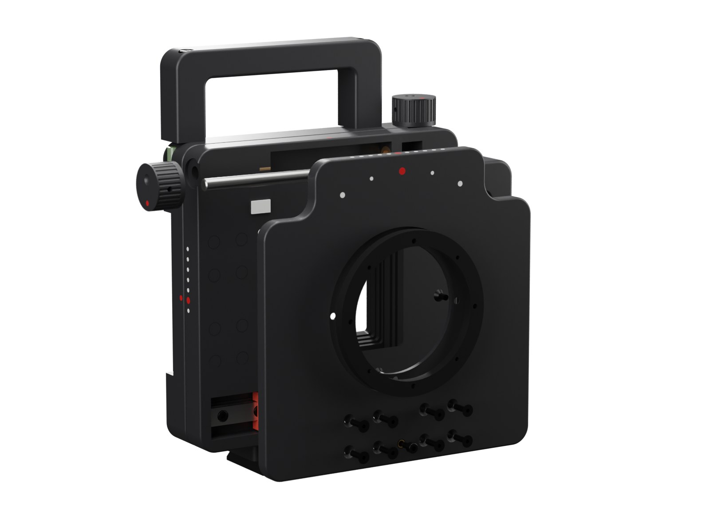
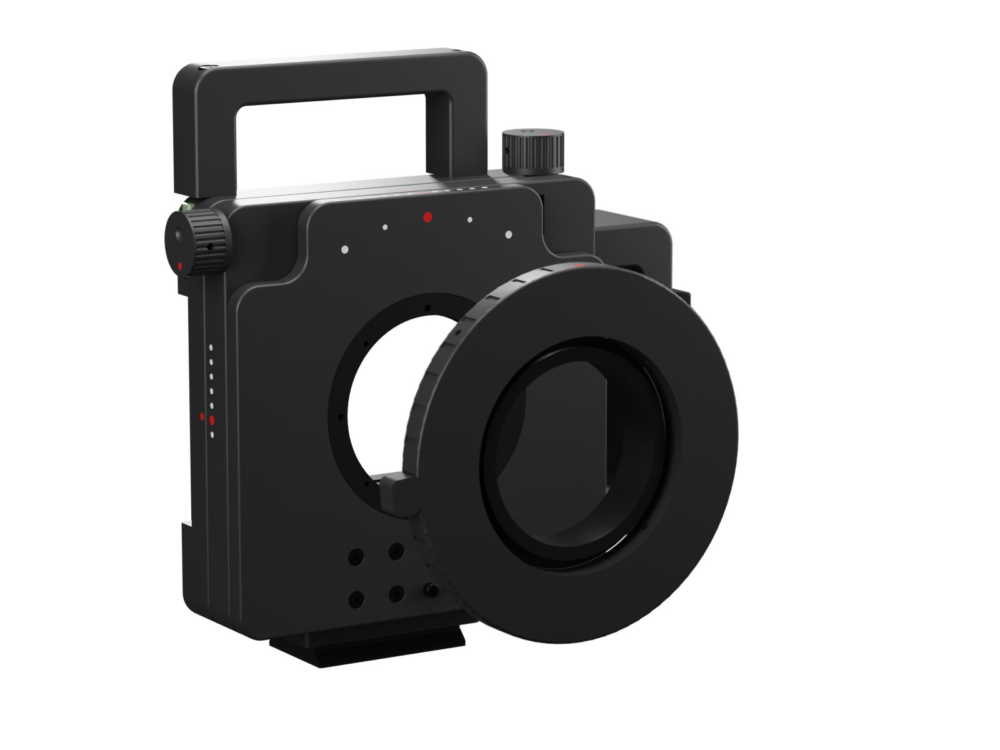
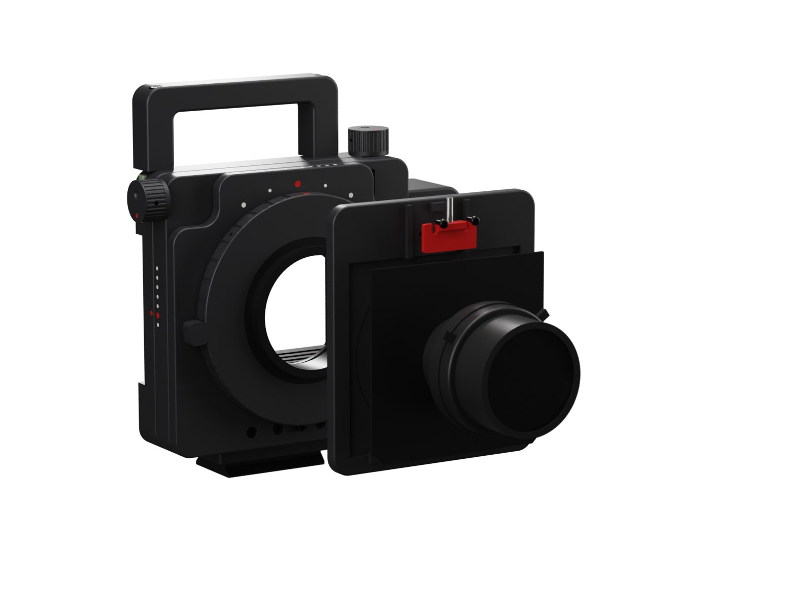
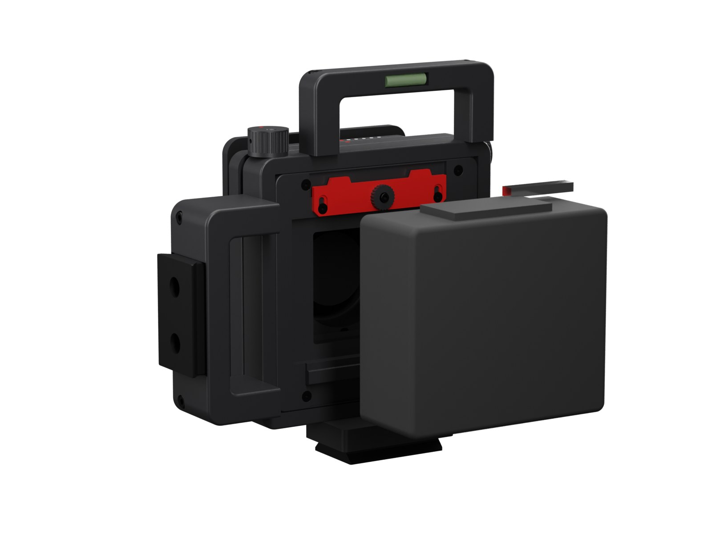

# Assembly

[Back to the project](../README.md)

About three hours, the first time. Everything is screwed together: nothing is glued except the vertical guide rail (bonded for stiffness) and the two spirit vials.

## Tools

- Soldering iron with a heat-set insert tip
- Hex keys 1.5, 2, 2.5, 3 mm; Phillips or hex bit for the grub screws
- M3 and M5 taps with a tap wrench
- 10 mm and 13 mm spanners
- Loctite 243 (medium), two-part epoxy, isopropyl alcohol
- Steel straightedge, caliper; a depth gauge for calibration

Screw names below match the [shopping list](bom.md). Positions match the images: the camera is seen from the front in the three-quarter views and from behind in the rear views.

> **MGN carriages lose their balls if they slide off the rail.** Keep every carriage on its rail, or on the plastic dummy rail it ships on, at all times.

---

## 1. Body

1. **Heat-set inserts in the body.**
   - 4 x M3 x 3 in the Graflok seat, the floor of the big rear recess.
   - 2 x M3 x 3 in the vertical guide channel floor, one near each end.
   - 2 x M4 x 8 in the top face for the top handle.
   - 2 x M4 x 8 in the left side face (photographer's left) for the side handle.
   - 2 x 1/4"-20 in the bottom plinth, inside the Arca pocket.
2. **Tap and fit the vertical zero detent.** Tap M5 into the hole on the front face (photographer's left of the gate, low) and screw in an M5 ball plunger until the ball stands 0.6 mm proud of the face.
3. **Portrait level.** Glue a 7 x 25 mm tubular vial in the slot on the photographer's right side face. Stand the body on its left side on a flat surface and centre the bubble before the glue sets.
4. **Velvet.** Cut self-adhesive black velvet into a frame around the gate on the front face. Its inner edge runs 1 mm outside the gate and its outer edge stays 1 mm inside the two channels. Leave free the zero-detent plunger and the strip where the Y plate pads slide (photographer's left of the gate, 42 to 54 mm from the centre).

## 2. Graflok module, clamp blade and wheel

Do the fit test of [calibration, section 1](calibration.md#1-before-printing-the-body-test-prints) with this module before printing the body.

1. **Inserts.** 3 x M3 x 3 in the module rear face: two for the blade guides, one for the wheel.
2. **Mount the module.** Drop it into the body recess, pocket opening toward the photographer's right, and fix it with 4 x M3 x 8 countersunk screws.
3. **Blade.** Lay the red blade on the top of the module rear face, tongues up. Fit 2 x M3 x 6 countersunk screws in its slots, snug them, then back them off a quarter turn so the blade slides freely.
4. **Wheel.** Put the knurled wheel on the U-slot and fix it with an M3 x 8 socket screw. Tightening the wheel clamps the blade.

## 3. Arca plates and handles

1. **Bottom Arca plate.** Seat it in the plinth pocket with two 1/4"-20 screws.
2. **Side handle.** Bolt it to the photographer's left side with 2 x M4 x 45 socket screws, from its outer face down through the posts into the body inserts.
3. **Portrait Arca plate.** Before fitting it, heat-set 2 x 1/4"-20 inserts in the handle's outer face (the pocket). Then seat the second plate in the pocket with two screws.
4. **Top handle.** Glue the second tubular vial in the slot at the back of its bar, bubble centred with the camera level. Then bolt the handle on with 2 x M4 x 50 socket screws.

To carry the camera on a strap, loop Peak Design Anchors (or any cord anchor) around the handle bars.

## 4. Vertical guide and bushings

1. **Bond the rail.** Degrease the 118 mm MGN9 rail and the channel floor with alcohol. Put a thin line of epoxy between the two locating ribs, press the rail in against the ribs, and fix it with 2 x M3 x 6 socket screws into the two inserts. The rail sits 8.5 mm off centre toward the top: the travel is +25 / -8 mm.
2. **Carriages.** Slide the two MGN9H carriages onto the rail from its dummy rail.
3. **Bushings.** Press the two 6 x 10 x 6 bronze bushings into the seats at both ends of the vertical screw channel (photographer's left of the gate).

Let the epoxy cure before step 5.

## 5. Y plate, rise screw and knob

1. **Parts on the Y plate.**
   - 6 x M3 x 3 inserts in the horizontal guide channel floor, on the front.
   - Tap M5 into the hole above the gate on the front and screw in the second ball plunger, 0.6 mm proud.
   - Press the two pads into their pockets beside the plunger.
   - Apply velvet on the front face around the opening, as in step 1.
2. **Drive nut.** Slide a brass M6 nut into the turret on the plate rear, from the side, flats vertical. It floats a little on purpose and cannot turn.
3. **Mount the plate.** Lower it onto the two carriages, with the turret going into the screw channel. Fix it with 8 x M3 x 12 socket screws through the counterbores on the front. The two pads on its rear must touch the body front; the velvet between the faces is compressed.
4. **Plugs.** Press the 8 printed plugs into the counterbores, flush with the face. They keep the light seal continuous over the screw heads.
5. **Rise screw.** Push the 160 mm M6 rod down from the top of the body, through the top bushing and the brass nut (turn it to thread through), through the bottom bushing and out of the recess in the bottom face.
6. **Bottom nuts.** Put two M6 nuts on the bottom end with a drop of Loctite 243 and jam them against each other, touching the bottom of the recess.
7. **Knob.** Put the O-ring over the rod on the top face, press an M6 nut into the knob, screw the knob down until the O-ring is lightly compressed, and lock it with the M3 grub screw and a drop of Loctite on the nut.
8. **Check.** Turn the knob: 1 mm per turn, a click at zero, hard stops at +25 and -8 mm. The O-ring gives a constant drag, so the plate stays where you leave it.

## 6. Horizontal guide and bushings

1. **Rail.** Screw the 134 mm MGN9 rail into the bottom channel of the Y plate front with 6 x M3 x 6 socket screws, between the locating ribs.
2. **Carriages.** Slide on the two carriages.
3. **Bushings.** Press the two bushings into the ends of the top screw channel.

## 7. Lens panel, M65 flange, turret, shift screw and knob

1. **Inserts in the lens panel.** 2 x M3 x 3 in the rear face for the turret, 1 x M3 x 3 in the front face (bottom) for the infinity stop pin.
2. **Metal flange.** Drop the RafCamera M65 flange into the front pocket and fix it from the rear with 4 x M3 x 6 countersunk screws, into its four M3 holes.
3. **Turret.** Put a brass M6 nut in the turret (flats horizontal) and screw the turret to the panel rear with 2 x M3 x 10 socket screws.
4. **Mount the panel.** Lower it onto the carriages, with the turret going into the Y plate screw channel. Fix it with 8 x M3 x 10 countersunk screws from the front.
5. **Shift screw.** Push the 140 mm M6 rod in from the photographer's right edge of the Y plate, through the right bushing, the nut and the left bushing.
6. **End nuts.** Put two M6 nuts with Loctite on the left end, in the pocket.
7. **Knob.** O-ring, knob and grub screw, as in step 5.
8. **Stop pin.** Screw an M3 x 5 socket screw into the front insert, leaving the head standing: it is the infinity stop.

## 8. Helicoid and focus ring

1. **Helicoid.** Screw its rear male thread into the metal flange until the shoulder seats.
   - Check that its front does not rotate when you turn the focusing ring.
   - A drop of Loctite 222 (low strength) on the flange thread stops it unscrewing under focusing torque.
2. **Focus ring.** Slide the 124 mm ring over the helicoid's knurled grip and hold it with 4 nylon-tip M3 grub screws. Leave them loose: the ring is aligned during calibration.

## 9. Adapter ring, board holder, lens board and lens

1. **Holder inserts.** 4 x M3 x 3 heat-set inserts in the board holder back. Stick a 1 mm felt ring in the groove around the central hole.
2. **Adapter ring.** Screw the printed M65 adapter into the front of the helicoid.
3. **Holder.** Screw it to the adapter with 4 x M3 x 6 button screws through the arc slots. Square the holder to the camera by eye, then tighten.
4. **Latch.** Put the 4 x 10 mm spring in its channel and fix the red latch with 2 x M2.5 x 6 button screws in its slots. It must spring back down by itself.
5. **Lens board.** Screw the lens onto the Technika board with its retaining ring. Hook the board's bottom edge under the two lips, push the top in and let the latch drop over it (4 mm of engagement).

## 10. Film back

1. **Loosen and lower.** Slacken the wheel and slide the red blade down.
2. **Hook the bottom.** Hook the back's bottom lip under the fixed bottom rail of the Graflok module. The rail also releases the Pro-S dark-slide interlock.
3. **Seat the back.** Swing the back onto the seat: the nose goes into the pocket.
4. **Lock.** Slide the blade up so its two tongues enter the back's top slots, then tighten the wheel.
5. **Dark slide.** It comes out toward the photographer's right, through the relief in the body.
6. **Advance after each frame.** Press the back's own wind-stop release lever by hand: the camera has no automatic coupling (see [design notes](design.md#open-points)).

The ground glass mounts the same way. Now go to [calibration and tests](calibration.md) before the first roll.
