# Assembly

[Back to the project](../README.md)

This guide assumes you have never built anything like it. Each of the nine steps is split into short sub-steps. Every picture shows what is already built in place and only the parts of that sub-step pulled out along the way they go in, with a dashed line to where they go; the red letters match the table under the picture. Follow the steps in order: the order was checked part by part, and some screws cannot be reached later.

Allow a day for the first build: about five hours of work, plus waiting for epoxy and threadlocker to cure.

## Words used in this guide

- **Front** is the lens side, **rear** is the film side.
- **Photographer's left and right** are as you stand behind the camera looking at the ground glass. A picture taken from the front shows them mirrored: the photographer's left is on the right of the picture.
- **Insert** means a brass heat-set insert: a small threaded sleeve melted into the plastic so a metal screw has metal threads to bite. Sizes are written M3 x 3 (thread x length).
- **Proud** means sticking out above a surface; **flush** means level with it.
- The **Y plate** moves up and down (rise and fall). The **lens panel** moves left and right (shift) and carries the lens. Together they are the **front standard**.
- A **dovetail way** is a printed rail with a slanted edge; the plate's slanted edge (its **lip**) slides under it. One rail of each pair is fixed; the other holds a **gib strip**, a thin printed bar pushed by three grub screws to take up the play.

## Before you start

1. **Print and check the parts.** Everything in [printing](printing.md), including the checks under *After printing*.
2. **Do the tests first.** Section 1 of [calibration](calibration.md) tells you whether your RB67 back fits and whether the dovetails slide, before you spend a day assembling.
3. **Sort the hardware.** Put a strip of masking tape on the table and lay out the screws by size. Every step starts with a *You need* list.
4. **Clean the holes.** Pull out any stringing with a hook or a drill turned by hand.

### Tools

| Tool | Used for |
|---|---|
| Soldering iron with heat-set tips for M3 and 1/4" | inserts |
| Hex keys 1.5, 2 and 2.5 mm, one of them long (at least 30 mm of shaft) | grub screws, countersunk and socket-head M3 screws |
| M3 and M5 taps with a small tap wrench | threads cut into the plastic |
| 8 mm drill bit (turned by hand) | reaming the bushing seats |
| 10 mm spanner | the M6 nuts |
| A small vice or a clamp, a flat piece of wood | pressing bushings and nuts |
| Steel ruler or straightedge, caliper | flatness and heights |
| Feeler gauge 1.0 mm (or ten sheets of 80 g printer paper) | ball plunger height |
| Sharp scissors, a new craft blade | velvet and felt |
| Loctite 243 and 222, two-part epoxy, isopropyl alcohol, cotton buds, black acrylic paint | as listed in the steps |

### Five techniques you will use

**1. Heat-set inserts.** This is most of the work, so practise on a test coupon first.

1. Set the iron to 230 C (ASA). Put the right tip on and let it heat for a minute.
2. Drop the insert into the hole with its **narrow end down**. It sits on the rim of the hole.
3. Put the tip into the insert and let it sink under its own weight plus a light push, straight down, for 5 to 10 seconds. Do not force it: if it does not move, wait.
4. Stop when the insert is 0.2 mm below the surface. Pull the tip straight out.
5. While the plastic is still soft, press a cold flat steel part (the side of a spanner) on the insert for five seconds: it comes out square and never proud.
6. Check: lay the straightedge across the hole. It must rock on nothing. An insert standing proud of a sliding face or of the back's seat leaks light or tilts the back.

Every insert in the camera is the same M3 x 3 x 5, 29 of them, plus two of 1/4" for the tripod plates. The 1/4" ones take 15 to 20 seconds: go slowly and keep the iron vertical.

**2. Tapping a thread into the plastic.** Used for the two ball plungers (M5) and for every M3 hole without an insert: the grub holes, the eight holes in the base of the horizontal rails and the two latch holes of the board holder. The holes are printed at the right size.

1. Put the tap in the wrench and start it straight, looking from two sides.
2. Turn half a turn in, a quarter turn back, and repeat. The plastic chips must break off.
3. Go only as deep as the hole. Blow the chips out.

**3. Pressing.** Bushings and the knob nuts are press fits. Use the vice or a clamp, never a hammer: ASA cracks. Put a flat piece of wood on the printed side.

**4. Threadlocker.** Anaerobic threadlockers attack ASA and can crack it. Use them only where metal meets metal: Loctite 243 on the two nuts that end the rods (steel on steel), Loctite 222 on the helicoid thread and on the Graflok blade screws (steel into brass inserts). One small drop, never on the plastic.

**5. Velvet and felt.** The camera has no bellows: light is kept out by sliding faces 0.8 mm apart with self-adhesive velvet between them. The pieces are V1, V2 (with two small discs) and the felt rings V3 and V4.

1. Print the templates in `print/templates/` at 100 %. Measure the 100 mm bar on the sheet: if it is not 100 mm, fix the printer scaling first.
2. Tape the template on the back of the velvet (the paper side), and cut through both with scissors for the outer edge and a craft blade against a ruler for the window.
3. Measure the velvet thickness with the caliper, pressing lightly: it must be 0.9 to 1.2 mm.
4. Degrease the plastic with alcohol. Peel off the backing, align one edge, and lay the velvet down from that edge like a screen protector. Press it all over with your thumb.
5. The velvet must never cover a ball plunger, a rail, or a hole a screw still has to reach (except where this guide says so).

---

## 1. Body

**You need:** the body, 15 M3 inserts, one 1/4"-20 insert, one M5 ball plunger, two 6 x 8 x 6 bushings, the M5 tap, epoxy.

### 1a. Inserts in the rear face

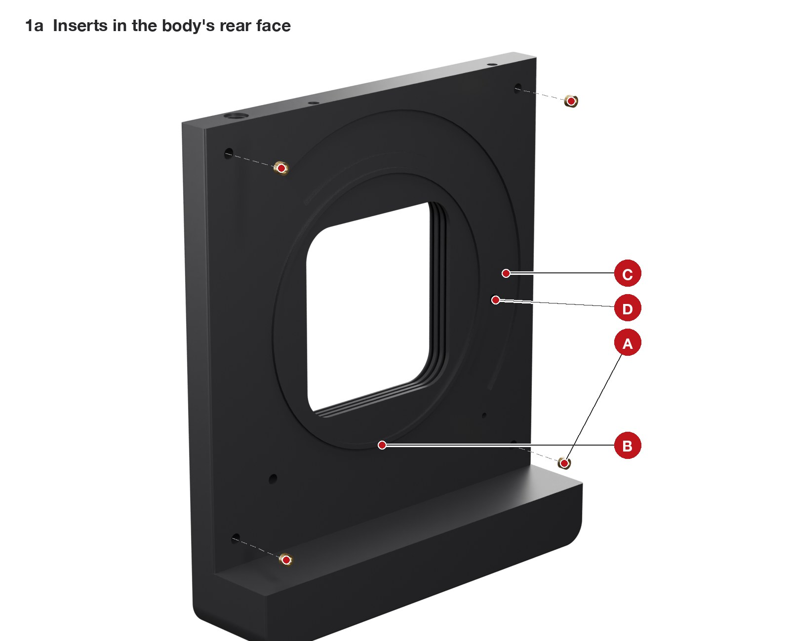

| | What | Qty | How |
|---|---|---|---|
| **A** | M3 x 3 insert | 4 | in the four corners of the rear face, for the rear frame |
| **B** | nothing | | the round ridge of the light trap: the rotator's groove runs over it. Keep it clean and sharp |
| **C** | nothing | | the curved pocket on the photographer's right: the dark-slide handle and the back's hooks turn in it |
| **D** | the back of the rise plunger | | you set its height from here in 1c |

Lay the body front face down on a towel and press the four inserts A. Check with the straightedge: the rear face is the reference for the film plane, so no insert may stand proud.

### 1b. Inserts along the front edges

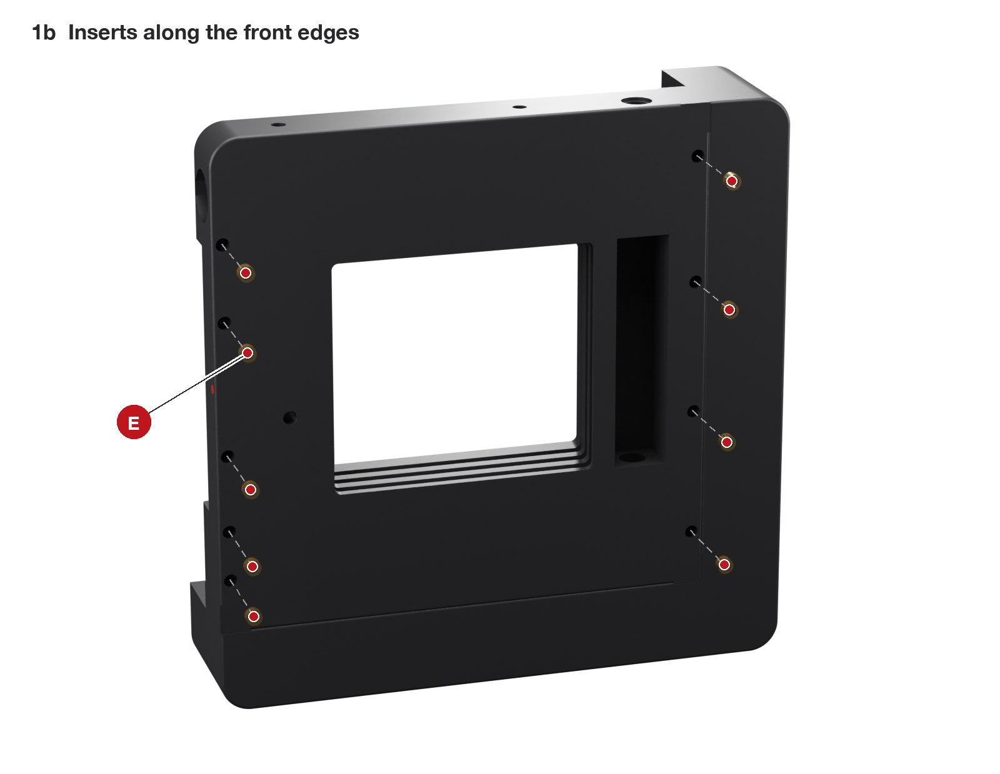

| | What | Qty | How |
|---|---|---|---|
| **E** | M3 insert | 9 | along the two side edges of the front face: 5 on the photographer's right (left in the picture), 4 on the left |

Turn the body over and press the nine inserts E. They carry the vertical rails in step 4.

### 1c. Rise plunger and bushings

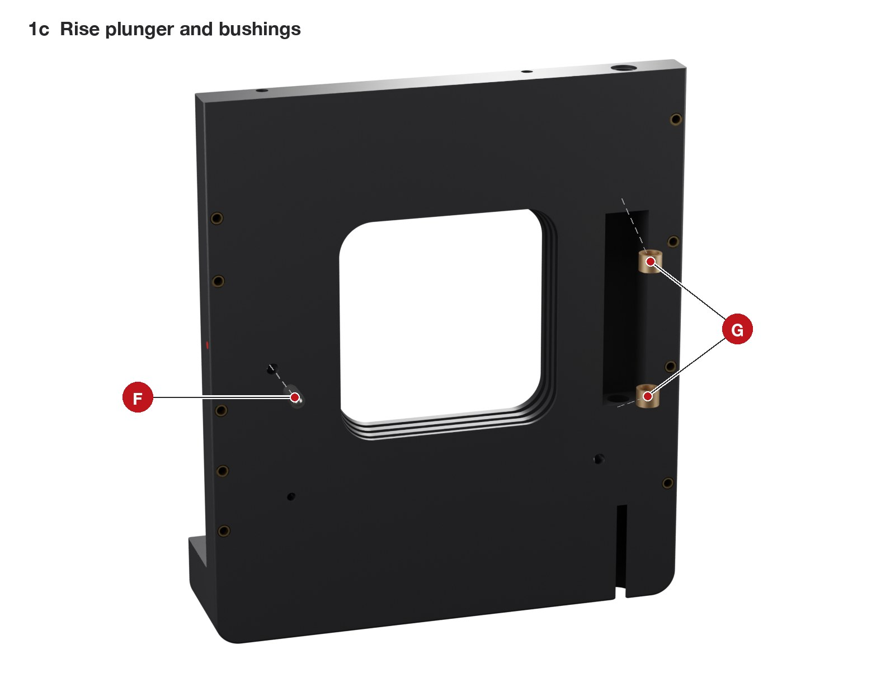

| | What | Qty | How |
|---|---|---|---|
| **F** | M5 ball plunger (POM ball) | 1 | tap M5 through, screw in from the front, set from behind (D) |
| **G** | bronze bushing 6 x 8 x 6 | 2 | one in each end wall of the screw channel |

1. **F.** Tap M5 through the small hole beside the window. Screw the plunger in from the front, ball toward you, until its hex is inside. From behind (D), turn it with a hex key until the ball stands **1.0 mm** proud of the front face: lay the feeler gauge on the face next to it and a ruler across both, and stop when the ball touches the ruler. A small drop of epoxy on the thread at the back, scraped flush with the rear face, locks the plunger and seals the hole.
2. **G.** Ream the two bushing seats with the 8 mm drill turned by hand. Drop a bushing into the screw channel and push it sideways into the round seat in the end wall until it is flush; a 6 mm bolt through its bore keeps it square. Do the other one the same way.

### 1d. Handle inserts on top

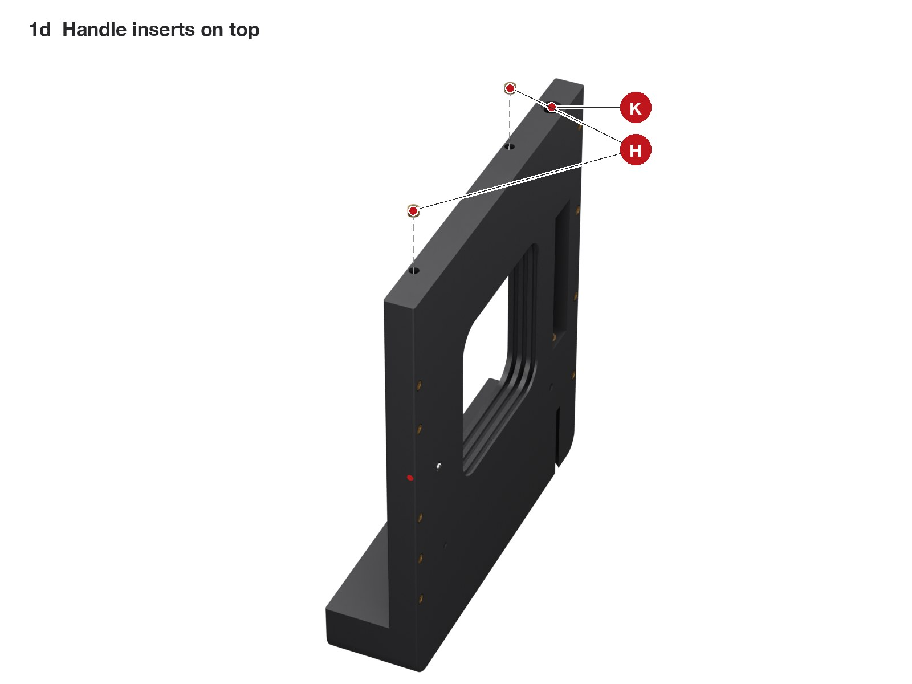

| | What | Qty | How |
|---|---|---|---|
| **H** | M3 insert | 2 | in the top face, for the top handle |
| **K** | nothing yet | | the rise rod comes out here (6f) |

### 1e. Tripod insert underneath

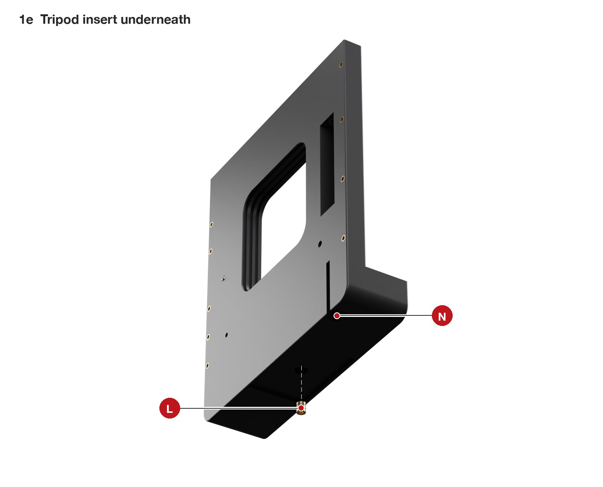

| | What | Qty | How |
|---|---|---|---|
| **L** | 1/4"-20 insert | 1 | in the middle of the Arca pocket |
| **N** | nothing yet | | the recess of the rise rod's end nut (6b) |

The 1/4" insert takes 15 to 20 seconds: go slowly and keep the iron vertical.

**Check.** No insert is proud on any face. Press the plunger ball with a fingertip: it springs back.

## 2. Rotating back and rear frame

The film back does not sit on the body: it sits on the **rotator**, a round plate that turns a quarter turn in the body's rear face. For vertical pictures you turn the back, not the camera, and the tripod, the handle and the level stay where they are. A **rear frame** screwed to the body holds the rotator's flange over a ring of velvet; a ball plunger clicks at the two positions and a grub screw stops it past them.

**You need:** the rotator, the blade, the wheel, the rear frame, 3 M3 inserts, 4 M3 x 10 socket heads, 2 M3 x 6 countersunk, 1 M3 x 8 countersunk, 1 M3 x 6 grub, one M5 ball plunger, velvet ring V5, the M3 and M5 taps, a long hex key, Loctite 222, epoxy, dry PTFE.

If the rotator from the test plate fitted your back, use that one.

### 2a. Inserts in the rotator

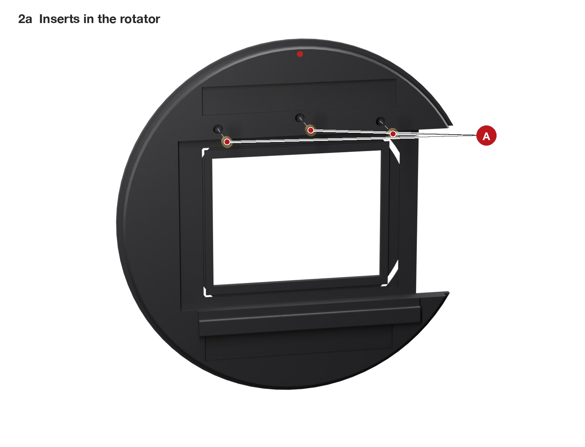

| | What | Qty | How |
|---|---|---|---|
| **A** | M3 x 3 insert | 3 | in the shallow recess along the top of the rear face: two for the blade, the middle one for the wheel |

### 2b. Blade and wheel on the rotator

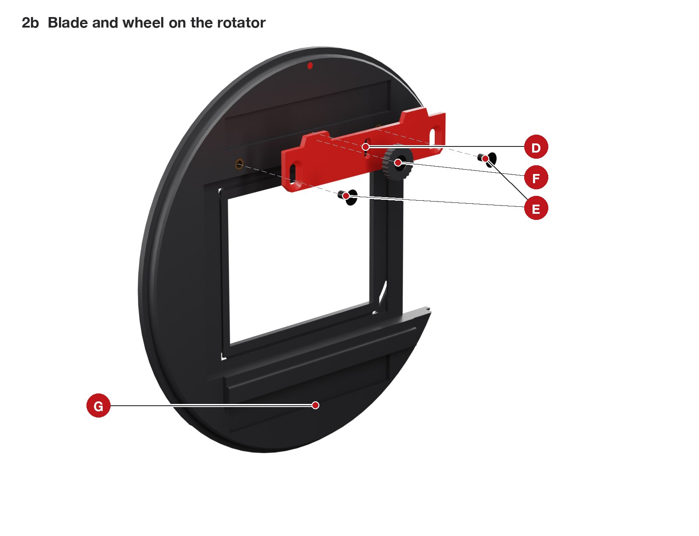

| | What | Qty | How |
|---|---|---|---|
| **D** | the red blade | 1 | in the recess, tongues pointing up |
| **E** | M3 x 6 countersunk | 2 | through the blade slots into the outer inserts, with Loctite 222 |
| **F** | wheel with an M3 x 8 countersunk | 1 | into the middle insert |
| **G** | nothing | | the fixed bottom rail: the back hooks under it |

1. **D and E.** Lay the blade in the recess. Put a small drop of Loctite 222 on the two screws E, screw them through the blade slots until they just touch, then back them off a quarter turn: the blade must slide up and down under its own weight. Leave the threadlocker to set for an hour: the screws then stay where they are.
2. **F.** Put a drop of epoxy in the cone at the back of the wheel and press the screw head into it, so the screw turns with the wheel. Once it has set, put the wheel over the U-slot of the blade and screw it in. Clockwise clamps the blade; anticlockwise frees it.

**Check.** With the wheel loose, the blade slides the full length of its slots. With the wheel tight, it does not move.

### 2c. Rotator, velvet ring and rear frame

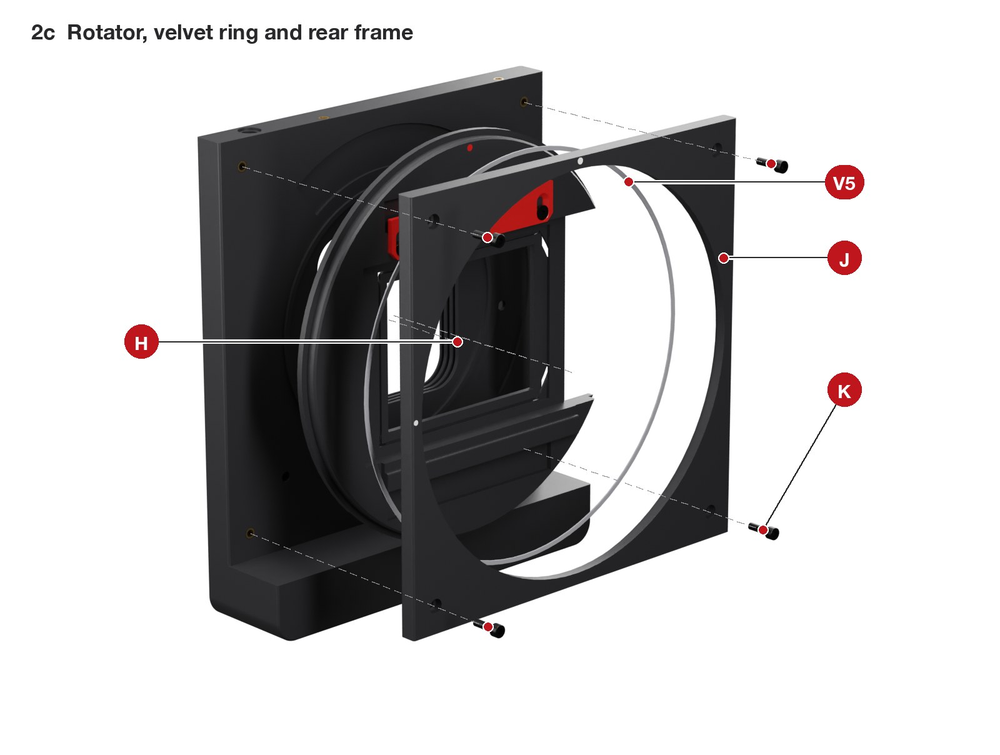

| | What | Qty | How |
|---|---|---|---|
| **H** | the rotator | 1 | into the round seat in the body's rear face, red dot at the top |
| **V5** | velvet ring | 1 | on the floor of the step inside the rear frame |
| **J** | the rear frame | 1 | over the rotator's flange, the big white dot at the top |
| **K** | M3 x 10 socket head | 4 | through the frame's corners into the inserts A of 1a |

1. **H.** Lay the body front face down. Wipe a thin film of dry PTFE on the ring of the rear face and on the rotator's front face. Put the rotator in with its red dot at the top: the groove on its front face drops over the ridge B, and it turns freely.
2. **V5.** Cut the ring with `print/templates/V5_velvet_rotator_ring.svg` and stick it on the floor of the step inside the frame, velvet up.
3. **J and K.** Lay the frame over the rotator, its white dots on the photographer's left and at the top, and screw it down with the four screws K, a little at a time in a cross, until the heads sit in their counterbores.

**Check.** The rotator turns with an even, velvety drag and has no play front to back. If it binds, the velvet is too thick: peel V5 and use a thinner one.

### 2d. Click and stop, from the front

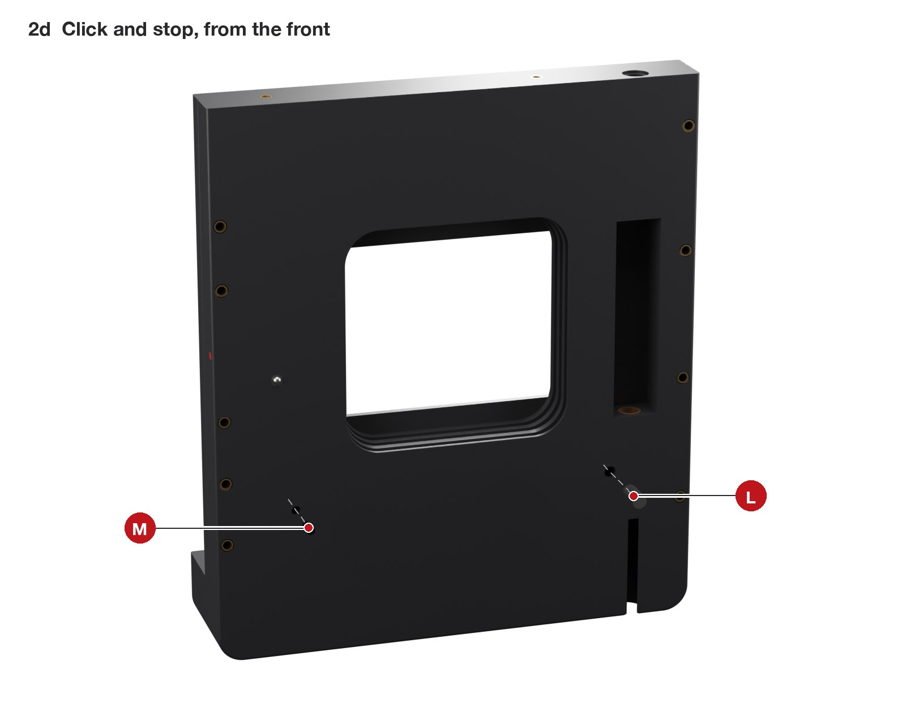

| | What | Qty | How |
|---|---|---|---|
| **L** | M5 ball plunger (POM ball) | 1 | in the hole at the bottom on the photographer's left (right in the picture) |
| **M** | M3 x 6 grub | 1 | in the hole at the bottom on the photographer's right (left in the picture) |

Stand the body on its bottom, front toward you. Both holes go through to the rotator.

1. **L.** Tap M5 through the hole. Screw the plunger in from the front, ball first, with the rotator at landscape (red dot at the top). When the ball touches the rotator, give it half a turn more. Turn the rotator: it clicks into place at landscape and at portrait. Firmer click: a quarter turn more; lighter: a quarter turn back.
2. **M.** Tap M3 into the narrow end of the other hole, reaching through the wide bore in front of it. Drive the grub in from the front with the long hex key until it touches the bottom of the groove in the rotator, then back it half a turn.

**Check.** Seen from behind, the back turns a quarter turn anticlockwise from landscape (red dot on the big white dot at the top) to portrait (red dot on the small white dot on the photographer's left), clicks at both, and stops hard just past each. The dark slide then comes out at the top.

## 3. Arca plate, top handle and level

**You need:** the Arca plate, one screw 1/4"-20 x 1/2" (plates often come with one), the top handle, 2 M3 x 20 socket heads, one 15 mm bull's-eye level, epoxy.

### 3a. Arca plate

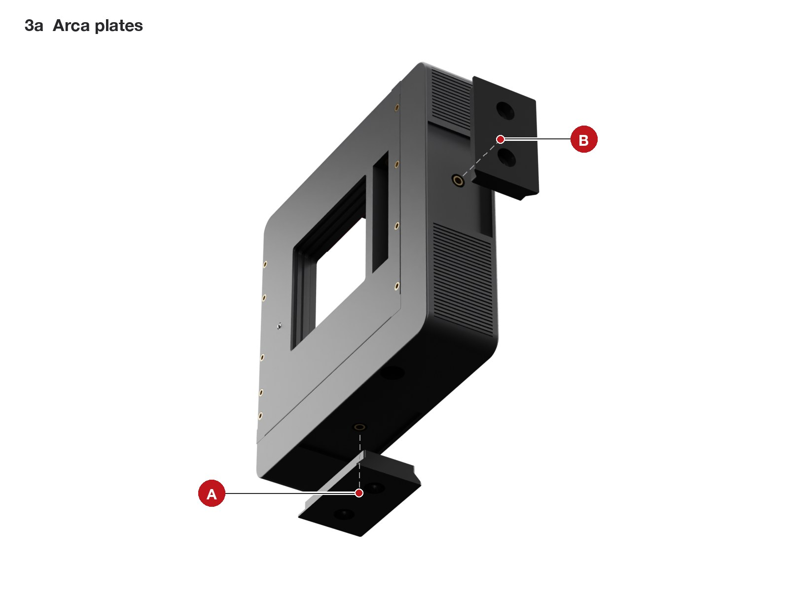

| | What | Qty | How |
|---|---|---|---|
| **A** | Arca plate | 1 | one 1/4"-20 x 1/2" screw into the insert L |

Remove any rubber pad from the plate. The pocket keeps it from turning, so one screw is enough. The camera always sits on this plate: for vertical pictures you turn the back (step 2), not the camera.

### 3b. Top handle

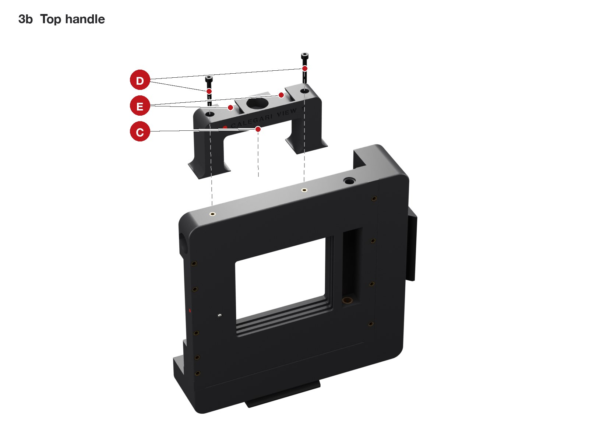

| | What | Qty | How |
|---|---|---|---|
| **C** | top handle | 1 | its two feet on the top face, over the inserts H |
| **D** | M3 x 20 socket head | 2 | down the long hole in each post, into H: use the long hex key |
| **E** | nothing | | two accessory shoes: slide a viewfinder, a meter or a level in from the back |

Tighten firmly: this handle carries the camera. A strap attaches to the bar between the posts (Peak Design Anchors, or any cord).

### 3c. The level

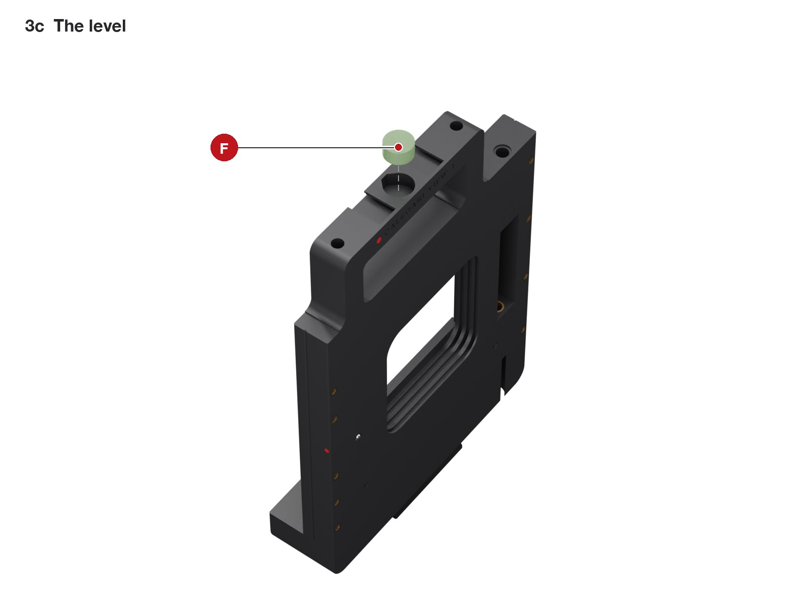

| | What | Qty | How |
|---|---|---|---|
| **F** | 15 mm bull's-eye level | 1 | glued in the pocket on top of the handle |

Put the camera on a tripod on its Arca plate and level it with a phone level laid on top of the body, in both directions. Put a drop of epoxy in the pocket on top of the handle, press the bull's-eye in, and let the glue set without touching the camera. The same level serves both orientations, since the camera no longer turns.

## 4. Vertical ways and body velvet

**You need:** the two vertical rails (the fixed one is plain; the gib one has three small holes on its outer face and a pocket along its inside), 9 M3 x 8 countersunk, the M3 tap, velvet piece V1.

### 4a. Vertical rails

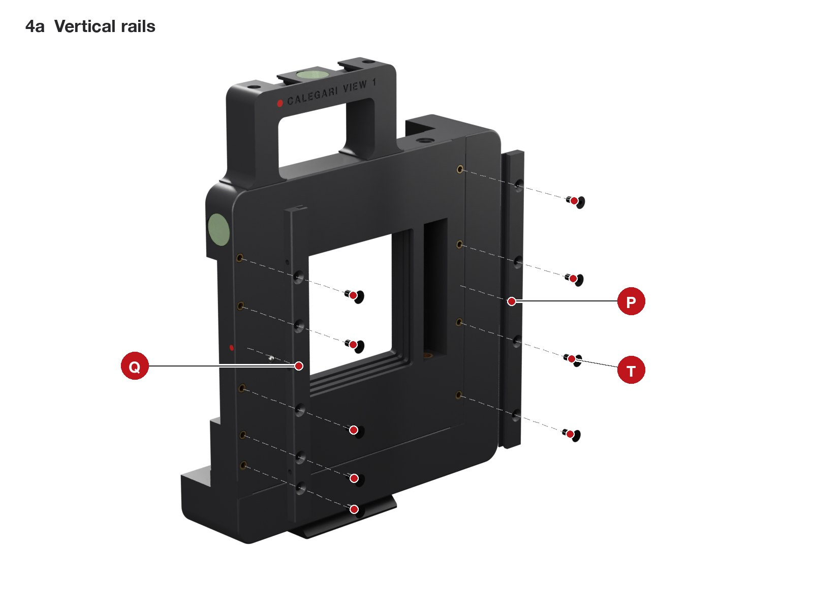

| | What | Qty | How |
|---|---|---|---|
| **P** | fixed rail | 1 | on the photographer's **left** edge (right in the picture), slanted side inward |
| **Q** | gib rail | 1 | on the photographer's **right** edge, its three small holes facing outward |
| **T** | M3 x 8 countersunk | 9 | through the rails into the inserts E: 4 in P, 5 in Q |

Tap M3 into the three small holes of Q first. The rails' round ends go to the top, where the body corner is round.

### 4b. Velvet V1 on the body front

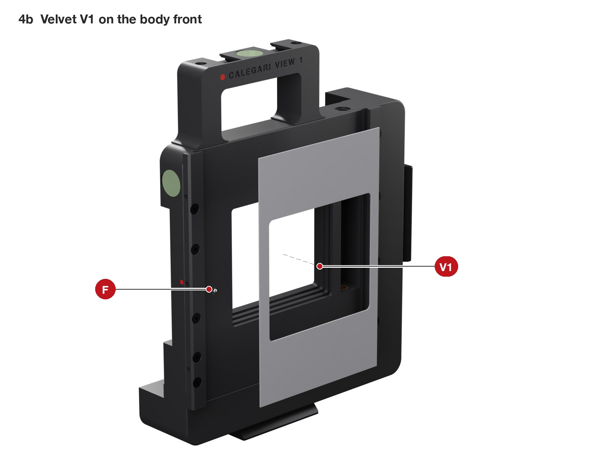

| | What | Qty | How |
|---|---|---|---|
| **V1** | velvet, cut from its template | 1 | around the window, between the rails |
| **F** | the plunger ball | | stays uncovered: the side of V1 marked *ball plunger side* goes toward it |

The velvet window is 0.3 mm larger than the body's window all round.

**Check.** Run a fingernail along the inside of both rails: no step, no burr.

## 5. Front standard, on the bench

**You need:** the Y plate, the lens panel, the two horizontal rails, the X gib strip, the shift nut turret, the metal M65 flange, 1 M3 insert, 1 brass M6 nut, 2 bushings, 1 M5 ball plunger, 4 M3 x 6 countersunk, 8 M3 x 16 socket heads, 4 M3 x 6 grubs, the 127 mm rod, an M6 washer and a stainless M6 nut (the thrust nut), O-ring, knob with its M6 nut, velvet V2, epoxy, Loctite 243, black paint.

The front standard is built as one unit on a clean flat table, then slides into the body in step 6.

### 5a. Y plate: bushings and shift plunger

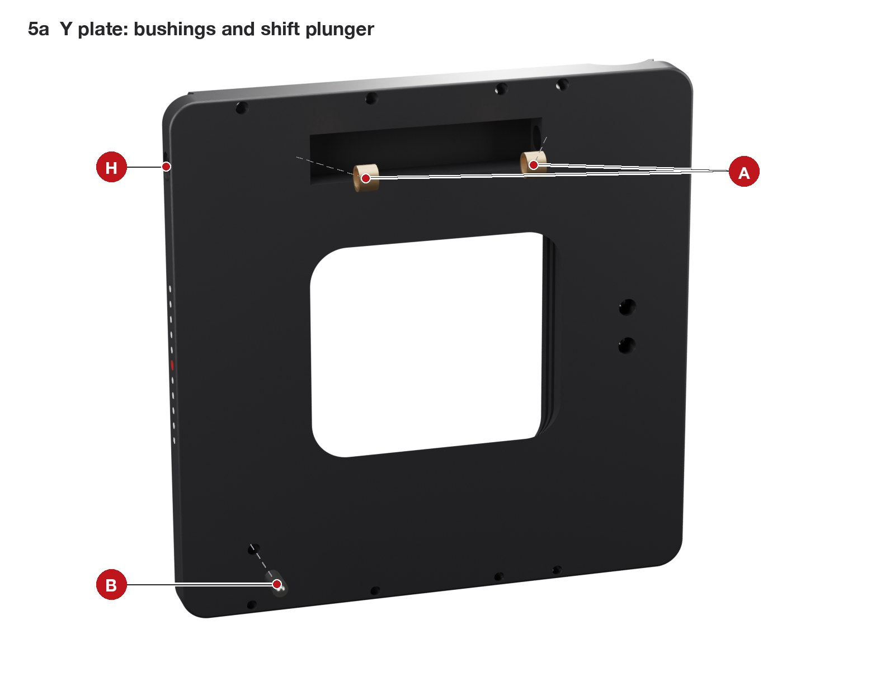

| | What | Qty | How |
|---|---|---|---|
| **A** | bronze bushing 6 x 8 x 6 | 2 | one in each end wall of the top screw channel |
| **B** | M5 ball plunger (POM ball) | 1 | tap M5 through, screw in from the front, set from behind (C) |
| **H** | nothing yet | | the shift rod goes in here, and the knob sits here (5k) |

Ream and press the bushings as in 1c. The left seat is blind: nothing of the rod will show on that edge.

### 5b. Y plate from behind

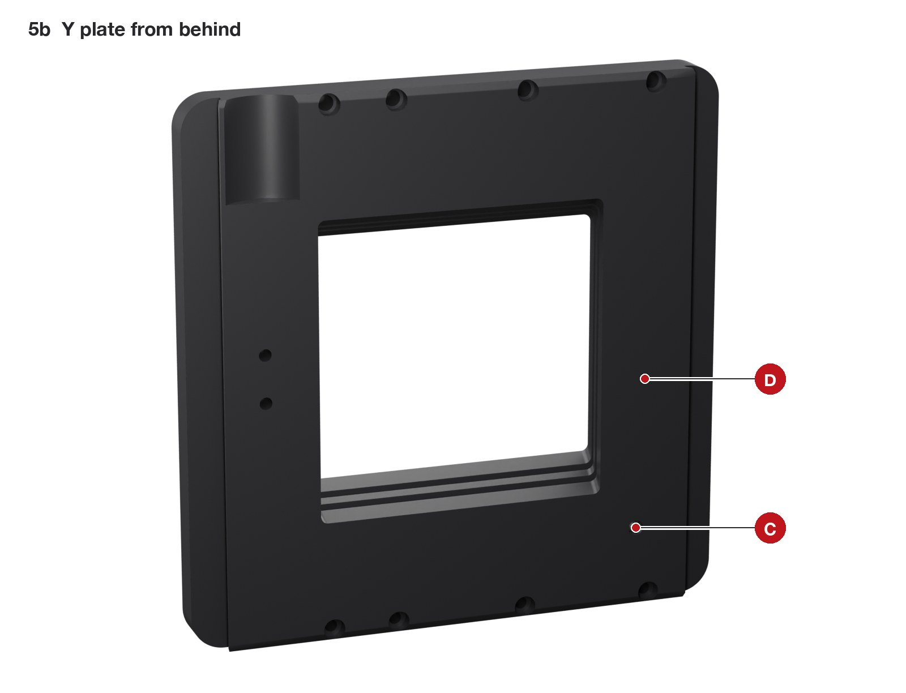

| | What | Qty | How |
|---|---|---|---|
| **C** | the back of the shift plunger | | set the ball 1.0 mm proud from here, then a drop of epoxy scraped flush |
| **D** | nothing | | the dimple of the rise detent |

### 5c. Velvet V2 on the Y plate

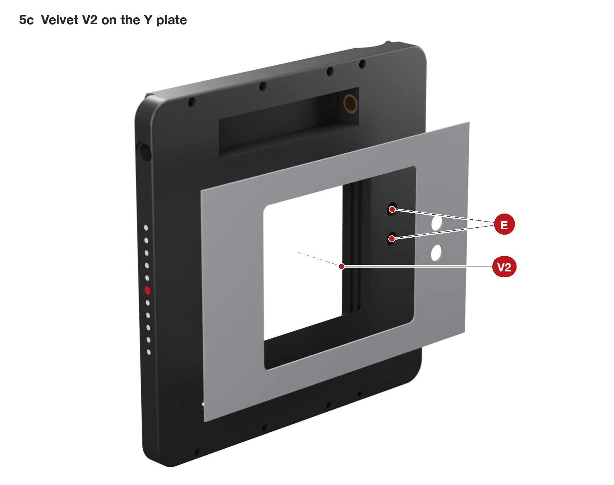

| | What | Qty | How |
|---|---|---|---|
| **V2** | velvet, cut from its template | 1 | on the Y plate front around the window |
| **E** | the two holes of V2 | | over the rise-turret screw holes; keep the two 7 mm discs for 6d |

### 5d. Lens panel: flange and stop insert

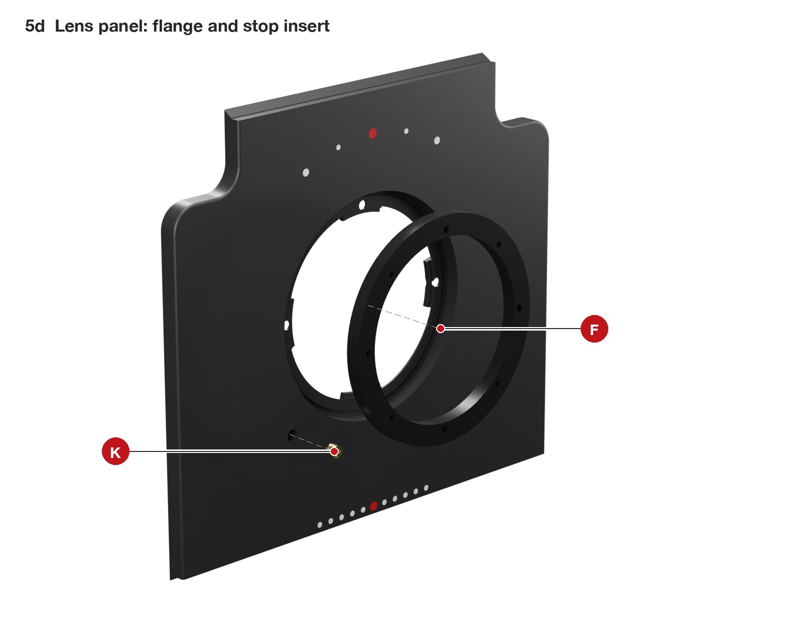

| | What | Qty | How |
|---|---|---|---|
| **F** | RafCamera M65 flange | 1 | dropped into the round pocket, flush |
| **K** | M3 insert | 1 | the infinity stop pin screws into it in 7a |

Turn the flange until its four threaded M3 holes sit over the four countersunk holes of the panel. Fill the flange's four unused holes with black paint: light would otherwise shine through them.

### 5e. Lens panel from behind: screws and turret

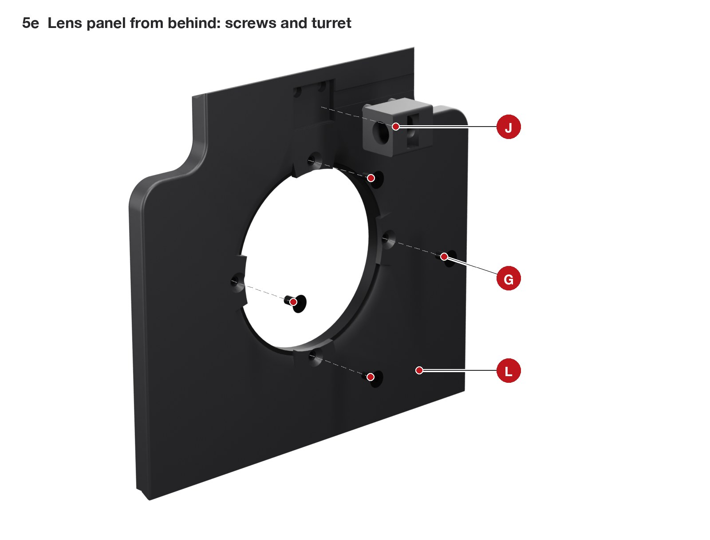

| | What | Qty | How |
|---|---|---|---|
| **G** | M3 x 6 countersunk | 4 | from behind into the flange's M3 holes |
| **J** | shift nut turret | 1 | bonded with epoxy into its pocket, pegs into their holes |
| **L** | nothing | | the dimple of the shift detent |

Put a thin layer of epoxy on the top of the turret J, press it into its pocket and let it cure. The brass nut does not go in the turret: it goes on the rod in 5g. Look at the small conical dimple L: if the first printed layer closed it, open it with a 2.5 mm drill turned by hand, 0.4 mm deep.

### 5f. Tap the horizontal rails

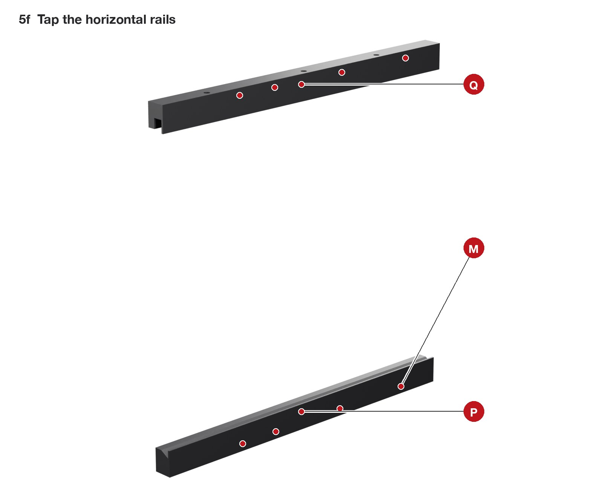

| | What | Qty | How |
|---|---|---|---|
| **M** | M3 thread | 8 | tap the four holes in the base of each rail by hand, 6 mm deep: the rails are too slim for inserts |
| **P** | fixed rail | | the one with the red index dot |
| **Q** | gib rail | | tap M3 into its three small holes |

### 5g. Shift rod, thrust nut and drive nut

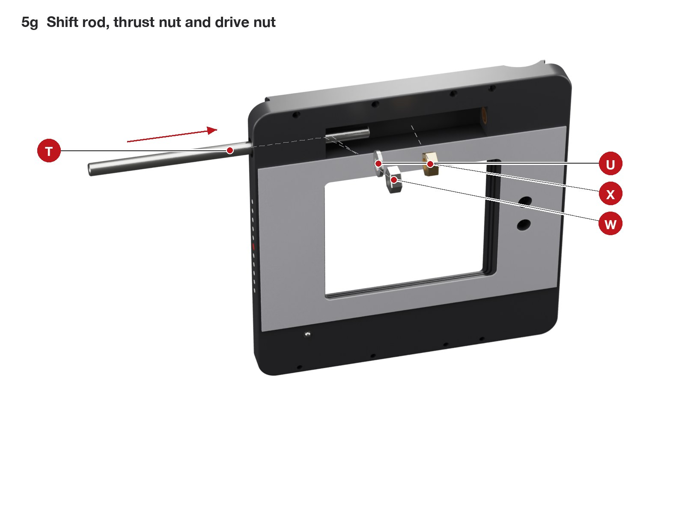

| | What | Qty | How |
|---|---|---|---|
| **T** | 127 mm rod | 1 | pushed in from the Y plate's **right** edge (photographer's right, H) |
| **U** | M6 washer | 1 | onto the rod inside the channel, first |
| **W** | stainless M6 nut (thrust nut) | 1 | next, with Loctite 243 |
| **X** | brass M6 nut (drive nut) | 1 | last |

Lay the Y plate front up. Push the rod in from the right edge, through the edge hole and the right bushing, into the channel. In the channel, thread onto its tip, one after the other, the washer U, the thrust nut W and the brass nut X: hold each one and turn the rod to feed it through. Push on until the tip stops at the bottom of the left seat, then pull the rod back 1 mm. Run the thrust nut back until it presses the washer against the bushing, finger tight, then put one drop of Loctite 243 where the rod comes out of the nut on the channel side: it wicks into the thread. Keep it away from the washer and the bushing. Let it set for an hour.

### 5h. Lens panel onto the Y plate

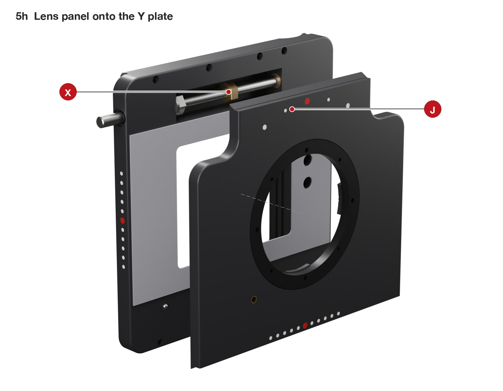

| | What | Qty | How |
|---|---|---|---|
| **J** | the turret under the lens panel | | drops into the channel, over the brass nut |
| **X** | brass nut | | in the middle of the channel, flats parallel to the channel sides |

Turn the brass nut to the middle of the channel, flats parallel to the channel sides. Lay the lens panel on the Y plate front, face up, its edges over the Y plate's edges: the turret is open underneath, so it drops into the channel over the rod and the nut. Hold the two plates together and turn them over, Y plate rear up.

### 5i. Horizontal rails, screwed from behind

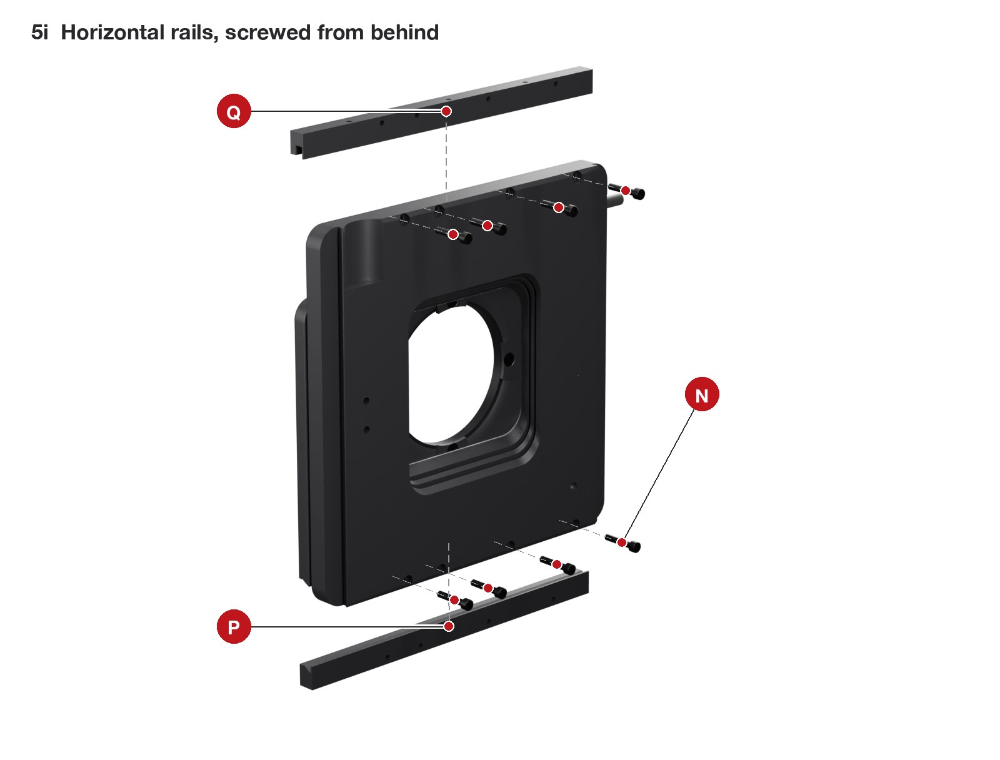

| | What | Qty | How |
|---|---|---|---|
| **P** | fixed rail | 1 | along the **bottom** edge, red index dot to the front |
| **Q** | gib rail | 1 | along the **top** edge, three small holes facing up |
| **N** | M3 x 16 socket head | 8 | from the Y plate rear into the tapped holes M |

Slide each rail in from its edge, between the two plates, until its holes line up with the Y plate's, and screw it from the rear.

### 5j. Gib strip and grub screws

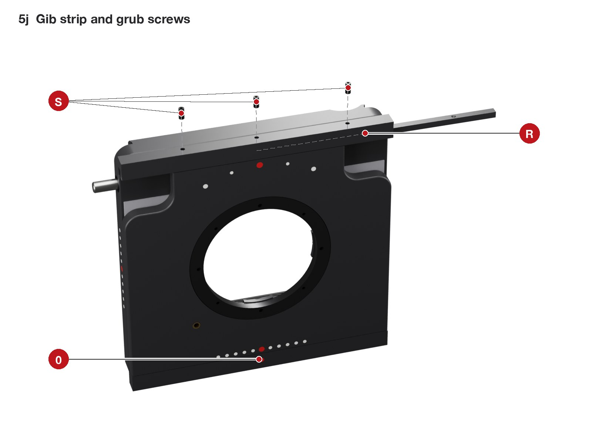

| | What | Qty | How |
|---|---|---|---|
| **R** | gib strip | 1 | slid into the pocket of Q from one end, dimples outward |
| **S** | M3 x 6 grub | 3 | through the top of Q, onto the dimples |
| **0** | nothing | | the shift index on the bottom rail |

Turn the stack face up. Tighten each grub a little at a time until the lens panel no longer rocks when you press its corners, then back each off an eighth of a turn. The panel must slide with an even, light drag over its whole travel. Give the dovetails a light spray of dry PTFE and slide the panel end to end a few times.

### 5k. Shift knob

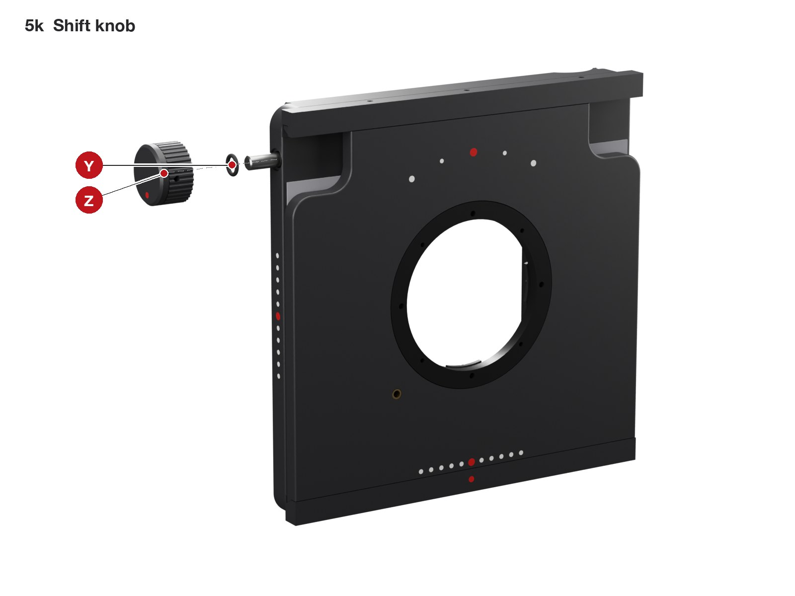

| | What | Qty | How |
|---|---|---|---|
| **Y** | O-ring 6 x 1.5 | 1 | in its seat around the rod at H |
| **Z** | knob with its M6 nut and grub | 1 | screwed onto the rod, locked with the grub |

Press a stainless M6 nut into the knob's hex pocket with the vice and tap M3 into the knob's small radial hole. Screw the knob onto the rod until it presses the O-ring lightly, and lock it with a grub. The right end wall of the Y plate is now held between the knob outside and the thrust nut inside.

**Check.** Turn the shift knob: 1 mm per turn, a click at zero, hard stops at 25 mm each side (on the right, the turret meets the thrust nut). The panel moves with an even drag and never rocks.

## 6. Front standard into the body, rise screw and knob

**You need:** the body from step 4, the front standard from step 5, the rise nut turret, 2 M3 inserts, 1 brass M6 nut, 2 M3 x 10 socket heads, the two 7 mm velvet discs, the Y gib strip, 3 M3 x 6 grubs, the 178 mm rod with a stainless M6 nut and an M6 washer (its end nut), O-ring, knob with its M6 nut and grub, Loctite 243, dry PTFE.

### 6a. Rise nut turret

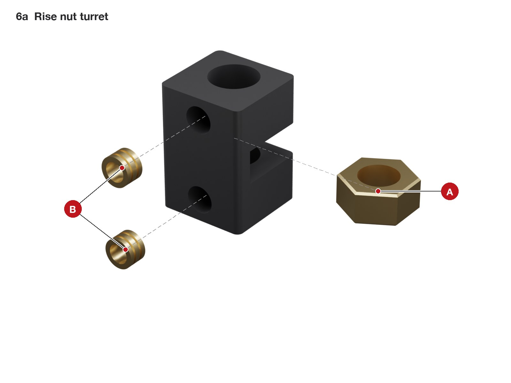

| | What | Qty | How |
|---|---|---|---|
| **A** | brass M6 nut | 1 | slid into the slot from the side, flats vertical |
| **B** | M3 insert | 2 | in the top face |

### 6b. Turret and rise rod into the body

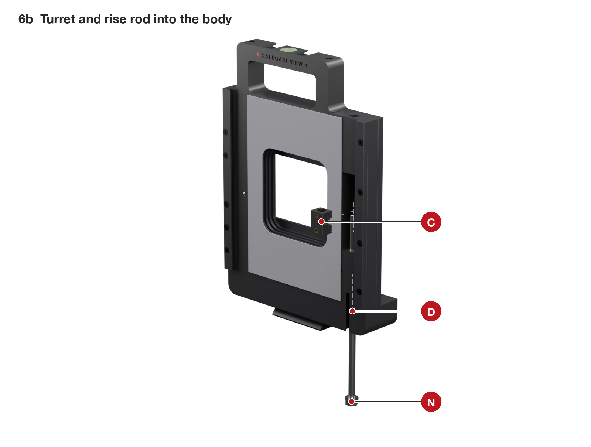

| | What | Qty | How |
|---|---|---|---|
| **C** | the turret | 1 | into the screw channel on the body front |
| **D** | 178 mm rod with its washer and end nut | 1 | pushed up from below, through the bushings and the turret nut |
| **N** | the end nut | | sits in its recess under the body, the washer against the top of the recess |

On the bench, slip the washer onto one end of the rod and screw the nut on behind it with a drop of Loctite 243, about 1 mm of rod beyond the nut; let it set. Stand the body on its bottom plate, put the turret in the channel, and push the rod up from below through the bottom bushing, the turret nut (turn the rod to thread it through) and the top bushing, until the washer sits against the top of its recess. Turn the rod until the turret is in the middle of the channel.

### 6c. The front standard slides in from the top

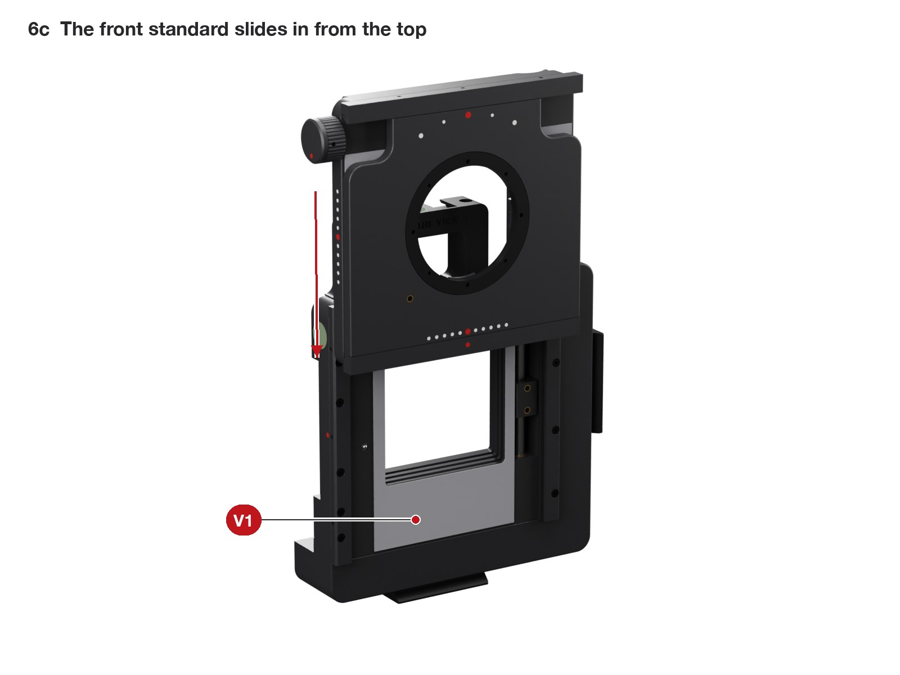

| | What | Qty | How |
|---|---|---|---|
| **V1** | the body velvet | | press its top edge flat with a finger as the plate passes |

Spray the vertical dovetails with dry PTFE. Hold the front standard upright above the body and lower it into the two vertical rails from the top: its slanted edges go under the rails. Slide it down slowly and stop when the Y plate is centred on the body.

### 6d. Turret screws and velvet discs

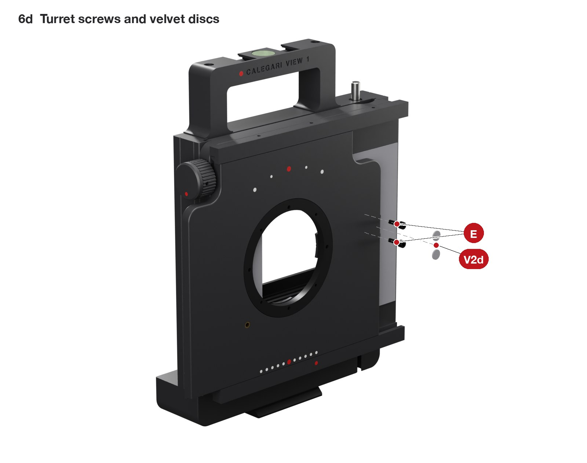

| | What | Qty | How |
|---|---|---|---|
| **E** | M3 x 10 socket head | 2 | through the Y plate into the turret inserts B; the heads sit deep in the plate |
| **V2d** | 7 mm velvet disc | 2 | over each screw head: it closes the hole to light |

Shift the lens panel fully to the photographer's right: the two holes are now uncovered. Turn the rise rod until the turret's inserts are under them, then screw the turret to the Y plate.

### 6e. Gib strip and grub screws

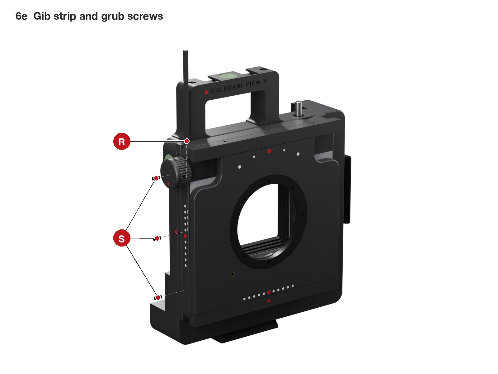

| | What | Qty | How |
|---|---|---|---|
| **R** | gib strip | 1 | slid into the pocket of the rail on the photographer's right, from the top, dimples outward |
| **S** | M3 x 6 grub | 3 | through the outer face of the rail |

Set it as in 5j: no rocking, an even light drag. The top grub sits behind the shift knob when the plate is near the middle: reach it with the plate at full fall.

### 6f. Rise knob

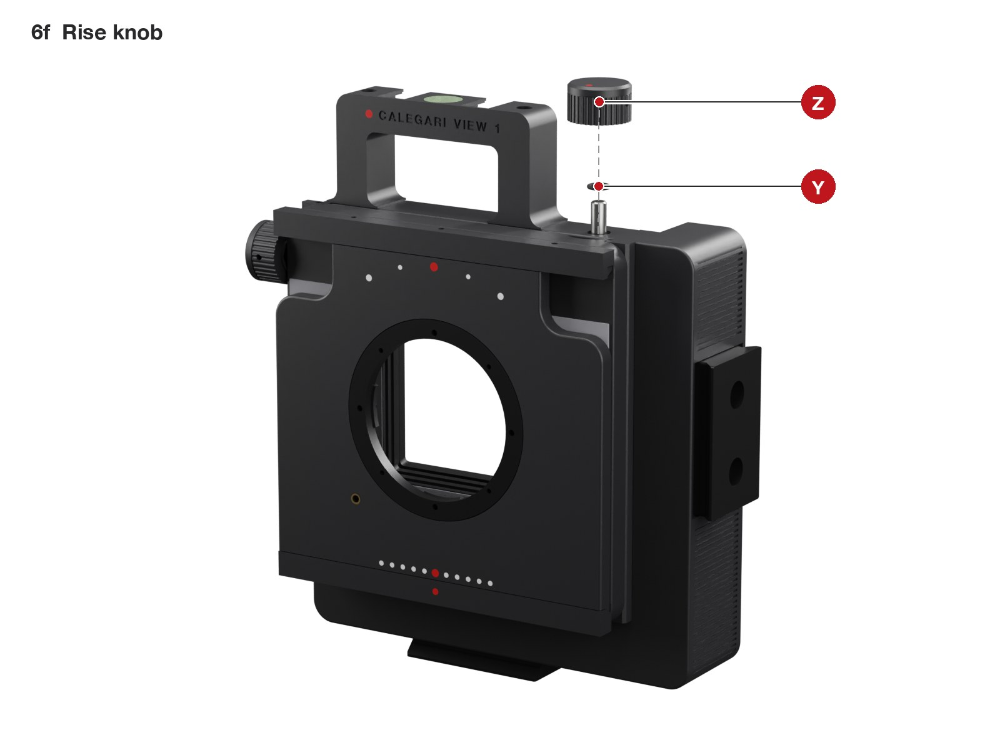

| | What | Qty | How |
|---|---|---|---|
| **Y** | O-ring 6 x 1.5 | 1 | in its seat on the top face, around the rod (K) |
| **Z** | knob with its M6 nut and grub | 1 | screwed onto the rod, locked with the grub |

Prepare the knob as in 5k. The rod turns with the knob until the plate reaches a hard stop: keep turning, and the knob then threads down onto the rod. Stop when it presses the O-ring lightly and lock it with the grub.

**Check.** Turn the rise knob: 1 mm per turn, a click at zero, hard stops at +25 and -25 mm. The plate stays where you leave it and never rocks.

## 7. Helicoid and focus ring

**You need:** the M65 helicoid, the focus ring, 5 M3 x 6 grubs (four for the ring, one is the stop pin), the M3 tap, Loctite 222.

### 7a. Stop pin and helicoid

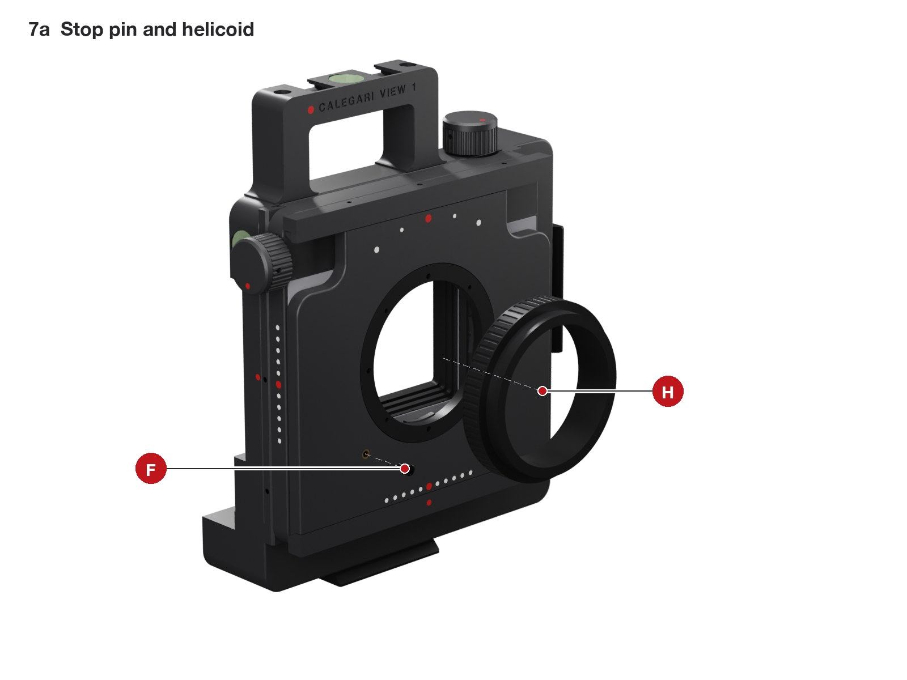

| | What | Qty | How |
|---|---|---|---|
| **F** | M3 x 6 grub: the stop pin | 1 | into the insert K of 5d until 3 mm stands proud; a drop of Loctite 222 |
| **H** | helicoid | 1 | its rear thread into the metal flange, one drop of Loctite 222 |

Screw the helicoid in until its shoulder seats. Hold its rear part and turn its focusing grip: the **front must not rotate**, it only moves in and out.

### 7b. Focus ring

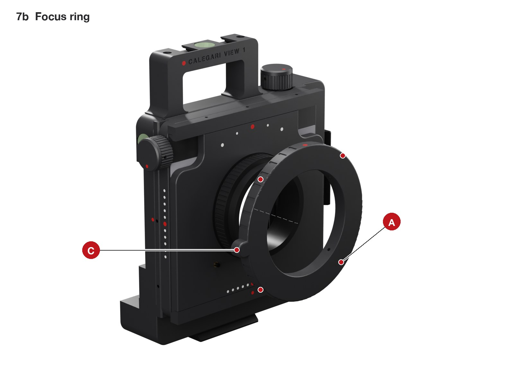

| | What | Qty | How |
|---|---|---|---|
| **A** | M3 x 6 grub | 4 | tap M3 into the four radial holes; they clamp the ring on the helicoid |
| **C** | nothing | | the focusing tab |

Slide the ring over the helicoid's grip, groove side toward the camera, so the stop pin runs in the groove. Screw in the four grubs until they just touch: the ring is set during [calibration](calibration.md#3-infinity-teach-the-camera-where-infinity-is).

### 7c. The hidden stop

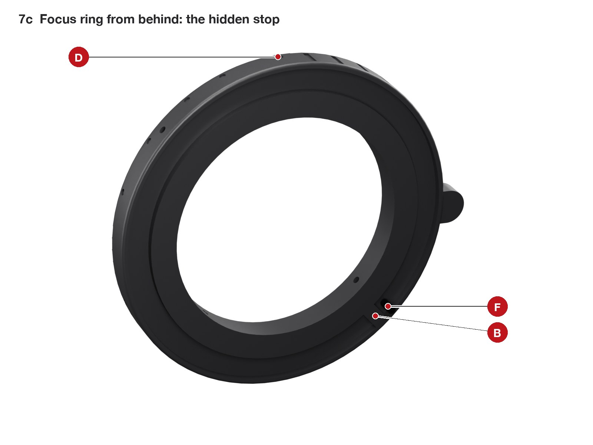

| | What | Qty | How |
|---|---|---|---|
| **B** | nothing | | the groove under the ring and its one solid block: at infinity the block rests on the pin |
| **F** | the stop pin | | runs in the groove |
| **D** | nothing | | the red infinity dot on the rim |

## 8. Adapter ring, board holder, lens board and lens

**You need:** the adapter ring, the board holder, the latch, 8 M3 inserts, 4 M3 x 8 countersunk, 2 M3 x 6 grubs, the 4 x 15 mm spring, felt pieces V3 and V4, the lens board and the lens.

### 8a. Inserts in the adapter ring

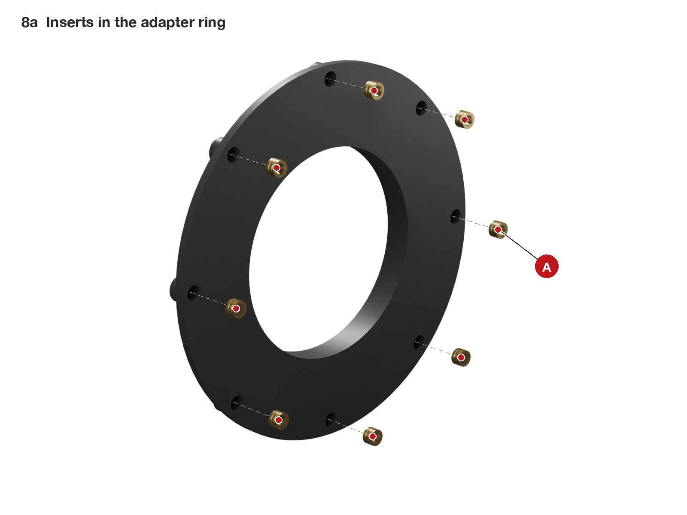

| | What | Qty | How |
|---|---|---|---|
| **A** | M3 x 3 insert | 8 | in the bosses, pressed from the front face |

### 8b. Felt V3 behind the board holder

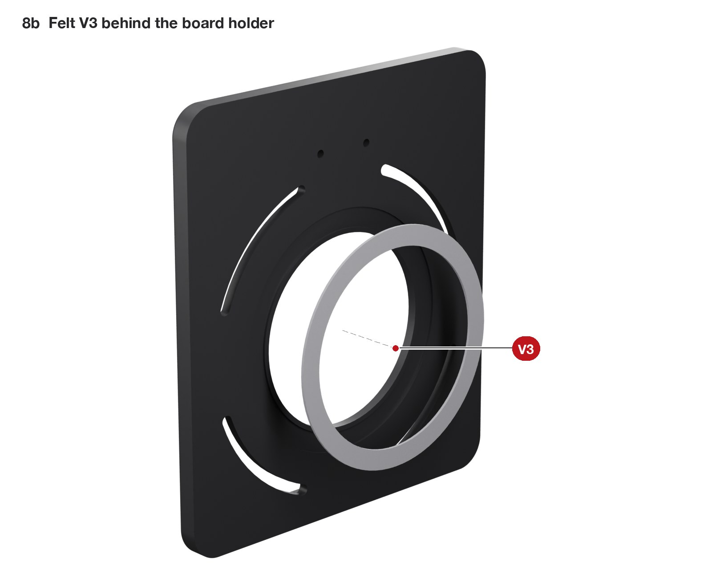

| | What | Qty | How |
|---|---|---|---|
| **V3** | felt ring, cut from its template | 1 | in the round groove around the hole |

### 8c. Felt V4 and the spring

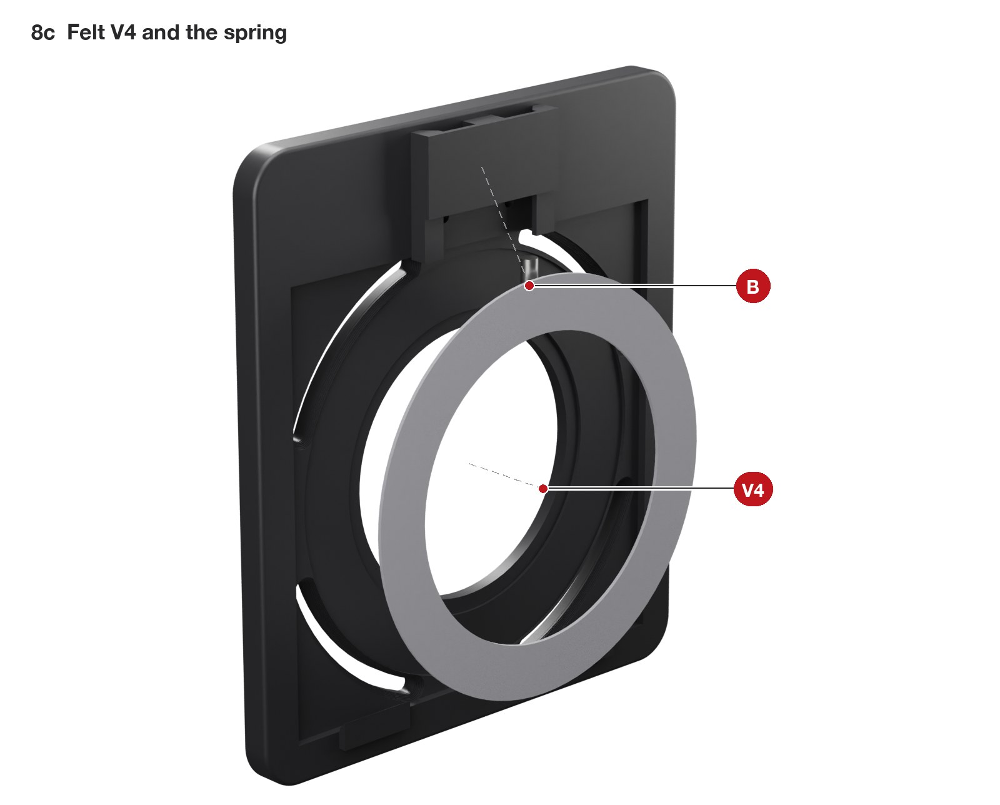

| | What | Qty | How |
|---|---|---|---|
| **V4** | felt ring | 1 | in the shallow round seat under the board |
| **B** | spring 4 x 15 | 1 | in its channel under the hood |

### 8d. Latch, held by two grubs from behind

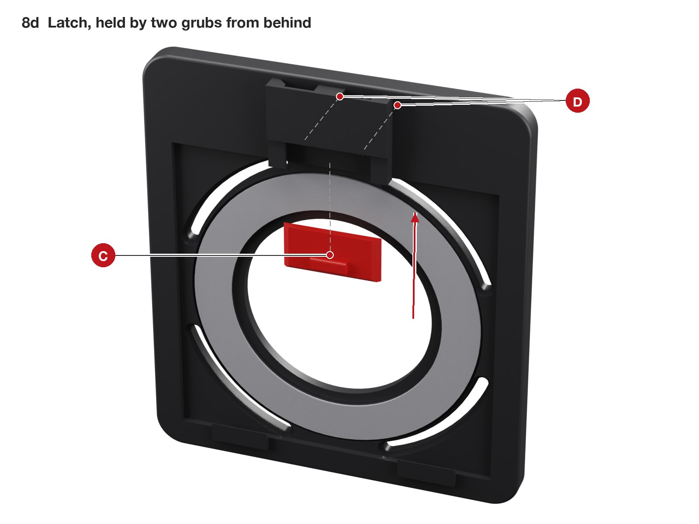

| | What | Qty | How |
|---|---|---|---|
| **C** | red latch | 1 | slid up into the dovetail between the rails, from below, flat face against the holder |
| **D** | M3 x 6 grub | 2 | tap M3 from the back of the holder, then turn the grubs in: their tips stand 1 mm proud and run in two grooves under the latch |

Slide the latch up into the dovetail from below and push it against the spring until its lower edge is level with the top edge of the board opening. Hold it there, turn the holder over and turn the two grubs D in from the back until they sit about 1.5 mm below the rear face: their tips now stand 1 mm proud in the grooves under the latch, and the groove ends stop it both ways. Pull the latch up with a thumbnail and let go: it snaps back down by itself. No screw shows on the front.

### 8e. Adapter and board holder onto the helicoid

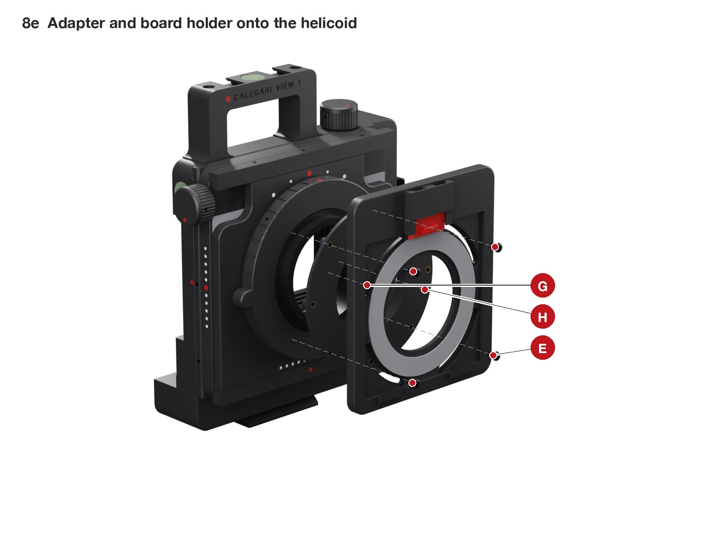

| | What | Qty | How |
|---|---|---|---|
| **G** | adapter ring | 1 | its male thread into the front of the helicoid, by hand, until its flange seats |
| **H** | board holder | 1 | laid on the adapter |
| **E** | M3 x 8 countersunk | 4 | through the holder's arc slots into whichever adapter inserts are under them; the heads sit flush under the board (use heads no wider than 6 mm) |

Leave the screws E loose, turn the holder until its edges are square with the lens panel, then tighten. They are under the board: you can reach them whenever the board is out.

### 8f. Lens board

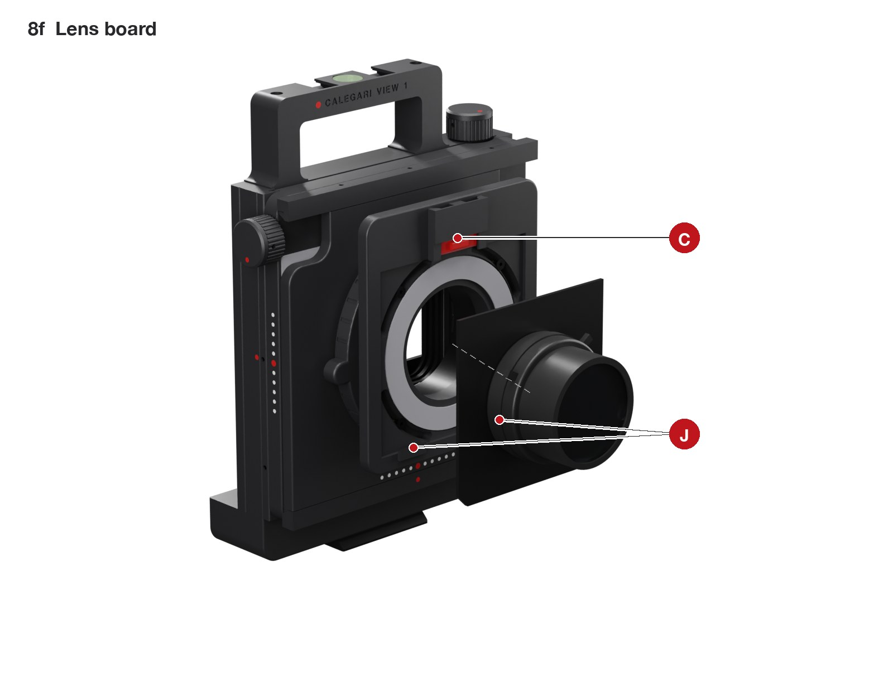

| | What | Qty | How |
|---|---|---|---|
| **J** | the two bottom lips | | the board's bottom edge goes under them |
| **C** | the latch | | lift it with your thumb, press the board in, let it go: it drops over the board |

Screw the lens onto the board with its retaining ring, from behind. Hook the board's bottom edge under the lips J, lift the latch, press the top in and let the latch go.

**Check.** The board sits flat and does not rattle; the latch covers its top edge by 4 mm.

## 9. Film back

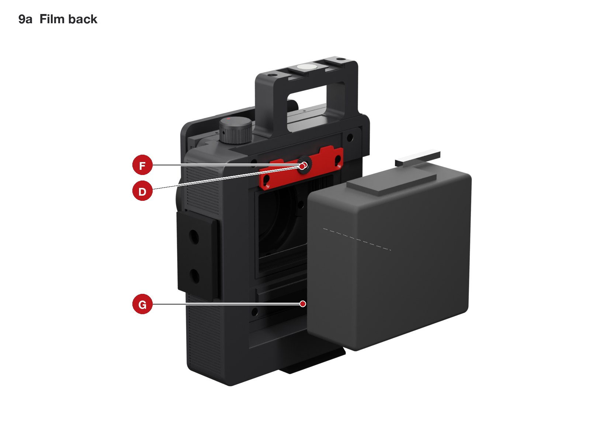

| | What | Qty | How |
|---|---|---|---|
| **G** | the fixed bottom rail | | the back's bottom lip hooks under it; it also releases the Pro-S dark-slide interlock |
| **D** | the blade | | slides up into the two slots on top of the back |
| **F** | the wheel | | anticlockwise frees the blade, clockwise locks it |

1. **Loosen and lower.** Turn the wheel anticlockwise and slide the blade down.
2. **Hook the bottom.** Hook the back's bottom lip under the rail G.
3. **Seat the back.** Swing the back onto the seat: its nose goes into the recess.
4. **Lock.** Slide the blade up so its two tongues enter the slots in the top of the back, then tighten the wheel.
5. **Dark slide.** It comes out toward the photographer's right in landscape and at the top in portrait.
6. **Advance after each frame.** Press the back's own wind-stop release lever by hand: the camera has no automatic coupling (see [design notes](design.md#open-points)).

The ground glass goes on the same way. Now go to [calibration](calibration.md), then [using the camera](using.md).

## Hardware by step

| Step | Inserts | Screws | Other |
|---|---|---|---|
| 1 | M3 x 15, 1/4" x 1 | | M5 plunger, 2 bushings, epoxy |
| 2 | M3 x 3 | M3 x 10 socket x 4, M3 x 6 countersunk x 2, M3 x 8 countersunk x 1, M3 x 6 grub x 1 | M5 plunger, V5, Loctite 222, epoxy, dry PTFE |
| 3 | | M3 x 20 socket x 2, 1/4"-20 x 1/2" x 1 | bull's-eye level, epoxy |
| 4 | | M3 x 8 countersunk x 9 | V1 |
| 5 | M3 x 1 | M3 x 6 countersunk x 4, M3 x 16 socket x 8, M3 x 6 grub x 4 | flange, brass nut, 2 bushings, M5 plunger, rod 127 + M6 washer + M6 nut, O-ring, knob + M6 nut, V2, epoxy, Loctite 243, paint |
| 6 | M3 x 2 | M3 x 10 socket x 2, M3 x 6 grub x 4 | brass nut, rod 178 + M6 washer + M6 nut, O-ring, knob + M6 nut, 2 velvet discs, Loctite 243 |
| 7 | | M3 x 6 grub x 5 | helicoid, Loctite 222 |
| 8 | M3 x 8 | M3 x 8 countersunk x 4, M3 x 6 grub x 2 | spring, V3, V4 |

All the small hardware is M3 stainless: socket heads in three lengths (10, 16, 20), countersunk in two (6, 8), one grub (6) and one insert. One assortment of each covers the camera.
