# Assembly

[Back to the project](../README.md)

This guide assumes you have never built anything like it. Every hole of every printed part is shown in a picture with a red letter, and a table next to it says what goes into that hole, how many, with which tool, and in which step. Follow the steps in order: some parts cannot be reached once the next plate is on.

Allow an afternoon for the first build: about four hours, plus a night for the epoxy.

## Words used in this guide

- **Front** is the lens side, **rear** is the film side.
- **Photographer's left and right** are as you stand behind the camera looking at the ground glass. A picture taken from the front shows them mirrored: the photographer's left is on the right of the picture.
- **Insert** means a brass heat-set insert: a small threaded sleeve melted into the plastic so a metal screw has metal threads to bite. Sizes are written M3 x 3 (thread x length).
- **Proud** means sticking out above a surface; **flush** means level with it.
- The **Y plate** moves up and down (rise and fall). The **lens panel** (also called the X plate) moves left and right (shift) and carries the lens.

## Before you start

1. **Print and check the parts.** Everything in [printing](printing.md), including the checks under *After printing*: the four sliding faces must be flat.
2. **Do the test prints first.** Section 1 of [calibration](calibration.md) tells you whether your RB67 back fits before you spend a day assembling.
3. **Sort the hardware.** Put a strip of masking tape on the table and lay out the screws by length. Every step starts with a *You need* list.
4. **Clean the holes.** Pull out any stringing with a hook or a 3 mm drill turned by hand.

### Tools

| Tool | Used for |
|---|---|
| Soldering iron with heat-set tips for M3, M4 and 1/4" | inserts (a plain conical tip works for M3, badly for the bigger ones) |
| Hex keys 1.5, 2, 2.5 and 3 mm | grub screws, M3, M4 screws |
| M3 and M5 taps with a small tap wrench | threads cut into the plastic |
| 10 mm spanner (two) | M6 nuts |
| A small vice or a big clamp, a 6 mm bolt | pressing bushings, nuts and pads |
| Steel ruler or straightedge, caliper | flatness and heights |
| Feeler gauge 0.6 mm (or 6 sheets of 80 g printer paper) | ball plunger height |
| Sharp scissors, a new craft blade | velvet and felt |
| Loctite 243, two-part epoxy, isopropyl alcohol, cotton buds | as listed in the steps |

### Five techniques you will use

**1. Heat-set inserts.** This is most of the work, so practise on the shrinkage gauge first.

1. Set the iron to 230 C (ASA). Put the right tip on and let it heat for a minute.
2. Drop the insert into the hole with its **narrow end down**. It sits on the rim of the hole.
3. Put the tip into the insert and let it sink under its own weight plus a light push, straight down, for 5 to 10 seconds. Do not force it: if it does not move, wait.
4. Stop when the insert is 0.2 mm below the surface. Pull the tip straight out.
5. While the plastic is still soft, press a cold flat steel part (the side of a spanner) on the insert for five seconds: it comes out square and never proud.
6. Check: lay the straightedge across the hole. It must rock on nothing. An insert standing proud of a sliding face or of the back's seat will leak light or tilt the back.

The camera has 23 M3 inserts, 2 M4 and 4 of 1/4". The bigger ones take 15 to 20 seconds: go slowly and keep the iron vertical.

**2. Tapping a thread into the plastic.** Used for the two ball plungers (M5) and six small holes (M3). The holes are printed at the right size (4.2 and 2.5 mm).

1. Put the tap in the wrench and start it straight, looking from two sides.
2. Turn half a turn in, a quarter turn back, and repeat. The plastic chips must break off.
3. Go only as deep as the hole. Blow the chips out.

**3. Pressing.** Bushings, the knob nuts and the small pads are press fits. Use the vice or a clamp, never a hammer: ASA cracks. Put a flat piece of wood on the printed side.

**4. Threadlocker.** Loctite 243 only on metal-to-metal threads (the M6 nuts on the rods). Anaerobic threadlockers attack ASA and can crack it: keep them off the plastic, and never put them on a screw that goes into a printed part or an insert.

**5. Velvet and felt.** The camera has no bellows: the light is kept out by sliding faces 0.8 mm apart, with self-adhesive velvet in between. Four pieces are needed, V1 to V4.

1. Print the templates in `print/templates/` at 100 % scale. Measure the 100 mm bar on the sheet: if it is not 100 mm, fix the printer scaling first.
2. Tape the template on the back of the velvet (the paper side), and cut through both with scissors for the outer edge and a craft blade against a ruler for the window.
3. Measure the velvet thickness with the caliper, pressing lightly: it must be 0.9 to 1.2 mm. Thinner velvet does not touch the other plate; thicker velvet makes the movement stiff.
4. Degrease the plastic with alcohol. Peel off the backing, align one edge, and lay the velvet down from that edge like a screen protector. Press it all over with your thumb.
5. The velvet must never cover a hard pad, a ball plunger, or a hole a screw still has to reach.

> **MGN carriages lose their balls if they slide off the rail.** Keep each carriage on its rail, or on the plastic dummy rail it ships on, at all times. If one does come off, stop: the balls are 1 mm and they will roll everywhere.

---

## 1. Body

**You need:** the body, 8 M3 x 3 inserts, 2 M4 inserts, 4 inserts 1/4"-20, one M5 ball plunger, the M5 tap.

The body has holes on five faces. The four pictures below show all of them; letters are unique to the body.

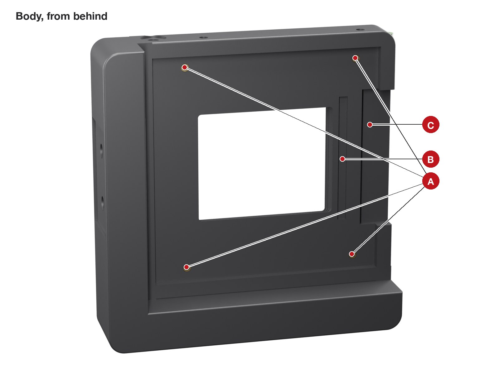

| | What goes here | Qty | How | Step |
|---|---|---|---|---|
| **A** | M3 x 3 insert | 4 | in the floor of the big rear recess (the seat of the Graflok module), pressed from behind | 1 |
| **B** | nothing | | light-trap groove: keep it clean, no stringing | |
| **C** | nothing | | passage for the dark slide handle | |

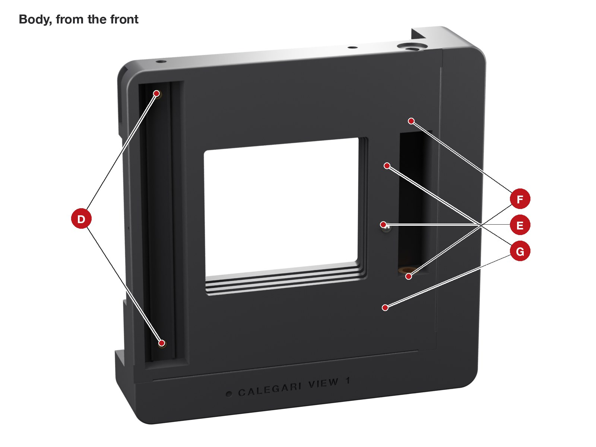

| | What goes here | Qty | How | Step |
|---|---|---|---|---|
| **D** | M3 x 3 insert | 2 | in the floor of the vertical rail channel, one at each end | 1 |
| **E** | M5 ball plunger | 1 | tap M5, then screw in from the front, ball 0.6 mm proud | 1 |
| **F** | bronze bushing 6 x 10 x 6 | 2 | one in each end wall of the screw channel | 4 |
| **G** | nothing, no velvet | | the two hard pads of the Y plate slide on this strip | |

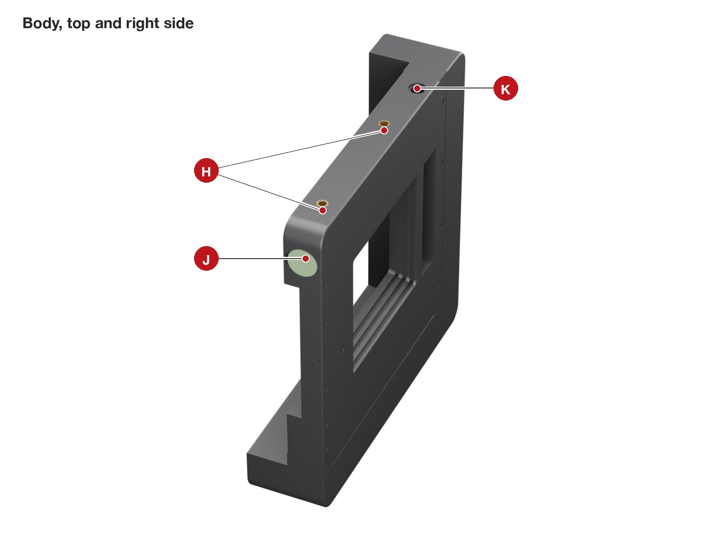

| | What goes here | Qty | How | Step |
|---|---|---|---|---|
| **H** | M4 insert (Ruthex M4 x 8.1) | 2 | in the top face, for the top handle | 1 |
| **J** | tubular spirit vial | 1 | glued in the slot on the photographer's right side | 3 |
| **K** | M6 rod, O-ring and knob | | the rise screw enters here | 5 |

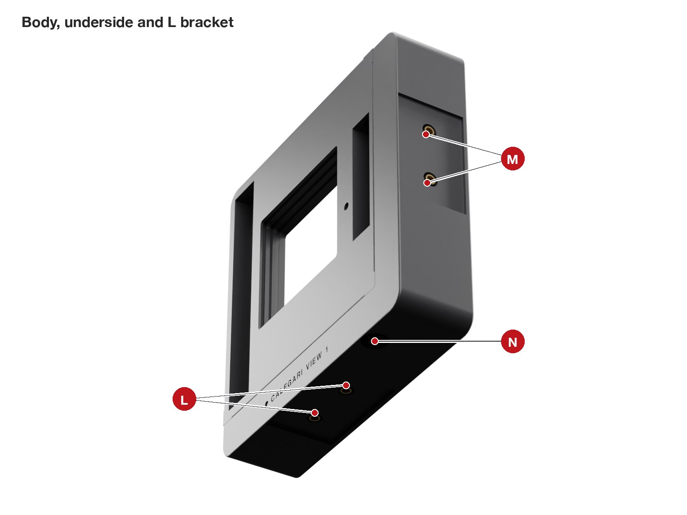

| | What goes here | Qty | How | Step |
|---|---|---|---|---|
| **L** | 1/4"-20 insert | 2 | in the floor of the bottom Arca pocket | 1 |
| **M** | 1/4"-20 insert | 2 | in the floor of the side leg's Arca pocket | 1 |
| **N** | two M6 nuts | | the rise screw comes out here | 5 |

1. **A.** Lay the body front face down on a towel. Press the four M3 inserts into the floor of the rear recess. Check with the straightedge: this floor is where the Graflok module, and so the film, sits.
2. **D.** Turn the body over. Press the two M3 inserts into the rail channel floor.
3. **H.** Stand the body on its bottom. Press the two M4 inserts into the top face.
4. **L and M.** Lay the body on its back. Press two 1/4" inserts into the bottom pocket, then turn it on its side and do the side leg.
5. **E.** Tap M5 into the small hole on the front face, to the photographer's left of the window (right in the front view). Screw the ball plunger in with a hex key until the ball stands 0.6 mm proud:
   - put the feeler gauge flat on the face next to the plunger and lay the ruler across both;
   - turn the plunger until the ball just touches the ruler.

**Check.** No insert is proud on any face. Press the plunger ball with a fingertip: it must spring back.

## 2. Graflok module, clamp blade and wheel

**You need:** the Graflok module, the red blade, the wheel, 3 M3 x 3 inserts, 4 M3 x 8 countersunk, 2 M3 x 6 countersunk, 1 M3 x 8 socket head.

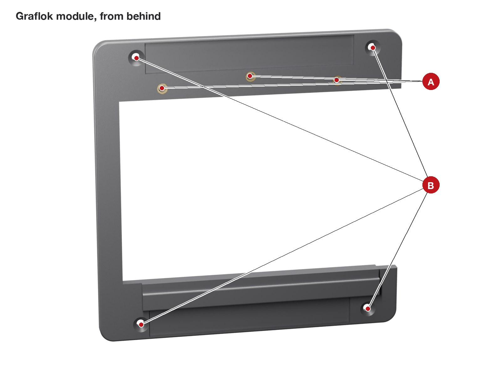

| | What goes here | Qty | How | Step |
|---|---|---|---|---|
| **A** | M3 x 3 insert | 3 | in the floor of the shallow recess along the top of the rear face: two for the blade, the middle one for the wheel | 2 |
| **B** | M3 x 8 countersunk | 4 | through the module into the body inserts A | 2 |

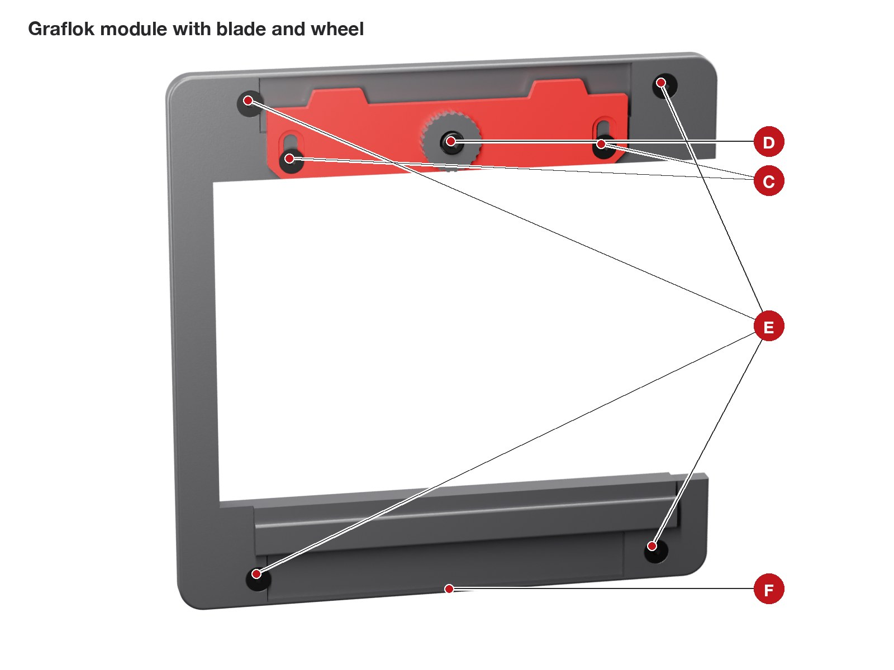

| | What goes here | Qty | How | Step |
|---|---|---|---|---|
| **C** | M3 x 6 countersunk | 2 | through the blade slots into the outer inserts | 2 |
| **D** | wheel with an M3 x 8 socket head | 1 | into the middle insert | 2 |
| **E** | the four screws of B, in place | | | |
| **F** | nothing | | fixed bottom rail: the back hooks under it | |

1. **A.** Press the three inserts, module rear face up.
2. **B.** Drop the module into the body's rear recess. The open side of the module (for the dark slide) goes to the photographer's right, over the passage C of the body. Fix it with the four countersunk screws: snug, not tight.
3. **C.** Lay the red blade in the recess, tongues pointing up. Put the two countersunk screws through its slots, tighten them gently, then back them off a quarter turn: the blade must slide up and down under its own weight.
4. **D.** Put the knurled wheel over the U-slot of the blade and screw it in with the M3 x 8. Turning the wheel clockwise clamps the blade; anticlockwise frees it.

**Check.** With the wheel loose, the blade slides the full length of its slots. With the wheel tight, it does not move.

## 3. Arca plates, top handle and levels

**You need:** the two Arca plates with their 1/4" screws, the top handle, 2 M4 x 50 socket heads, 2 tubular vials, a few drops of epoxy.

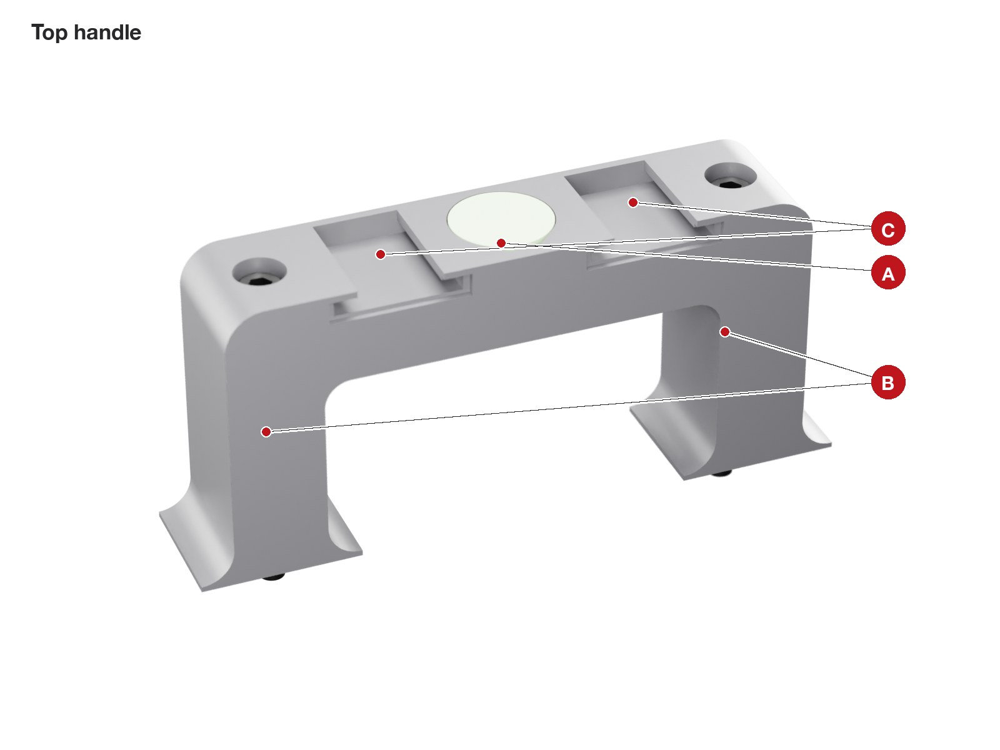

| | What goes here | Qty | How | Step |
|---|---|---|---|---|
| **A** | tubular spirit vial | 1 | glued in the slot at the back of the bar | 3 |
| **B** | M4 x 50 socket head | 2 | from the top of the bar, down through the posts into the body inserts H | 3 |

1. **Arca plates.** Remove any rubber pad from the plates. Seat one plate in the bottom pocket and one in the side leg's pocket, and screw each in with two 1/4" screws into L and M. The plate's safety stops, if any, go toward the rear.
2. **Top handle.** Bolt it on with the two M4 x 50 screws into H. Tighten firmly: this handle carries the camera.
3. **Landscape level (A).** Put the camera on a tripod on its bottom plate and level it with a phone level on the top of the body. Put a drop of epoxy in the slot at the back of the handle bar, lay the vial in, and centre the bubble. Leave the camera alone until the epoxy sets.
4. **Portrait level (body J).** Move the camera to the side plate (lens pointing forward, the top of the body now toward the photographer's left), level it again with the phone, and glue the second vial in the slot J the same way.

A strap attaches to the top handle: loop Peak Design Anchors, or any cord, around the bar.

## 4. Vertical guide, bushings and body velvet

**You need:** one 134 mm MGN9 rail, two MGN9H carriages, 2 M3 x 6 socket heads, 2 bronze bushings, epoxy, alcohol, velvet piece V1.

1. **Bond the rail.** Degrease the rail's underside and the channel floor with alcohol. Put a thin line of epoxy along the middle of the channel floor, between the two raised ribs. Press the rail in, pushed against the ribs, and fix it through its **two outermost holes** with the M3 x 6 screws into the inserts D. Wipe away any epoxy that squeezes out: it must not reach the rail's top.
2. **Carriages.** Hold a carriage's dummy rail end to end with the real rail and slide the carriage across. Do the same with the second. Leave both near the middle.
3. **Bushings (F).** Drop a bushing into the screw channel at its top end, then push it sideways into the round seat in the end wall until it is flush with the wall. Push it with a 6 mm bolt through its bore so it goes in square. Do the bottom one the same way. If a seat is tight, ream it with a 10 mm drill turned by hand.
4. **Velvet V1.** Cut V1 from its template. Stick it on the body front face around the window, the edge marked *rail side* toward the rail. The window of the velvet is 1 mm larger than the body's window all round. The strip G and the ball plunger E stay uncovered.

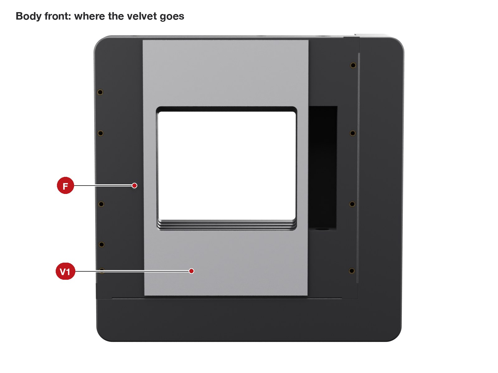

**Check.** Slide each carriage the full length of the rail: smooth, no notch. Let the epoxy cure overnight before step 5.

## 5. Y plate, rise screw and knob

**You need:** the Y plate, 7 M3 x 3 inserts, 1 brass M6 nut, 1 M5 ball plunger, the 2 printed pads, 8 M3 x 12 socket heads, the 8 printed plugs, the 160 mm M6 rod, 3 stainless M6 nuts, 1 O-ring, 1 knob, 1 M3 x 4 grub screw, Loctite 243.

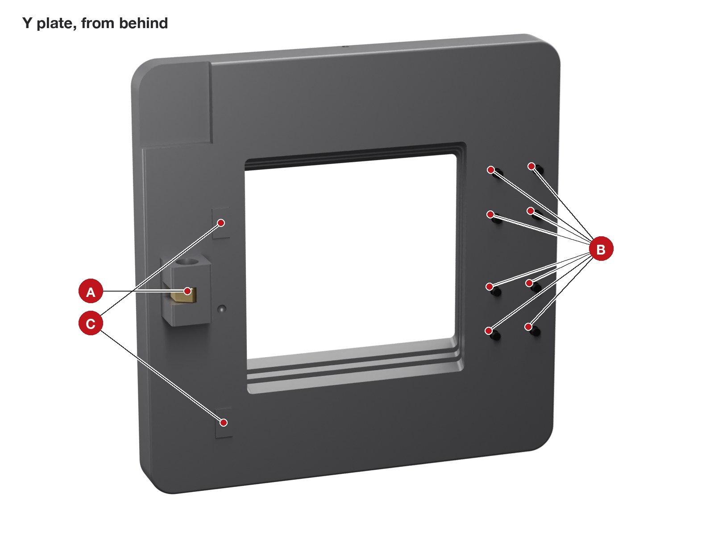

| | What goes here | Qty | How | Step |
|---|---|---|---|---|
| **A** | brass M6 nut | 1 | slid into the pocket of the turret from the photographer's left, flats vertical | 5 |
| **B** | M3 x 12 socket head | 8 | from the front, through the plate into the carriages | 5 |
| **C** | nothing | | two hard pads, printed with the plate: they slide on the body strip G | |

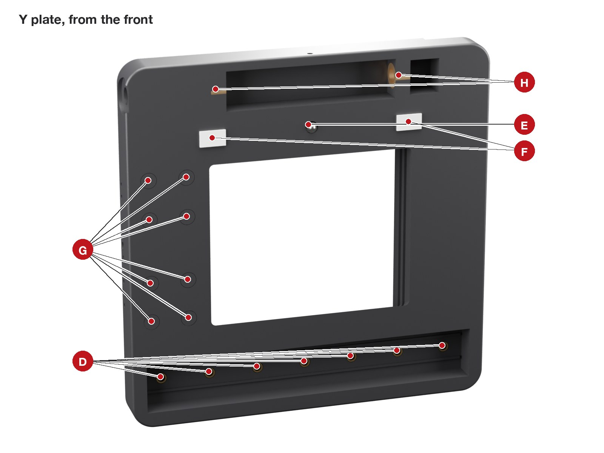

| | What goes here | Qty | How | Step |
|---|---|---|---|---|
| **D** | M3 x 3 insert | 7 | in the floor of the bottom rail channel | 5 |
| **E** | M5 ball plunger | 1 | tap M5, then screw in from the front, ball 0.6 mm proud | 5 |
| **F** | printed pad | 2 | pressed into the two rectangular pockets until they bottom out | 5 |
| **G** | printed plug | 8 | pressed into the counterbores over the screw heads B | 5 |
| **H** | bronze bushing | 2 | one in each end wall of the top screw channel | 6 |

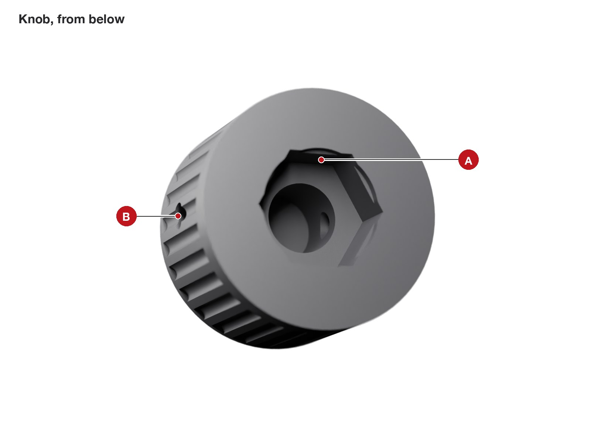

| | What goes here | Qty | How | Step |
|---|---|---|---|---|
| **A** | stainless M6 nut | 1 | pressed into the hex pocket, flush | 5 |
| **B** | M3 x 4 nylon-tip grub screw | 1 | tap M3, it locks the knob on the rod | 5 |

1. **Inserts D.** Press the seven M3 inserts into the bottom channel of the Y plate front.
2. **Plunger E.** Tap M5 into the hole above the window and set the plunger 0.6 mm proud, as in step 1.
3. **Pads F.** Press the two printed pads into their pockets beside the plunger, with the vice, until they touch the bottom of the pocket. They stand 0.8 mm proud.
4. **Drive nut A.** Slide the brass nut into the turret on the plate rear, from the side, flats vertical. It is meant to float a little and cannot turn.
5. **Mount the plate.** Line the two carriages up with the plate's holes: they sit 42 mm apart, centre to centre. Lower the plate onto them with the turret going into the screw channel of the body. Fix it with the eight M3 x 12 screws B, from the front: all loose first, then tight in a cross pattern.
6. **Check the light seal faces.** The two pads C on the plate's rear must touch the body strip G, and the velvet V1 is squeezed between the faces. Push the plate by hand along its travel: it moves with an even, light drag.
7. **Plugs G.** Press the eight printed plugs into the counterbores, flush with the face. They keep the light seal continuous over the screw heads.
8. **Rise screw.** Push the 160 mm rod down from the top of the body through hole K, the top bushing, and the brass nut (turn the rod to thread it through the nut), then through the bottom bushing and out of the recess N in the bottom face.
9. **Bottom nuts (N).** Screw two M6 nuts onto the bottom end until the first touches the top of the recess. Put a small drop of Loctite 243 between them, away from the plastic, and jam them against each other with two spanners.
10. **Knob.** Press an M6 nut into the knob's hex pocket (A). Tap M3 into the small radial hole (B). Put the O-ring over the rod on the body's top face, screw the knob down the rod until the O-ring is lightly squeezed, and lock it with the grub screw.

**Check.** Turn the knob: the plate moves 1 mm per turn, clicks at zero, and stops hard at +25 and -25 mm. It stays where you leave it. If it is stiff, back the knob off a quarter turn before locking the grub screw again.

## 6. Horizontal guide, bushings and Y plate velvet

**You need:** the second 134 mm rail, two carriages, 7 M3 x 6 socket heads, 2 bronze bushings, velvet piece V2.

1. **Rail.** Screw the rail into the bottom channel of the Y plate front with seven M3 x 6 screws into the inserts D, pushed against the locating ribs. No glue here: the rail is screwed along its whole length.
2. **Carriages.** Slide on the two carriages from their dummy rails.
3. **Bushings H.** Press the two bushings into the end walls of the top screw channel, as in step 4.
4. **Velvet V2.** Stick V2 on the Y plate front, around the window, over the plugs. Its top edge stays below the pads F and the plunger E.

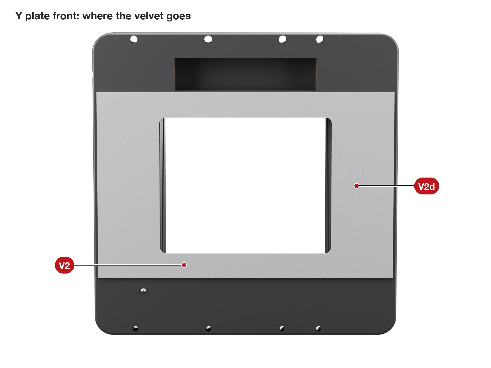

## 7. Lens panel, M65 flange, turret, shift screw and knob

**You need:** the lens panel, the turret, the metal M65 flange, 3 M3 x 3 inserts, 1 brass M6 nut, 4 M3 x 6 countersunk, 2 M3 x 10 socket heads, 8 M3 x 10 countersunk, 1 M3 x 5 socket head, the 140 mm M6 rod, 3 stainless M6 nuts, O-ring, knob, M3 x 4 grub screw.

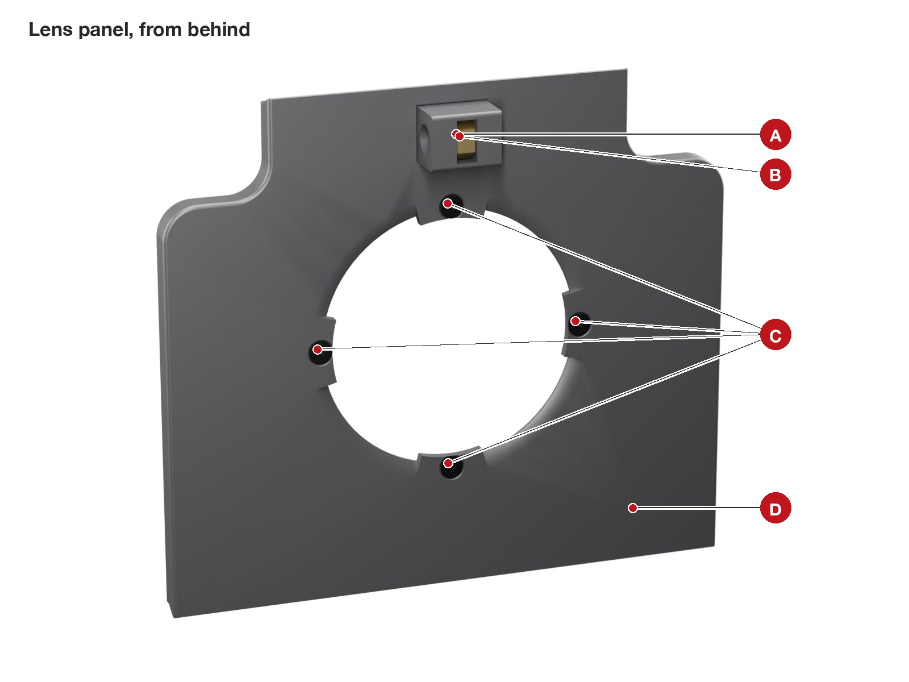

| | What goes here | Qty | How | Step |
|---|---|---|---|---|
| **A** | M3 x 3 insert | 2 | in the rear face, above the window | 7 |
| **B** | brass M6 nut | 1 | in the turret's pocket, from below, before the turret is screwed on | 7 |
| **C** | M3 x 10 socket head | 2 | through the turret into A | 7 |
| **D** | M3 x 6 countersunk | 4 | from behind, through the panel into the flange's M3 holes | 7 |

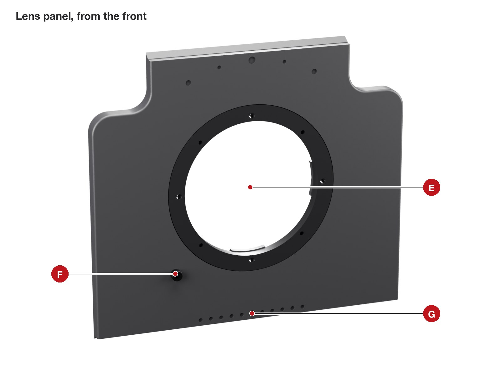

| | What goes here | Qty | How | Step |
|---|---|---|---|---|
| **E** | RafCamera M65 flange | 1 | dropped into the round pocket, flush | 7 |
| **F** | M3 x 3 insert, then an M3 x 5 socket head with its head standing | 1 + 1 | the infinity stop pin | 7 |
| **G** | M3 x 10 countersunk | 8 | from the front into the carriages | 7 |

1. **Inserts.** Press two M3 inserts into A on the rear face, and one into F on the front face (bottom corner, photographer's right).
2. **Flange E.** Drop the metal flange into the front pocket. Turn it until its four threaded M3 holes sit over the four countersunk holes of the panel. Fix it from behind with the four M3 x 6 countersunk screws D.
3. **Turret.** Put the brass nut into the turret's pocket from below (B), flats horizontal, and screw the turret to the panel rear with the two M3 x 10 screws C.
4. **Mount the panel.** Space the two carriages 42 mm apart. Lower the panel onto them, turret into the Y plate's top screw channel, and fix it with the eight M3 x 10 countersunk screws G from the front. The panel rests on the two pads F of the Y plate.
5. **Shift screw.** Push the 140 mm rod in from the photographer's right edge of the Y plate, through the right bushing, the brass nut (turn the rod) and the left bushing.
6. **End nuts.** Two M6 nuts on the left end, in the pocket, jammed together with a drop of Loctite, as in step 5.
7. **Knob.** Nut, grub hole, O-ring and knob, as in step 5.
8. **Stop pin F.** Screw the M3 x 5 socket head into the front insert, leaving 3 mm of the head standing proud. This is the pin the focus ring stops against at infinity.

**Check.** Turn the shift knob: 1 mm per turn, a click at zero, hard stops at 25 mm each side. At every position, look at the gap between the panel and the Y plate from the side: it is even.

## 8. Helicoid and focus ring

**You need:** the M65 helicoid, the focus ring, 4 M3 x 4 nylon-tip grub screws, 1 M3 x 12 socket head (the infinity stop screw), the M3 tap, Loctite 222.

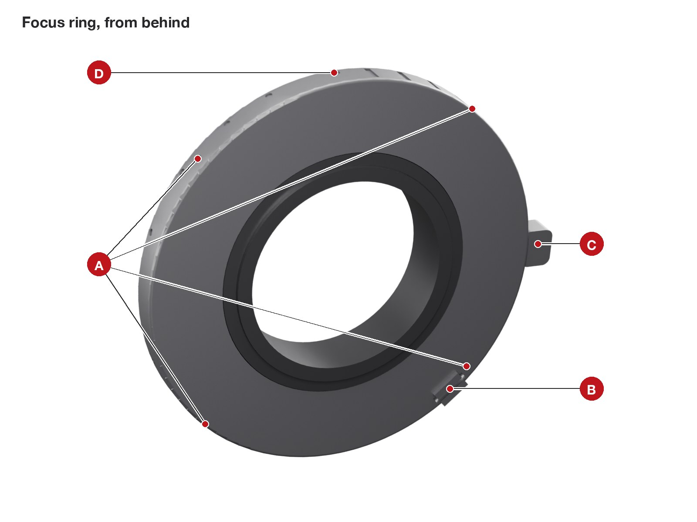

| | What goes here | Qty | How | Step |
|---|---|---|---|---|
| **A** | M3 x 4 nylon-tip grub screw | 4 | tap M3, radial, they clamp the ring on the helicoid | 8 |
| **B** | M3 x 12 socket head | 1 | tap M3 through the tab; the screw tip comes out toward the stop pin | 8 |
| **C** | nothing | | the focusing lever | |
| **D** | nothing | | the red infinity dot | |

1. **Helicoid.** Put one drop of Loctite 222 on the flange thread. Screw the helicoid's rear (male) thread into the metal flange until its shoulder seats. Hold the helicoid's rear part, turn its focusing grip, and check that the **front does not rotate**: it only moves in and out.
2. **Tap the ring.** Tap M3 into the four radial holes A and through the tab B.
3. **Focus ring.** Slide the ring over the helicoid's grip, tab and lever toward the camera. Screw in the four grub screws until they just touch: the ring is aligned during [calibration](calibration.md#3-infinity-teach-the-camera-where-infinity-is).
4. **Stop screw B.** Screw the M3 x 12 into the tab from the side away from the stop pin, until its tip comes out 2 mm on the pin side.

## 9. Adapter ring, board holder, lens board and lens

**You need:** the adapter ring, the board holder, the red latch, 4 M3 x 3 inserts, 4 M3 x 6 button heads, 2 M2.5 x 6 button heads, the 4 x 10 mm spring, felt pieces V3 and V4, the lens board and the lens.

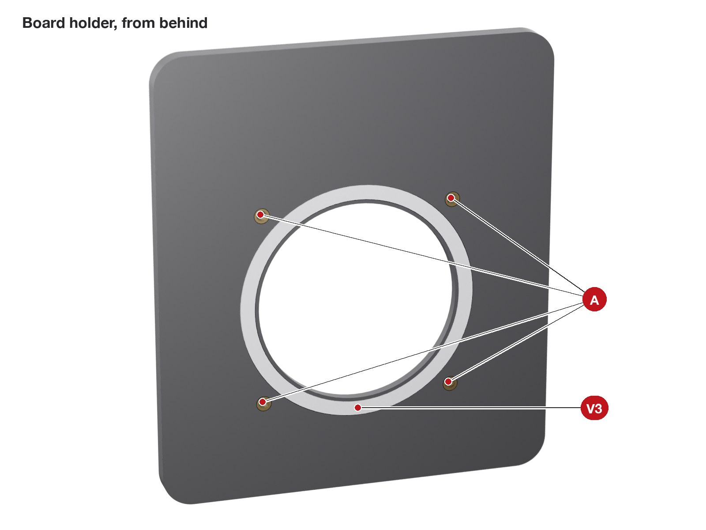

| | What goes here | Qty | How | Step |
|---|---|---|---|---|
| **A** | M3 x 3 insert | 4 | in the rear face | 9 |
| **V3** | felt ring | 1 | in the round groove around the hole | 9 |

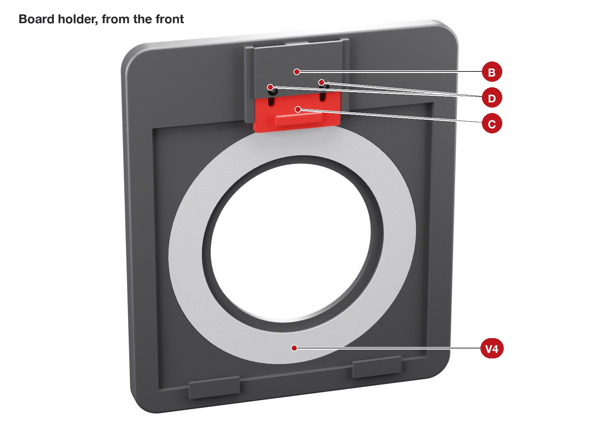

| | What goes here | Qty | How | Step |
|---|---|---|---|---|
| **V4** | felt ring | 1 | in the shallow round seat under the board | 9 |
| **B** | spring 4 x 10 | 1 | in its channel, between the latch and the stop block | 9 |
| **C** | red latch | 1 | between the two rails | 9 |
| **D** | M2.5 x 6 button head | 2 | through the latch slots, straight into the plastic | 9 |

1. **Inserts A.** Press the four inserts into the holder's rear face.
2. **Felt V3 and V4.** Cut both rings from their template. V3 goes into the groove on the back, V4 into the shallow seat on the front. Press them flat.
3. **Adapter ring.** Screw the printed adapter's male thread into the front of the helicoid, by hand, until it stops.
4. **Holder.** Put the holder on the adapter and screw it on with the four M3 x 6 button heads through the arc slots of the adapter into A. Leave them loose, turn the holder until its edges are square with the lens panel, then tighten.
5. **Latch.** Put the spring in its channel. Lay the red latch between the rails over it, and fix it with the two M2.5 screws through its slots: they cut their own thread in the plastic. Tighten gently, then back off a quarter turn. Pull the latch up with a thumbnail and let go: it must snap back down by itself.
6. **Lens board.** Screw the lens onto the board with its retaining ring, from behind. Hook the board's bottom edge under the two lips of the holder, press the top in, and let the latch drop over it.

**Check.** The board sits flat and does not rattle; the latch covers its top edge by 4 mm.

## 10. Film back

1. **Loosen and lower.** Turn the wheel anticlockwise and slide the red blade down.
2. **Hook the bottom.** Hook the back's bottom lip under the fixed bottom rail of the Graflok module. This rail also releases the Pro-S dark slide interlock.
3. **Seat the back.** Swing the back onto the seat: its nose goes into the recess.
4. **Lock.** Slide the blade up so its two tongues enter the slots in the top of the back, then tighten the wheel.
5. **Dark slide.** It comes out toward the photographer's right, through the passage C of the body.
6. **Advance after each frame.** Press the back's own wind-stop release lever by hand: the camera has no automatic coupling (see [design notes](design.md#open-points)).

The ground glass goes on the same way. Now go to [calibration](calibration.md), then [using the camera](using.md).

## Hardware by step

| Step | Inserts | Screws | Other |
|---|---|---|---|
| 1 | M3 x 8, M4 x 2, 1/4" x 4 | | M5 plunger |
| 2 | M3 x 3 | M3 x 8 countersunk x 4, M3 x 6 countersunk x 2, M3 x 8 socket x 1 | |
| 3 | | M4 x 50 x 2, the Arca plates' own screws | 2 vials |
| 4 | | M3 x 6 socket x 2 | rail, 2 carriages, 2 bushings, V1, epoxy |
| 5 | M3 x 7 | M3 x 12 socket x 8, M3 x 4 grub x 1 | M5 plunger, brass nut, 3 steel nuts, rod 160, O-ring, knob, pads, plugs |
| 6 | | M3 x 6 socket x 7 | rail, 2 carriages, 2 bushings, V2 |
| 7 | M3 x 3 | M3 x 6 countersunk x 4, M3 x 10 socket x 2, M3 x 10 countersunk x 8, M3 x 5 socket x 1, M3 x 4 grub x 1 | flange, brass nut, 3 steel nuts, rod 140, O-ring, knob |
| 8 | | M3 x 4 grub x 4, M3 x 12 socket x 1 | helicoid |
| 9 | M3 x 4 | M3 x 6 button x 4, M2.5 x 6 button x 2 | spring, V3, V4 |
