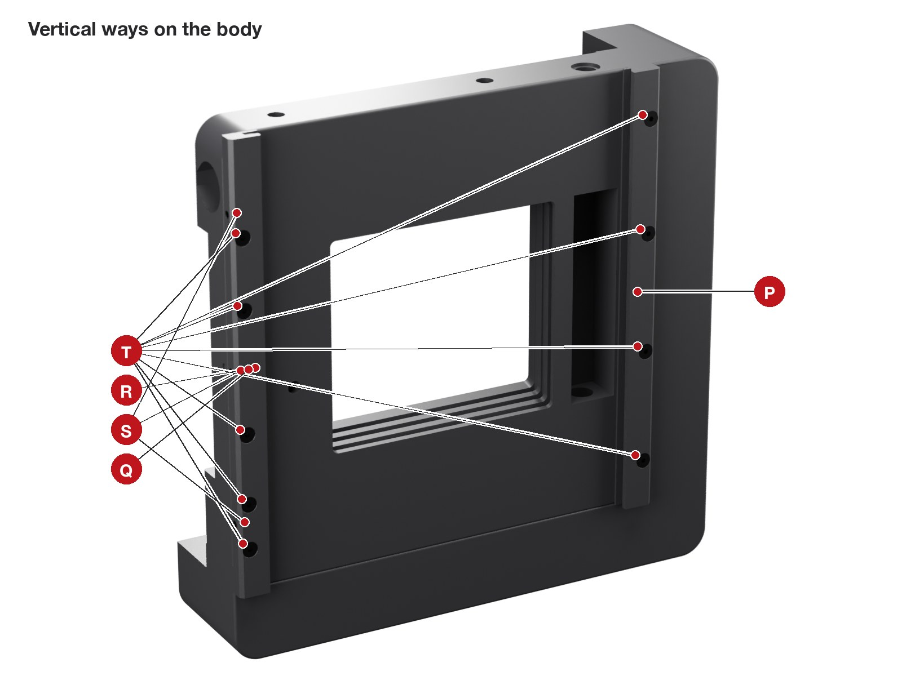
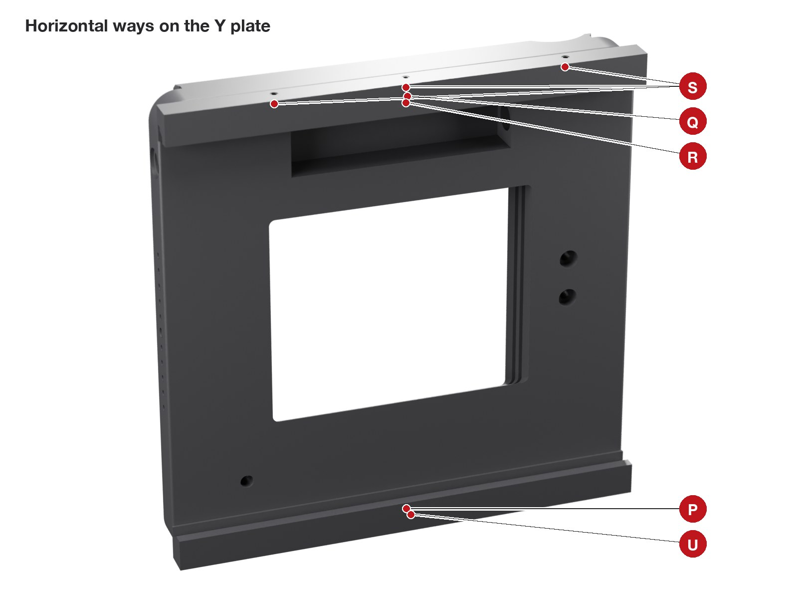
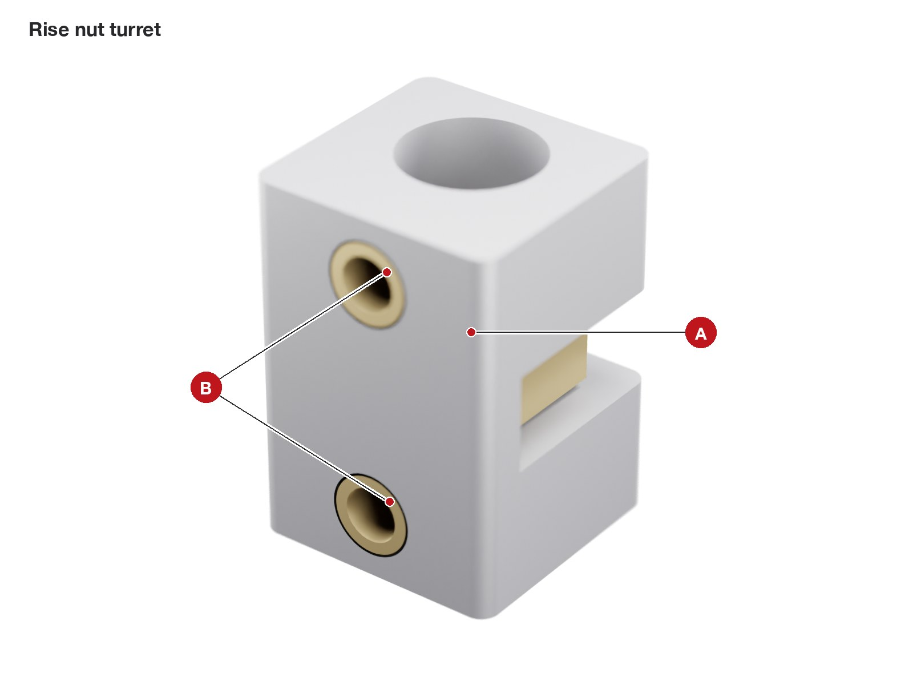
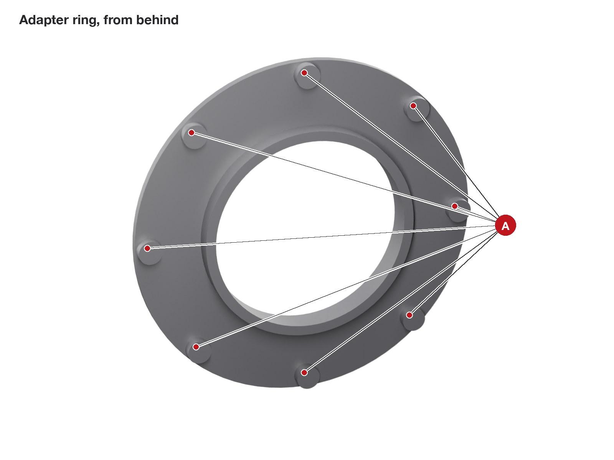

# Assembly

[Back to the project](../README.md)

This guide assumes you have never built anything like it. Every hole of every printed part is shown in a picture with a red letter, and a table next to it says what goes into that hole, how many, with which tool, and in which step. Follow the steps in order: the order was checked part by part, and some screws cannot be reached later.

Allow a day for the first build: about five hours of work, plus waiting for epoxy and threadlocker to cure.

## Words used in this guide

- **Front** is the lens side, **rear** is the film side.
- **Photographer's left and right** are as you stand behind the camera looking at the ground glass. A picture taken from the front shows them mirrored: the photographer's left is on the right of the picture.
- **Insert** means a brass heat-set insert: a small threaded sleeve melted into the plastic so a metal screw has metal threads to bite. Sizes are written M3 x 3 (thread x length).
- **Proud** means sticking out above a surface; **flush** means level with it.
- The **Y plate** moves up and down (rise and fall). The **lens panel** moves left and right (shift) and carries the lens. Together they are the **front standard**.
- A **dovetail way** is a printed rail with a slanted edge; the plate's slanted edge (its **lip**) slides under it. One rail of each pair is fixed; the other holds a **gib strip**, a thin printed bar pushed by three grub screws to take up the play.

## Before you start

1. **Print and check the parts.** Everything in [printing](printing.md), including the checks under *After printing*.
2. **Do the tests first.** Section 1 of [calibration](calibration.md) tells you whether your RB67 back fits and whether the dovetails slide, before you spend a day assembling.
3. **Sort the hardware.** Put a strip of masking tape on the table and lay out the screws by size. Every step starts with a *You need* list.
4. **Clean the holes.** Pull out any stringing with a hook or a drill turned by hand.

### Tools

| Tool | Used for |
|---|---|
| Soldering iron with heat-set tips for M2.5, M3, M4 and 1/4" | inserts |
| Hex keys 1.5, 2, 2.5 and 3 mm | grub screws, M2.5, M3 and M4 screws |
| M3 and M5 taps with a small tap wrench | threads cut into the plastic |
| 8 mm drill bit (turned by hand) | reaming the bushing seats |
| 10 mm spanner | the knob nuts and cap nuts |
| A small vice or a clamp, a flat piece of wood | pressing bushings and nuts |
| Steel ruler or straightedge, caliper | flatness and heights |
| Feeler gauge 1.0 mm (or ten sheets of 80 g printer paper) | ball plunger height |
| Sharp scissors, a new craft blade | velvet and felt |
| Loctite 243 and 222, two-part epoxy, isopropyl alcohol, cotton buds, black acrylic paint | as listed in the steps |

### Five techniques you will use

**1. Heat-set inserts.** This is most of the work, so practise on a test coupon first.

1. Set the iron to 230 C (ASA). Put the right tip on and let it heat for a minute.
2. Drop the insert into the hole with its **narrow end down**. It sits on the rim of the hole.
3. Put the tip into the insert and let it sink under its own weight plus a light push, straight down, for 5 to 10 seconds. Do not force it: if it does not move, wait.
4. Stop when the insert is 0.2 mm below the surface. Pull the tip straight out.
5. While the plastic is still soft, press a cold flat steel part (the side of a spanner) on the insert for five seconds: it comes out square and never proud.
6. Check: lay the straightedge across the hole. It must rock on nothing. An insert standing proud of a sliding face or of the back's seat leaks light or tilts the back.

The camera has 18 M3 inserts, 17 M2.5, 2 M4 and 4 of 1/4". The bigger ones take 15 to 20 seconds: go slowly and keep the iron vertical.

**2. Tapping a thread into the plastic.** Used for the two ball plungers (M5) and for the small grub-screw holes (M3). The holes are printed at the right size.

1. Put the tap in the wrench and start it straight, looking from two sides.
2. Turn half a turn in, a quarter turn back, and repeat. The plastic chips must break off.
3. Go only as deep as the hole. Blow the chips out.

**3. Pressing.** Bushings and the knob nuts are press fits. Use the vice or a clamp, never a hammer: ASA cracks. Put a flat piece of wood on the printed side.

**4. Threadlocker.** Anaerobic threadlockers attack ASA and can crack it. Use them only where metal meets metal: Loctite 243 on the two cap nuts (steel on the rod), Loctite 222 on the helicoid thread and on the Graflok blade screws (steel into brass inserts). One small drop, never on the plastic.

**5. Velvet and felt.** The camera has no bellows: light is kept out by sliding faces 0.8 mm apart with self-adhesive velvet between them. The pieces are V1, V2 (with two small discs) and the felt rings V3 and V4.

1. Print the templates in `print/templates/` at 100 %. Measure the 100 mm bar on the sheet: if it is not 100 mm, fix the printer scaling first.
2. Tape the template on the back of the velvet (the paper side), and cut through both with scissors for the outer edge and a craft blade against a ruler for the window.
3. Measure the velvet thickness with the caliper, pressing lightly: it must be 0.9 to 1.2 mm.
4. Degrease the plastic with alcohol. Peel off the backing, align one edge, and lay the velvet down from that edge like a screen protector. Press it all over with your thumb.
5. The velvet must never cover a ball plunger, a rail, or a hole a screw still has to reach (except where this guide says so).

---

## 1. Body

**You need:** the body, 4 M3 x 3 inserts, 9 M2.5 inserts, 2 M4 inserts, 4 inserts 1/4"-20, one M5 ball plunger, two 6 x 8 x 6 bushings, the M5 tap, epoxy.

The body has holes on five faces. The four pictures below show all of them; letters are unique to the body.

| | What goes here | Qty | How | Step |
|---|---|---|---|---|
| **A** | M3 x 3 insert | 4 | in the floor of the big rear recess (the seat of the Graflok module), pressed from behind | 1 |
| **B** | nothing | | light-trap grooves in the seat: keep them clean | |
| **C** | nothing | | passage for the dark slide handle | |
| **D** | the back of the rise ball plunger | | you set its height from here | 1 |

| | What goes here | Qty | How | Step |
|---|---|---|---|---|
| **E** | M2.5 insert | 9 | along the two side edges of the front face: 5 on the photographer's right (left in this picture), 4 on the left | 1 |
| **F** | M5 ball plunger | 1 | tap M5 through, screw in from the front, set from behind (D) | 1 |
| **G** | bronze bushing 6 x 8 x 6 | 2 | one in each end wall of the screw channel | 1 |

| | What goes here | Qty | How | Step |
|---|---|---|---|---|
| **H** | M4 insert (Ruthex M4 x 8.1) | 2 | in the top face, for the top handle | 1 |
| **J** | 15 mm bull's-eye level | 1 | glued in the pocket on the photographer's right side | 3 |
| **K** | rise rod, O-ring and knob | | the rise screw comes out here | 6 |

| | What goes here | Qty | How | Step |
|---|---|---|---|---|
| **L** | 1/4"-20 insert | 2 | in the floor of the bottom Arca pocket | 1 |
| **M** | 1/4"-20 insert | 2 | in the floor of the side leg's Arca pocket | 1 |
| **N** | the rise rod's cap nut | | it sits in this recess | 6 |

1. **A.** Lay the body front face down on a towel. Press the four M3 inserts into the floor of the rear recess. Check with the straightedge: this floor is where the film sits.
2. **E.** Turn the body over. Press the nine M2.5 inserts into the front face along the two side edges.
3. **H, L, M.** Press the two M4 inserts into the top face, then the four 1/4" inserts into the two Arca pockets.
4. **F and D.** Tap M5 through the small hole on the front face, to the photographer's right of the window (left in the front view). Screw the plunger in from the front, ball first toward you, until its hex is inside. Then, from behind (D), turn it with a hex key until the ball stands **1.0 mm** proud of the front face: lay the feeler gauge on the face next to it and a ruler across both, and stop when the ball touches the ruler. Put a small drop of epoxy on the thread at the back and scrape it flush with the seat: it locks the plunger and seals the hole.
5. **G.** Ream the two bushing seats with the 8 mm drill turned by hand. Drop a bushing into the screw channel at its top end and push it sideways into the round seat in the end wall until it is flush. Push it with a 6 mm bolt through its bore so it goes in square. Do the bottom one the same way.

**Check.** No insert is proud on any face. Press the plunger ball with a fingertip: it springs back.

## 2. Graflok module, clamp blade and wheel

**You need:** the Graflok module, the blade, the wheel, 3 M3 x 3 inserts, 4 M3 x 8 countersunk, 2 M3 x 5 countersunk, 1 M3 x 6 hex-head bolt, Loctite 222, epoxy.

If the module from the test plate fitted your back, use that one.

| | What goes here | Qty | How | Step |
|---|---|---|---|---|
| **A** | M3 x 3 insert | 3 | in the floor of the shallow recess along the top of the rear face: two for the blade, the middle one for the wheel | 2 |
| **B** | M3 x 8 countersunk | 4 | through the module into the body inserts A | 2 |

| | What goes here | Qty | How | Step |
|---|---|---|---|---|
| **C** | M3 x 5 countersunk | 2 | through the blade slots into the outer inserts, with Loctite 222 | 2 |
| **D** | wheel with an M3 x 6 hex-head bolt | 1 | the bolt head sits in the wheel's hex pocket | 2 |
| **E** | the four screws of B, in place | | | |
| **F** | nothing | | fixed bottom rail: the back hooks under it | |

1. **A.** Press the three inserts, module rear face up.
2. **B.** Drop the module into the body's rear recess. The open side of the module (for the dark slide) goes to the photographer's right, over the passage C of the body. Fix it with the four countersunk screws: snug, not tight.
3. **C.** Lay the blade in the recess, tongues pointing up. Put a small drop of Loctite 222 on the two countersunk screws, screw them through the blade slots until they just touch, then back them off a quarter turn: the blade must slide up and down under its own weight. Leave the threadlocker to set for an hour: the screws then stay where they are.
4. **D.** Put a drop of epoxy in the wheel's hex pocket and press the hex bolt's head into it, so the bolt cannot fall out. Once it has set, put the wheel over the U-slot of the blade and screw it in. Turning the wheel clockwise clamps the blade; anticlockwise frees it.

**Check.** With the wheel loose, the blade slides the full length of its slots. With the wheel tight, it does not move.

## 3. Arca plates, top handle and levels

**You need:** the two Arca plates, 4 screws 1/4"-20 x 1/2", the top handle, 2 M4 x 45 socket heads, two 15 mm bull's-eye levels, epoxy.

| | What goes here | Qty | How | Step |
|---|---|---|---|---|
| **A** | 15 mm bull's-eye level | 1 | glued in the pocket on top of the bar | 3 |
| **B** | M4 x 45 socket head | 2 | from the top of the bar, down through the posts into the body inserts H | 3 |
| **C** | nothing | | two accessory shoes: slide a viewfinder, a meter or a level in from the back | |

1. **Arca plates.** Remove any rubber pad from the plates. Seat one plate in the bottom pocket and one in the pocket of the side leg, each with two 1/4"-20 x 1/2" screws into L and M (the plate's slot must be at least 40 mm long).
2. **Top handle.** Bolt it on with the two M4 x 45 screws into H. Tighten firmly: this handle carries the camera.
3. **Landscape level (A).** Put the camera on a tripod on its bottom plate and level it with a phone level laid on the top of the body, in both directions. Put a drop of epoxy in the pocket on top of the handle, press the bull's-eye in, and wait for the glue to set without touching the camera.
4. **Portrait level (J).** Move the camera to the side plate (lens pointing forward, the top of the body now toward the photographer's left), level it again with the phone, and glue the second bull's-eye in the pocket J the same way.

A strap attaches to the top handle: loop Peak Design Anchors, or any cord, around the bar between the posts.

## 4. Vertical ways and body velvet

**You need:** the two vertical rails (the fixed one is plain; the gib one has three small holes on its outer face and a pocket along its inside), 9 M2.5 x 10 countersunk, the M3 tap, velvet piece V1.

| | What goes here | Qty | How | Step |
|---|---|---|---|---|
| **P** | fixed rail | 1 | on the photographer's **left** edge (right in this picture), slanted side inward | 4 |
| **Q** | gib rail | 1 | on the photographer's **right** edge, its three small holes facing outward | 4 |
| **R** | gib strip | 1 | slides into the pocket of Q | 6 |
| **S** | M3 x 6 cone-point grub screw | 3 | through the holes of Q, onto the dimples of the strip | 6 |
| **T** | M2.5 x 10 countersunk | 9 | through the rails into the body inserts E | 4 |

1. **Tap** M3 into the three small holes of the gib rail Q.
2. **Rails.** Lay the fixed rail P on the photographer's left edge of the body front, slanted side facing the window, and screw it down with four countersunk screws T. Do the same with the gib rail Q on the right edge (five screws). The rails' round ends go to the top where the body corner is round.
3. **Velvet V1.** Cut V1 from its template. Stick it on the body front around the window: the side marked *ball plunger side* goes toward the plunger F, which stays uncovered. The velvet window is 0.3 mm larger than the body's window all round.

**Check.** Run a fingernail along the inside of both rails: no step, no burr.

## 5. Front standard, on the bench

**You need:** the Y plate, the lens panel, the two horizontal rails, the X gib strip, the shift nut turret, the metal M65 flange, 8 M2.5 inserts, 1 M3 x 3 insert, 1 brass M6 nut, 2 bushings, 1 M5 ball plunger, 4 M3 x 6 countersunk, 8 M2.5 x 16 socket heads, 4 M3 x 6 cone-point grubs, the 170 mm rod with a cap nut and an M6 washer, O-ring, knob with its M6 nut, velvet V2, epoxy, Loctite 243, black paint.

The front standard is built as one unit on a clean flat table, then slides into the body in step 6.

| | What goes here | Qty | How | Step |
|---|---|---|---|---|
| **A** | M2.5 x 16 socket head | 8 | from behind into the inserts in the horizontal rails | 5 |
| **B** | the rise nut turret | | it is screwed against this face in step 6 | 6 |
| **C** | nothing | | the dimple of the rise detent | |
| **D** | the back of the shift ball plunger | | you set its height from here | 5 |

| | What goes here | Qty | How | Step |
|---|---|---|---|---|
| **E** | bronze bushing 6 x 8 x 6 | 2 | one in each end wall of the top screw channel | 5 |
| **F** | M5 ball plunger | 1 | tap M5 through, screw in from the front, set from behind (D) | 5 |
| **G** | M3 x 14 socket head | 2 | through the plate into the rise turret | 6 |
| **H** | O-ring and shift knob | | the shift rod comes out here | 5 |

| | What goes here | Qty | How | Step |
|---|---|---|---|---|
| **P** | fixed rail | 1 | along the **bottom** edge, red index dot to the front | 5 |
| **Q** | gib rail | 1 | along the **top** edge, three small holes facing up | 5 |
| **R** | gib strip | 1 | in the pocket of Q | 5 |
| **S** | M3 x 6 cone-point grub screw | 3 | through the top of Q | 5 |
| **U** | nothing | | the shift index | |

| | What goes here | Qty | How | Step |
|---|---|---|---|---|
| **A** | shift nut turret | 1 | bonded with epoxy into its pocket | 5 |
| **B** | brass M6 nut | 1 | in the turret, pushed in from below | 5 |
| **C** | M3 x 6 countersunk | 4 | from behind into the flange's M3 holes | 5 |
| **D** | nothing | | the dimple of the shift detent | |

| | What goes here | Qty | How | Step |
|---|---|---|---|---|
| **E** | RafCamera M65 flange | 1 | dropped into the round pocket, flush | 5 |
| **F** | M3 x 3 insert now; M3 x 4 socket head in step 7 | 1 + 1 | the infinity stop pin | 5, 7 |
| **G** | nothing | | the shift scale | |

1. **Y plate.** Ream and press the two bushings into the ends of the top channel (E), as in step 1. Tap M5 through the plunger hole F, screw the plunger in from the front and set it from behind (D) so the ball stands 1.0 mm proud of the front face. Seal the back with a drop of epoxy scraped flush.
2. **Velvet V2.** Stick V2 on the Y plate front around the window, the two small holes over the screw holes G. Keep the two 7 mm discs cut from the same template for step 6.
3. **Lens panel.** Press the M3 insert F into the front face (bottom corner, photographer's right). Drop the metal flange into the front pocket and turn it until its four threaded M3 holes sit over the four countersunk holes; fix it from behind with the four M3 x 6 countersunk screws C. Fill the flange's four unused holes with black paint: light would otherwise shine through them.
4. **Shift turret.** Push the brass nut into the turret from below, flats horizontal. Put a thin layer of epoxy on the top of the turret (keep it off the nut), press the turret into its pocket on the lens panel rear (A), pegs into their holes, and let it cure. Look at the small conical dimple D next to it: if the first printed layer closed it, open it with a 2.5 mm drill turned by hand, 0.4 mm deep.
5. **Rails.** Press the eight M2.5 inserts into the bases of the two horizontal rails. Tap M3 into the three holes of the gib rail.
6. **Stack.** Lay the lens panel face down on the table, turret up. Lay the Y plate face down on it, the channel side of the Y plate over the notched side of the panel, so the turret drops into the channel.
7. **Horizontal rails.** Slide the fixed rail in from the bottom edge, between the Y plate and the table, until its holes line up with the Y plate's; screw it from the Y plate rear with four M2.5 x 16 (A). Do the same with the gib rail at the top edge. Slide the gib strip R into the top rail's pocket, dimples outward, and screw in the three grubs S until they just touch.
8. **Set the gib.** Turn the stack face up. Tighten each grub a little at a time until the lens panel no longer rocks when you press its corners, then back each off an eighth of a turn. The panel must slide with an even, light drag over its whole travel. Give the dovetails a light spray of dry PTFE and slide the panel end to end a few times.
9. **Shift rod.** On the bench, screw the cap nut onto one end of the 170 mm rod with a drop of Loctite 243 and let it set for an hour. Slip an M6 washer onto the rod against the cap nut. Push the rod in from the Y plate's **left** edge (photographer's left): through the edge hole, the left bushing, the turret nut (turn the rod to thread it through), the right bushing and out of the right edge (H). The washer ends up between the cap nut and the plate.
10. **Knob.** Press a stainless M6 nut into the knob's hex pocket with the vice. Tap M3 into the knob's small radial hole. Put the O-ring into its seat at H, screw the knob onto the rod until it presses the O-ring lightly, and lock it with the cone-point grub.

**Check.** Turn the shift knob: 1 mm per turn, a click at zero, hard stops at 25 mm each side. The panel moves with an even drag and never rocks.

## 6. Front standard into the body, rise screw and knob

**You need:** the body from step 4, the front standard from step 5, the rise nut turret, 2 M3 x 3 inserts, 1 brass M6 nut, 2 M3 x 14 socket heads, the two 7 mm velvet discs, the Y gib strip, 3 M3 x 6 cone-point grubs, the 156 mm rod with a cap nut, O-ring, knob with its M6 nut and grub, Loctite 243, dry PTFE.

| | What goes here | Qty | How | Step |
|---|---|---|---|---|
| **A** | brass M6 nut | 1 | slid into the slot from the side, flats vertical | 6 |
| **B** | M3 x 3 insert | 2 | in the top face | 6 |

1. **Turret.** Press the two inserts into the turret (B) and slide the brass nut into its slot (A).
2. **Rise rod.** On the bench, fix the cap nut on one end of the 156 mm rod with Loctite 243 and let it set. Stand the body on its bottom plate. Put the turret into the screw channel on the body front. Push the rod up from below through the recess N, the bottom bushing, the turret nut (turn the rod to thread it through; you can see it) and the top bushing, until the cap nut sits in its recess and the rod comes out of the top (K). Turn the rod until the turret is in the middle of the channel.
3. **Slide the front standard in.** Spray the vertical dovetails with dry PTFE. Hold the front standard upright above the body and lower it into the two vertical rails from the top: its slanted edges go under the rails. Slide it down slowly, pressing the top edge of the velvet V1 flat with a finger as the plate passes. Stop when the Y plate is centred on the body.
4. **Turret screws.** Shift the lens panel fully to the photographer's right: the two holes G are now visible. Turn the rod until the turret's inserts are under them, and screw the turret to the Y plate with the two M3 x 14. Lay a 7 mm velvet disc into each hole, over the screw head: it closes the hole to light.
5. **Gib.** Slide the gib strip into the pocket of the rail on the photographer's right, from the top, dimples outward, and screw in the three grubs S. Set it as in step 5, point 8: no rocking, an even light drag. The top grub sits behind the shift knob when the plate is near the middle: reach it with the plate at full fall.
6. **Knob.** Press a stainless M6 nut into the second knob, tap its radial hole, put the O-ring in its seat on the top face (K) and screw the knob onto the rod. The rod turns with the knob until the plate reaches a hard stop: keep turning, and the knob then threads down onto the rod. Stop when it presses the O-ring lightly and lock it with the cone-point grub.

**Check.** Turn the rise knob: 1 mm per turn, a click at zero, hard stops at +25 and -25 mm. The plate stays where you leave it and never rocks.

## 7. Helicoid and focus ring

**You need:** the M65 helicoid, the focus ring, 4 M3 x 4 nylon-tip grub screws, the M3 x 4 socket head (stop pin), the M3 tap, Loctite 222.

| | What goes here | Qty | How | Step |
|---|---|---|---|---|
| **A** | M3 x 4 nylon-tip grub screw | 4 | tap M3, radial: they clamp the ring on the helicoid | 7 |
| **B** | nothing | | the infinity stop: a groove with one solid block; the stop pin runs in it | |
| **C** | nothing | | the focusing tab | |
| **D** | nothing | | the red infinity dot | |

1. **Stop pin.** Screw the M3 x 4 socket head into the insert F on the lens panel front, all the way down.
2. **Helicoid.** Put one drop of Loctite 222 on the flange thread. Screw the helicoid's rear (male) thread into the metal flange until its shoulder seats. Hold the helicoid's rear part and turn its focusing grip: the **front must not rotate**, it only moves in and out.
3. **Tap the ring.** Tap M3 into the four radial holes A.
4. **Focus ring.** Slide the ring over the helicoid's grip, the groove side toward the camera, so the stop pin runs in the groove. Screw in the four grubs until they just touch: the ring is set during [calibration](calibration.md#3-infinity-teach-the-camera-where-infinity-is).

## 8. Adapter ring, board holder, lens board and lens

**You need:** the adapter ring, the board holder, the latch, 8 M3 x 3 inserts, 4 M3 x 6 button heads, 2 M2.5 x 6 button heads with washers, the 4 x 15 mm spring, felt pieces V3 and V4, the lens board and the lens.

| | What goes here | Qty | How | Step |
|---|---|---|---|---|
| **A** | M3 x 3 insert | 8 | in the bosses, pressed from the front face | 8 |

| | What goes here | Qty | How | Step |
|---|---|---|---|---|
| **V3** | felt ring | 1 | in the round groove around the hole | 8 |

| | What goes here | Qty | How | Step |
|---|---|---|---|---|
| **V4** | felt ring | 1 | in the shallow round seat under the board | 8 |
| **B** | spring 4 x 15 | 1 | in its channel, between the latch and the stop block | 8 |
| **C** | latch | 1 | over the two bosses, between the rails | 8 |
| **D** | M2.5 x 6 button head with a washer | 2 | tight on the bosses: the latch slides under the washers | 8 |
| **E** | M3 x 6 button head | 4 | through the arc slots into the adapter inserts | 8 |

1. **Adapter.** Press the eight inserts into the adapter's bosses from its front face.
2. **Felt.** Cut V3 and V4 from their template. V3 goes into the groove on the back of the holder, V4 into the shallow seat on the front.
3. **Latch.** Put the spring in its channel, under the hood. Lay the latch between the rails, its slots over the two bosses and its top end against the spring. Screw the two M2.5 x 6 with their washers tight onto the bosses: the latch slides under the washers, and the ends of its slots stop it both ways. Pull it up with a thumbnail and let go: it snaps back down by itself.
4. **Adapter on the helicoid.** Screw the adapter's male thread into the front of the helicoid, by hand, until its flange seats.
5. **Holder.** Lay the holder on the adapter and put the four M3 x 6 button heads through its arc slots into whichever inserts are under them. Leave them loose, turn the holder until its edges are square with the lens panel, then tighten. The screws are under the board: you can reach them whenever the board is out.
6. **Lens board.** Screw the lens onto the board with its retaining ring, from behind. Hook the board's bottom edge under the two lips of the holder and press the top in: it pushes the latch up and the latch snaps down over it.

**Check.** The board sits flat and does not rattle; the latch covers its top edge by 4 mm.

## 9. Film back

1. **Loosen and lower.** Turn the wheel anticlockwise and slide the blade down.
2. **Hook the bottom.** Hook the back's bottom lip under the fixed bottom rail of the Graflok module. This rail also releases the Pro-S dark slide interlock.
3. **Seat the back.** Swing the back onto the seat: its nose goes into the recess.
4. **Lock.** Slide the blade up so its two tongues enter the slots in the top of the back, then tighten the wheel.
5. **Dark slide.** It comes out toward the photographer's right, through the passage C of the body.
6. **Advance after each frame.** Press the back's own wind-stop release lever by hand: the camera has no automatic coupling (see [design notes](design.md#open-points)).

The ground glass goes on the same way. Now go to [calibration](calibration.md), then [using the camera](using.md).

## Hardware by step

| Step | Inserts | Screws | Other |
|---|---|---|---|
| 1 | M3 x 4, M2.5 x 9, M4 x 2, 1/4" x 4 | | M5 plunger, 2 bushings, epoxy |
| 2 | M3 x 3 | M3 x 8 countersunk x 4, M3 x 5 countersunk x 2, M3 x 6 hex bolt x 1 | Loctite 222, epoxy |
| 3 | | M4 x 45 x 2, 1/4"-20 x 1/2" x 4 | 2 bull's-eye levels, epoxy |
| 4 | | M2.5 x 10 countersunk x 9 | V1 |
| 5 | M2.5 x 8, M3 x 1 | M3 x 6 countersunk x 4, M2.5 x 16 x 8, M3 x 6 cone-point grub x 4 | flange, brass nut, 2 bushings, M5 plunger, rod 170 + cap nut + M6 washer, O-ring, knob + nut, V2, epoxy, Loctite 243, paint |
| 6 | M3 x 2 | M3 x 14 x 2, M3 x 6 cone-point grub x 4 | brass nut, rod 156 + cap nut, O-ring, knob + nut, 2 velvet discs, Loctite 243 |
| 7 | | M3 x 4 x 1, M3 x 4 nylon-tip grub x 4 | helicoid, Loctite 222 |
| 8 | M3 x 8 | M3 x 6 button x 4, M2.5 x 6 button + washer x 2 | spring, V3, V4 |
