# Calibration and tests

[Back to the project](../README.md)

You do not need to know view cameras to calibrate this one. This page explains every word the first time it appears, says what you are doing and why, and tells you what a good result looks like. The software already checked that the parts fit together and that the light path is sealed; what follows can only be checked with the real parts in your hands.

Take the sections in order. Section 1 happens before you print the big parts; the rest after [assembly](assembly.md).

## The camera in five minutes

If you have used only digital or 35 mm cameras, these are the pieces that are new.

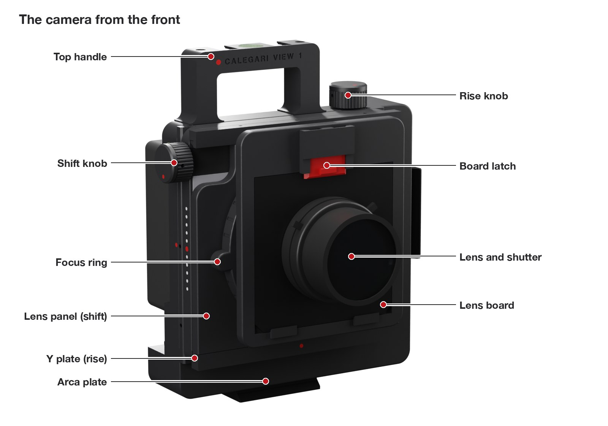

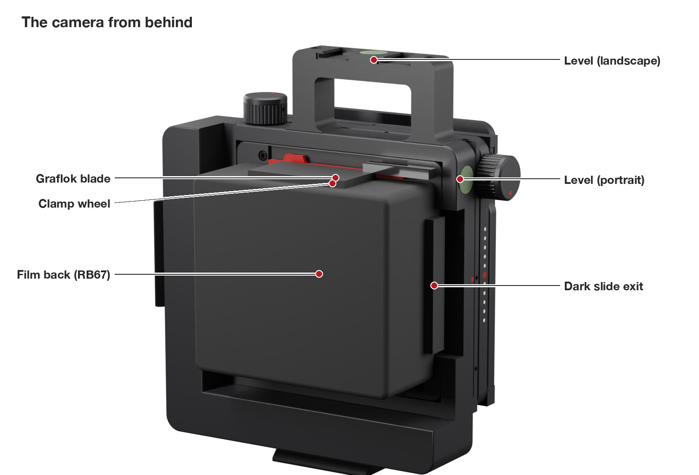

- **Lens and shutter.** Large-format lenses carry their own shutter, a little mechanism with the speeds and the aperture on it (*Copal 0* is its size). The camera body has no shutter and no electronics.
- **Lens board.** A flat metal plate (99 x 96 mm, the *Technika* size) with the lens screwed into it. Each lens lives on its own board; changing lens means changing board, which takes ten seconds.
- **Helicoid.** The focusing tube between the camera and the lens board. Turning it moves the lens forward and back. The printed **focus ring** with its lever sits on it.
- **Infinity.** Anything far away: mountains, buildings across a square. At infinity the lens is as close to the film as it will ever be. The **stop** is a pin on the lens panel that makes the focus ring stop exactly there, so you can find infinity without looking.
- **Film back.** A Mamiya RB67 roll film holder: it holds a 120 roll and takes ten 6 x 7 cm pictures. The **dark slide** is the thin metal sheet you pull out before exposing and push back afterwards; while it is in, the back can come off in daylight.
- **Graflok.** The standard way the back clamps to the camera: a hook at the bottom, a sliding blade with two tongues at the top.
- **Rotating back.** The back clamps to a round plate, the rotator, that turns a quarter turn in the body: landscape or portrait without turning the camera.

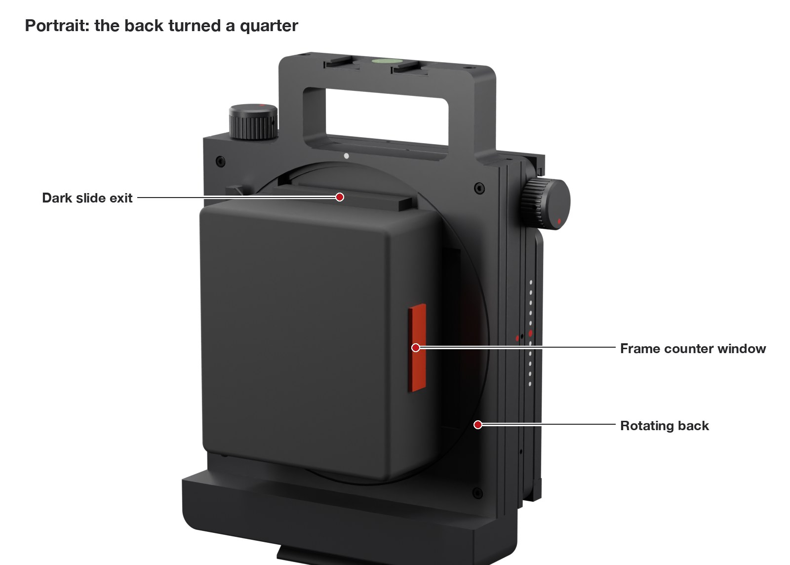
- **Ground glass.** A frosted glass in a frame, with the same shape as the film back. You clamp it on instead of the back to see the image, check the composition and focus. The image on it is upside down and mirrored: that is normal. A **loupe** (4x to 8x magnifier) laid on the glass shows fine focus, and a **dark cloth** over your head and the camera makes the dim image visible.
- **Shift.** Moving the lens up, down or sideways instead of pointing the camera. Keeping the camera level and moving the lens up (**rise**) is how architecture photographers keep vertical lines vertical. **Fall** is the opposite of rise. The **image circle** is how much picture the lens draws: the more it covers, the further you can shift.

## 1. Before printing the body: test prints

Software cannot check your own back, your ground glass, or how your printer makes a sliding fit. Print `plate_00a_shrink_gauge` and set the shrinkage (see [printing](printing.md#shrinkage-calibrate-it-before-anything-else)), then `plate_00b_test_1` and `plate_00c_test_thread_0.12mm_layers` in the ASA you will use. About four hours in all.

### Does my back fit?

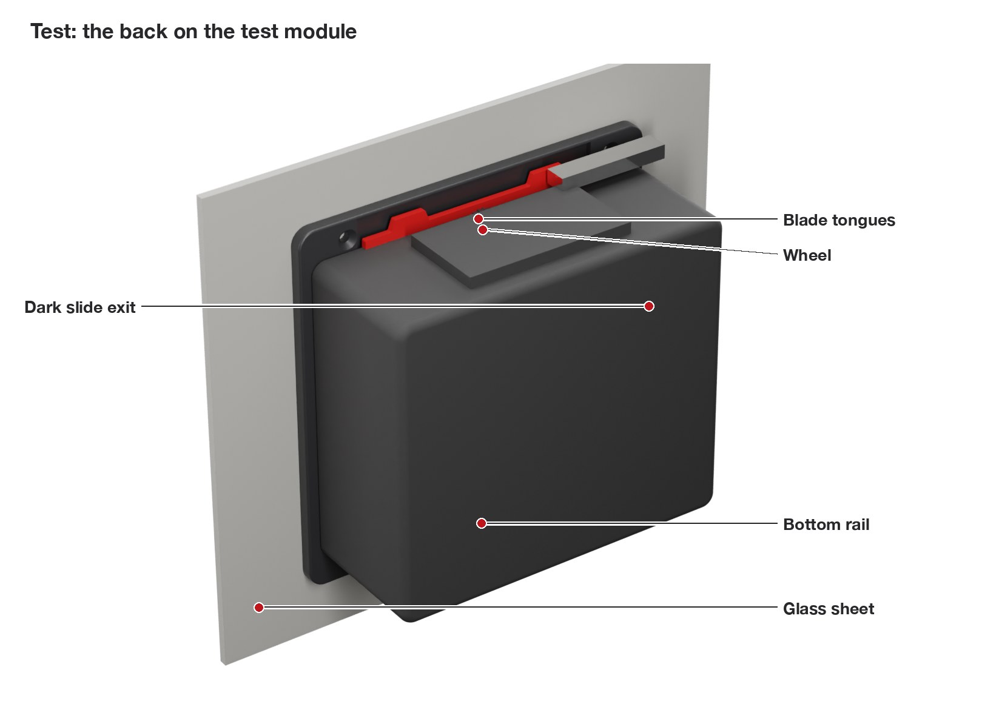

1. Assemble the test rotator as in [assembly, 2a and 2b](assembly.md#2a-inserts-in-the-rotator), with its inserts: if it fits, it is the rotator you will use.
2. Lay it on the table, front face down. Cut four strips of thin paper, 1 cm wide, and lay one across the seat on each side of the gate (the seat is the floor the back's nose will sit on).
3. **Mount the back.** Turn the wheel loose and slide the red blade down. Hook the bottom lip of the back under the bottom rail of the rotator, swing the back down onto the seat, slide the blade up into the two slots on top of the back, and tighten the wheel.
4. **Look for four things:**
   - the back's raised nose (the rectangle around its opening) presses on the seat all round: pull each paper strip, all four must be held;
   - the back's top and bottom lips sit in the cut-outs of the rotator without touching;
   - both tongues of the blade are inside the back's slots;
   - pushing the back with your hand, it does not move.
5. **Dark slide.** With the back locked, pull the dark slide out toward the right as you look at the back. It must slide out freely. On a Pro-S back this also proves that the bottom rail releases the safety catch that otherwise locks the slide.
6. **Ground glass.** Do the same with your ground glass.

If all of it works, print the camera as it is.

If something does not fit, measure the back and change the numbers in `cad/params.py`, Graflok section (`POCKET_*`, `LIP_RELIEF_*`, `SLIDE_RELIEF_*`; `BLADE_*` and `TONGUE_X` in `parts.py`), then run `check.py` and `export.py` again. The measurements that matter, with the nose face as Z = 0 and the centre of the film frame as X/Y = 0:

The twelve measurements

| # | What | Why |
|---|---|---|
| M1 | nose: X to the closed end and to the dark-slide end, Y top and bottom, protrusion over the rim | pocket |
| M2 | light-trap ridge: X position, width, height | groove in the seat |
| M3 | top and bottom lips: inner and outer Y, X extent, gap from the nose face | lip reliefs |
| M4 | Graflok slots in the top lip: X centres, width, depth, walls from the nose face | blade tongues |
| M5 | dark-slide handle: hook Y band, protrusion ahead of the nose face, handle X and thickness, full slide length | dark-slide relief |
| M6 | dark-slide safety catch (Pro-S, Pro-SD): X, Y, diameter, protrusion, release depth | bottom rail |
| M7 | wind-stop release receptor: X, Y, diameter, stroke | future coupling |
| M8 | film advance lever: hub position, lever length, height above the top, swing | top handle clearance |
| M9 | overall outline including the lever | |
| M10 | same as M5 to M7 for a Pro-SD | |
| M11 | ground glass: outline, nose, ridge, slots | |
| M12 | nose face to the inner film rails, where the emulsion lies (Graflok standard: 4.75 mm) | registration |

### Do the dovetails slide?

The test plate has ten 40 mm slices of the real dovetail ways. They tell you in five minutes whether the movements will slide on your printer.

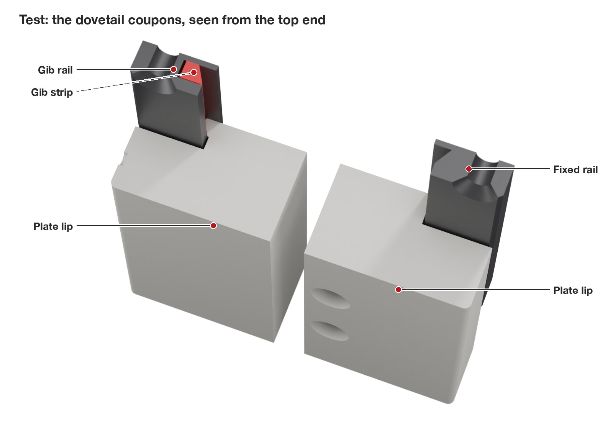

1. **Fixed side.** Stand `coupon_way_y_fixed` on its base on the table and slide `coupon_lip_y_left` along it, its slanted edge under the rail's slanted edge and its back resting on the rail's thin flange. It must slide by hand with a light, even drag, and must not rock up or down.
2. **Gib side.** Stand `coupon_way_y_gib` on its base, lay `coupon_gib_y` in its pocket (dimple outward), slide `coupon_lip_y_right` in, and turn one M3 x 6 grub screw into the middle hole until the play is gone. It must still slide.
3. **Horizontal ways.** Repeat with the `x` coupons.

| What you feel | Cause | What to change |
|---|---|---|
| slides with a light, even drag, no rocking | right | nothing |
| the fixed side is tight or scrapes | the print is oversize | check the shrinkage; then raise `FLANK_C` in `params.py` by 0.05 |
| the fixed side rocks | the print is undersize | lower `FLANK_C` by 0.05 |
| the gib side cannot take up the play | gib strip too thin | raise `GIB_T` for that stage by 0.2 |

A light coat of dry PTFE on the flanks makes any fit smoother; file off a layer that sticks out before judging.

### Do the metal parts fit the printed ones?

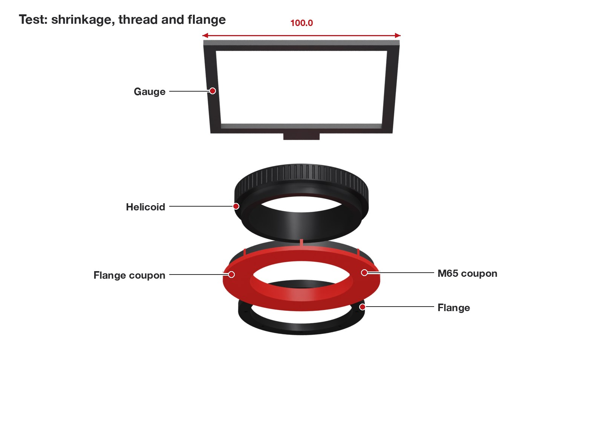

- **M65 coupon** (printed at 0.12 mm, like the adapter). It must screw into the front of your helicoid by hand, with no wobble and no forcing. Tight: lower `M65` in `params.py` by 0.1. Loose: raise it by 0.1.
- **Flange coupon.** The RafCamera metal flange must drop into the pocket and sit flush, with its four threaded holes over the four countersunk holes. If it does not go in, check the shrinkage setting before changing anything else.
- **Shrinkage gauge.** It must measure 100.0 mm, plus or minus 0.1, on both sides.

### Measure your helicoid

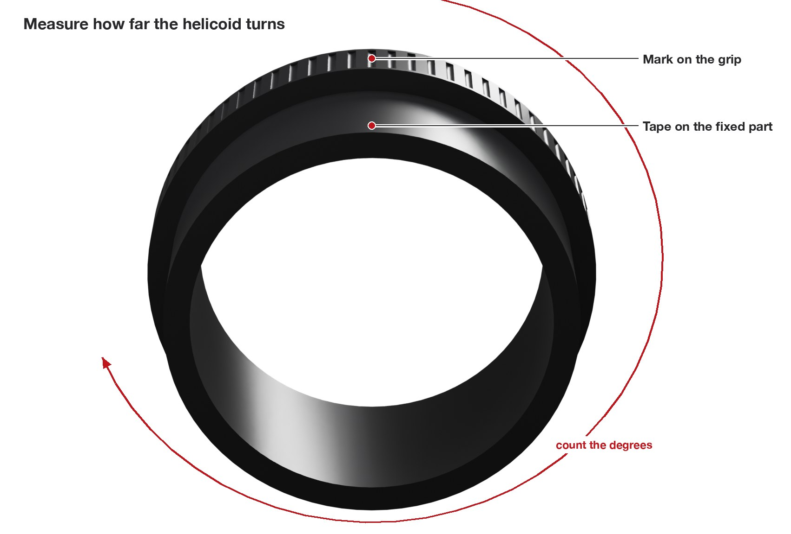

1. **How far does it turn?** Screw it fully in, put a piece of tape on the fixed part and a mark on the grip, and count the degrees (or turns) to fully out. Chinese M65 17-31 helicoids turn anywhere from about 170 to 310 degrees. Write the value in `HELI_ROT` in `params.py` and the turning direction in `FOCUS_DIR`, then export the focus ring again: the distance dots move with it.
2. **Rear thread length.** Measure the male thread at the back: 5 mm or less, or it will not seat in the metal flange.
3. **Does the front rotate?** Hold the rear, turn the grip: the front must move in and out without turning. If it turns, the lens would turn with it; return the helicoid.

## 2. Light test

A single pinhole of light ruins a roll. This test takes ten minutes and finds it before you waste film.

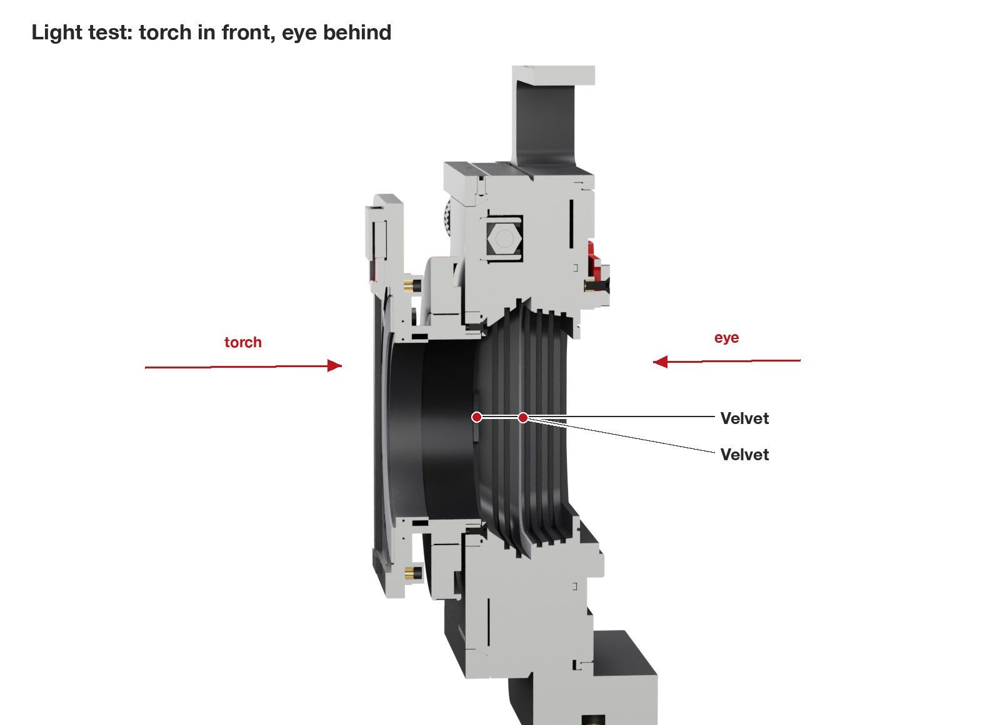

1. **From inside.** In a dark room, remove the lens board. Wait two minutes for your eyes to adapt. Shine a strong torch into the camera through the lens opening, and look from behind through the window of the body (no back mounted). You should see the torch only through the window, never around the plates.
2. **From outside.** Put a white sheet of paper behind the body window and move the torch around every edge and gap of the plates, the knobs and the rear frame, where the rotator turns. The paper must stay black.
3. **Repeat at the four corners of the movements:** both knobs at +25 and at -25 mm, in the four combinations. Then turn the back to portrait and do the rear frame again.
4. **Film test.** Load a roll, put the lens cap on, leave the camera in the sun for ten minutes at maximum shift, then develop. The film must come out clear.

**If there is a leak:** it is almost always a velvet edge that lifts, a velvet disc missing over a rise-turret screw, or an insert standing proud. Press the velvet down, put the disc back, or file the insert flush.

## 3. Infinity: teach the camera where infinity is

**What you are doing.** You focus the lens on something very far away, looking at the ground glass, and then fix the focus ring on the helicoid at the angle where its hidden stop rests on the pin of the lens panel. After that, turning the ring to its stop always gives infinity, its red dot faces the red index, and the white distance dots are correct.

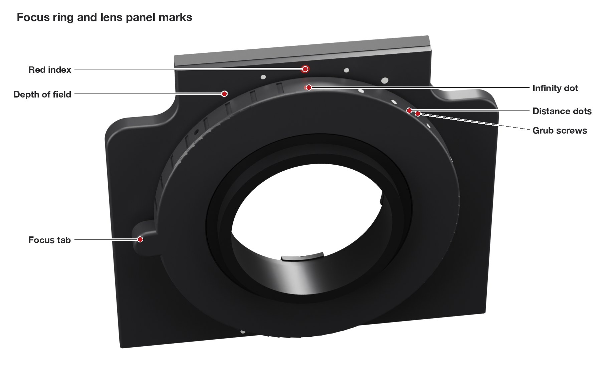

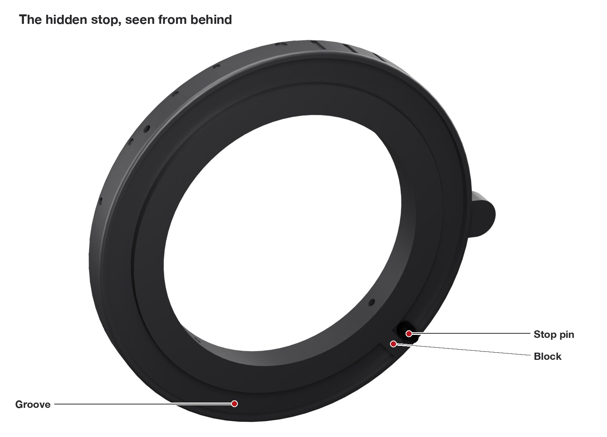

**You need:** the ground glass, a loupe, a dark cloth (or a dark jacket), a 1.5 mm hex key for the grub screws, and a day with something at least 200 m away (a church tower, a crane, a mountain).

1. **Set up.** Camera on a tripod, the ground glass on, the lens board in. Both movements at zero (the knobs click).
2. **Open the shutter.** On the shutter, set the speed dial to **T** or **B** and fire, or push the small *press focus* lever if your shutter has one: the blades must stay open. Turn the aperture to its largest opening (smallest number).
3. **Free the focus ring.** Loosen the four grub screws of the ring (A in [step 7](assembly.md#7-helicoid-and-focus-ring)) half a turn, so the ring turns freely on the helicoid.
4. **Focus.** Put the cloth over your head and the camera, and look at the ground glass: aim at the distant object, and put the loupe flat on the glass over it. Turn the **helicoid's own grip** (not the printed ring) in the direction that makes the helicoid shorter, until the object is sharp. Go a little past, then come back, and stop where it is sharpest.
5. **Set the ring.** Without moving the helicoid, turn the printed ring toward infinity until it stops: its hidden block now rests on the stop pin, and its big red dot faces the red dot on the top of the lens panel. Tighten the four grub screws a little at a time, in a cross.
6. **Check** in the loupe that the object is still sharp. If it moved, repeat from step 4.
7. **Close the shutter** (set the speed back from T or B and fire, or release the press-focus lever).

**If infinity cannot be reached** (the helicoid is fully in and the far object is still not sharp), the lens sits too far forward. Reprint the adapter ring thinner: `ADAPTER_T` in `params.py`; 0.5 mm less gives 0.5 mm more. That is what the printed adapter ring is for.

**If the object is sharp with the helicoid far from fully in,** that is fine: the helicoid has 14 mm of travel, and you only need about 7 mm to focus down to 70 cm.

**Reading the ring afterwards.** The white dots on the ring are distances: 5, 3, 2, 1.5, 1 and 0.7 m, read against the red dot on the lens panel. Either side of that red dot are two pairs of white dots: the small pair is f/11, the big pair f/22. After focusing, everything whose distance dot falls between the pair for your aperture is sharp. This is how you can focus without the ground glass.

## 4. More lenses: one stop for all of them

With one lens, section 3 is all you need. A second lens will usually reach infinity at a slightly different place, because every lens has its own distance from the board to the film. You have two choices.

- **Easy way:** always focus on the ground glass (you do anyway for architecture), and ignore the stop with the second lens. Nothing to do.
- **Quick-change way:** make every board reach infinity at the same stop, with a printed **shim**: a thin ring under the shutter that moves that lens forward. Then any lens goes on in ten seconds and is ready at infinity. A shim can only move a lens forward, so the lens that needs the helicoid shortest sets the stop, and the others get a shim.

The shims are on `print/plates/plate_07_shims_0.2mm_layers.3mf`: 0.4, 0.6, 0.8, 1.0 and 1.2 mm. Print them with 0.2 mm layers (the plate says so). The notches on the rim tell the thickness: count them and multiply by 0.2 mm.

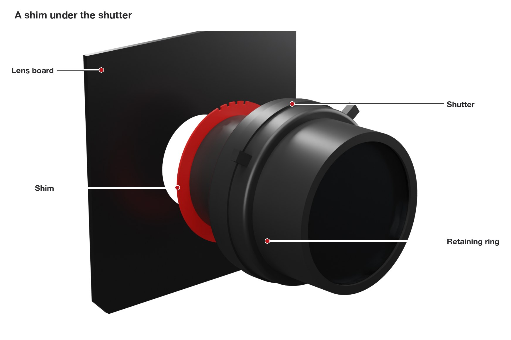

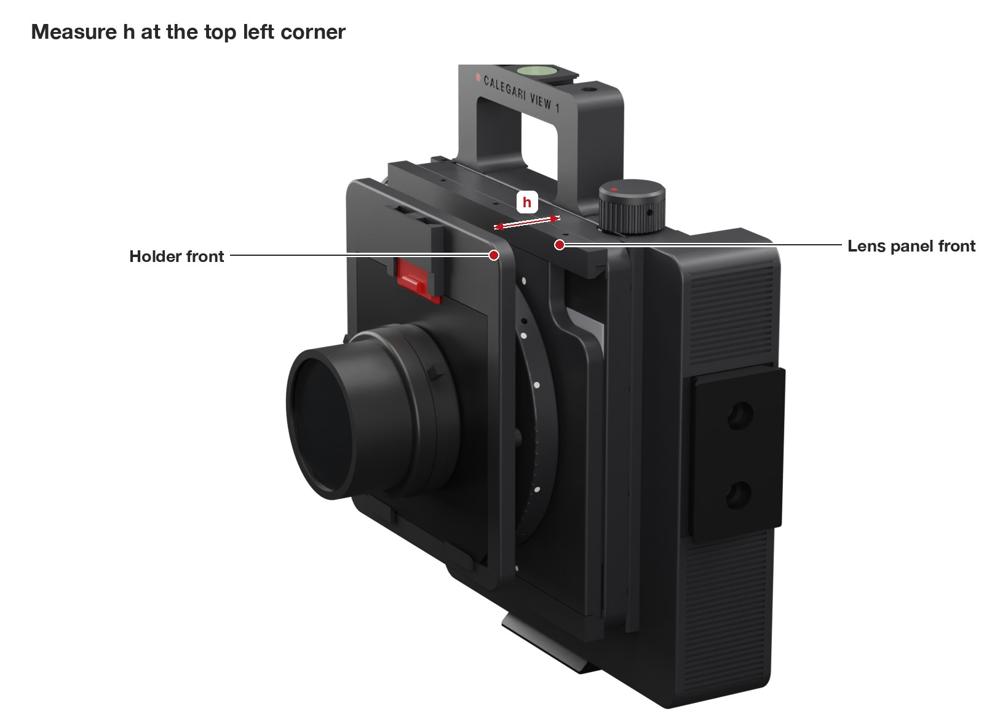

1. **Measure lens 1.** With the first lens at infinity (ring on its stop), measure with the depth rod of the caliper from the front face of the lens panel to the front face of the board holder, at the top left corner. Write it down: h1.
2. **Measure lens 2.** Put the second board in. Loosen the ring's grub screws, so the stop does not hold you, and focus at infinity on the ground glass with the helicoid grip, as in section 3. Measure the same way: h2.
3. **Compare.**
   - **h2 larger than h1:** lens 2 needs the helicoid longer than lens 1 does. Shim lens 2 by h2 - h1; lens 1 keeps setting the stop.
   - **h2 smaller than h1:** the other way round. Shim lens 1 by h1 - h2, and set the stop with lens 2 from now on.
4. **Fit the shim.** Unscrew the lens's retaining ring from behind the board, pull the lens out, put the shim on the rear of the shutter, and put the lens back through the board. The shim sits between the shutter and the front of the board. Tighten the retaining ring.
5. **Set the ring** with the lens that has no shim (section 3), then check the other lens at infinity: it should be sharp on the stop.

Round the shim to the nearest 0.2 mm and stack two if needed. The rounding does not matter: at f/11 the film can be 0.6 mm out of place before anything looks soft. For a difference bigger than about 3 mm, add a thicker value to `SHIM_STEPS` in `cad/parts.py` and export again.

Write the shim on a strip of tape on the back of the board.

## 5. Ground glass against film

The frosted surface of the ground glass must sit exactly where the film sits, or what is sharp on the glass is soft on film. The Graflok standard takes care of it, but glasses and backs vary.

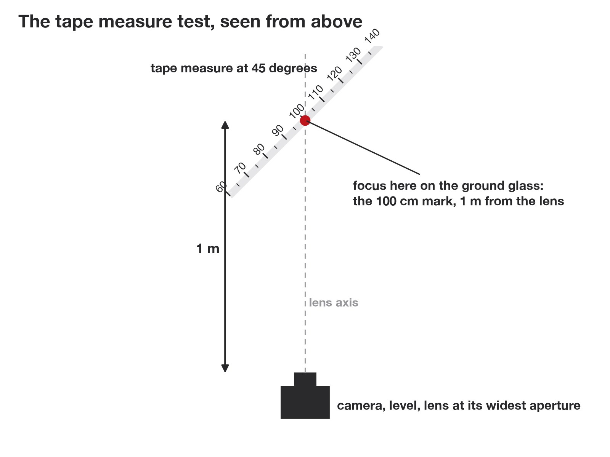

**Simple test (no tools).** Put a tape measure on a table at 45 degrees to the camera, 1 m away. Focus on the 100 cm mark at the widest aperture on the ground glass, then take a picture on film at the widest aperture: the depth of field is then smallest, so the test is sharpest. On the negative, the sharpest mark must be the 100 cm one. If it is clearly closer or further, the glass and the film disagree.

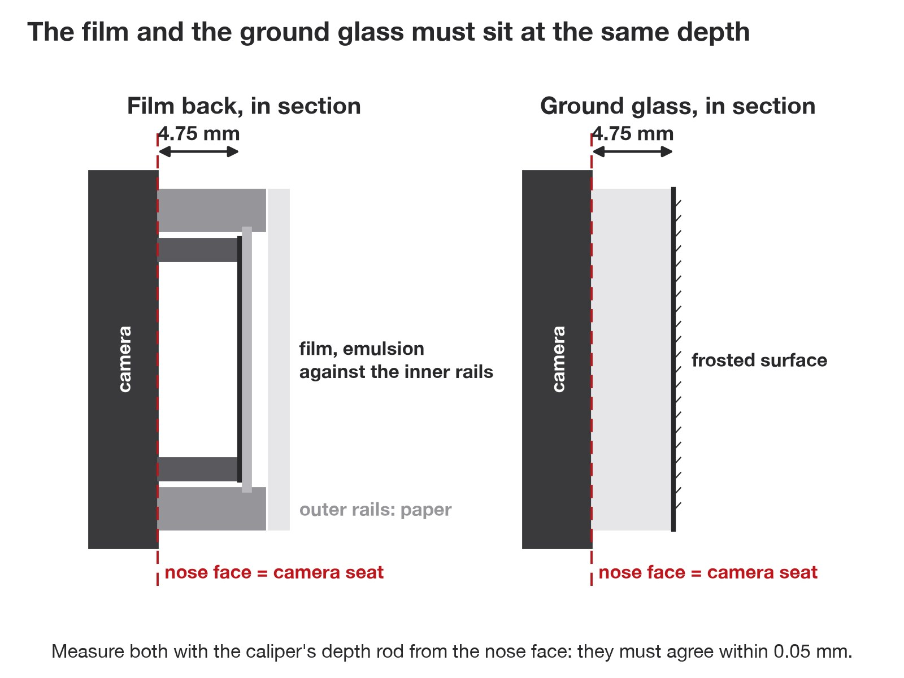

**Measured test.** With the depth rod of the caliper, measure from the back's nose face to the frosted surface of the glass at five points (centre and four corners), then from the nose face of the film back to its inner film rails (where the emulsion lies, not the outer rails that carry the backing paper). The two must agree within 0.05 mm.

If they do not, shim the ground glass rather than the back: Mercury sells its glasses at RS-0, RS-20 and RS-30 depths for this.

## 6. Lens panel parallel to the film

If the lens is not parallel to the film, one side of the picture is sharper than the other.

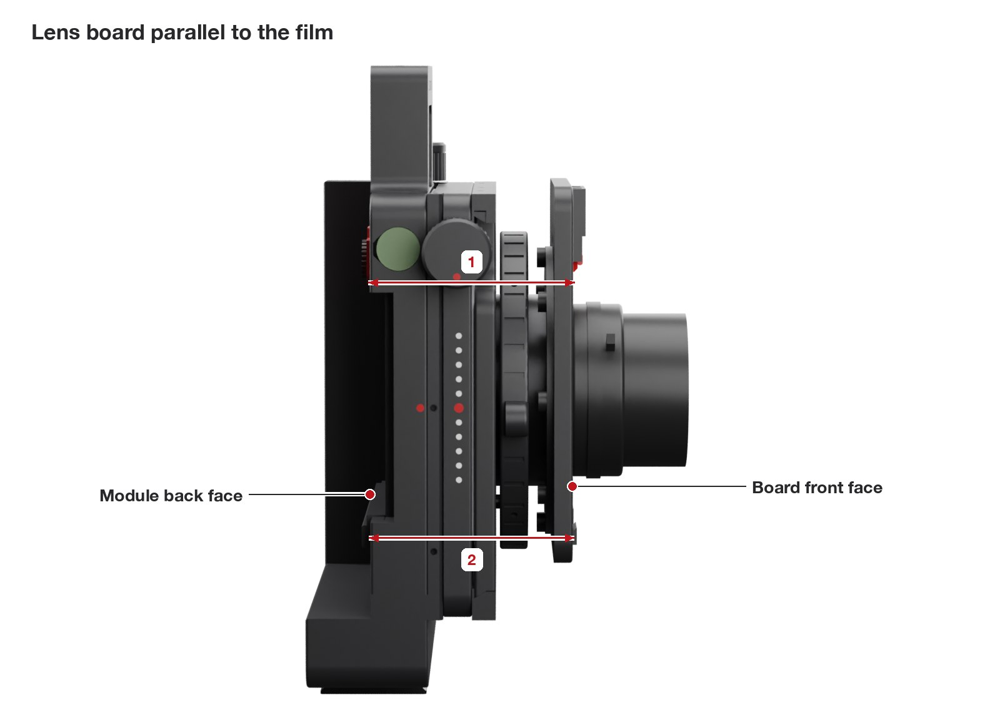

1. With the caliper's depth rod, measure from the rear face of the rear frame to the front face of the lens board, at the four corners of the board.
2. The four readings must agree within 0.1 mm.
3. Repeat at the four corners of the movements.

If one corner is always off, check the plates for flatness with the straightedge and the gib strips for play before anything else.

## 7. First roll

1. **A wall.** Photograph a flat brick wall at f/8, with the camera square to it, at zero and at maximum rise. Look at the four corners of the negatives with the loupe: they must be as sharp as the centre, apart from the natural softening of the lens.
2. **A ruler.** Repeat the tape measure test of section 5.
3. **Shift.** Photograph a building from close with the camera level, using rise to fit the top in. The verticals must stay vertical.

## 8. If something is wrong

| What you see | Most likely cause | What to do |
|---|---|---|
| A fogged streak on the film, always in the same place | a light leak | section 2; look at the velvet edges, the two velvet discs over the rise-turret screws, and the flange's unused holes (black paint) |
| The whole film is grey | dark slide pulled with the back loose, or a leak at the Graflok | lock the back before pulling the slide; check the nose sits all round (section 1) |
| Nothing is sharp at infinity | the helicoid cannot go far enough in | thinner adapter ring (section 3) |
| Sharp on the ground glass, soft on film | glass and film planes disagree | section 5 |
| One side soft | panel not parallel | section 6 |
| Dark corners at big shifts | beyond the lens's image circle | see the limits below |
| A knob is stiff | O-ring squeezed too much | loosen the grub, back the knob off a quarter turn, lock again |
| A plate moves by itself | O-ring too loose | screw the knob down a quarter turn |
| A plate rocks or clicks when pushed | gib too loose | turn its three grub screws in a little, evenly |
| A plate is hard to move over part of its travel | gib too tight, or a layer sticking out on a flank | back the grubs off an eighth of a turn; file the flank and add dry PTFE |
| The board rattles | latch not down | pull the latch and let it snap down; check the spring |
| The back turns too easily or does not click | the rotator's ball plunger is not pressing enough | it sits under the Y plate: take the front standard off (step 6 backwards), screw the plunger in a quarter turn, and put it back |
| The back is hard to turn | velvet ring V5 too thick, or the rear frame screwed down unevenly | loosen the four frame screws and tighten them again in a cross; if still hard, a thinner ring |

## 9. Limits worth knowing

The camera's own openings were checked with a ray trace (`cad/optics_check.py`) from the lens to the four corners of the 6x7 frame:

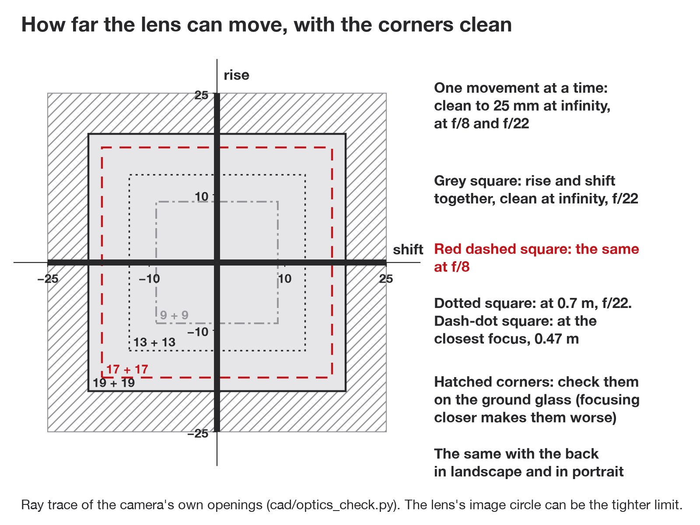

- **One movement at a time.** At infinity, rise, fall or shift up to the full 25 mm leave the corners clean at f/22 and at f/8, with the back in landscape or in portrait. Focusing closer moves the lens forward, and the movement along the long side of the frame suffers first. In landscape, rise and fall stay clean to 25 mm down to about 0.9 m, 24 mm at 0.7 m (the closest mark on the ring) and 18 mm at the closest focus (0.47 m); shift stays clean to 24 mm at 0.9 m, 20 mm at 0.7 m and 16 mm at 0.47 m. In portrait the two swap.
- **Rise and shift together.** In both orientations, up to 19 + 19 mm are clean at infinity at f/22, and 17 + 17 at f/8. Focusing closer, the limit drops to 14 + 14 at about 0.9 m, 13 + 13 at 0.7 m and 9 + 9 at the closest focus (0.47 m). The opening that cuts the far corner is the 61 mm bore of the helicoid's rear stub, just behind the lens panel, so large combined movements are an infinity setting. The ground glass shows it: look into each corner from a hand's width away, toward the lens. If you see the whole round aperture, the corner is covered.
- **The lens's image circle.** The Super-Angulon 65/8 (153.5 mm) would cover about 22 + 22 mm, and the Nikkor-SW 65/4 and Grandagon-N 65/4.5 (170 mm) even more: with all three, the camera's own openings (19 + 19 at infinity) are the tighter limit. Measure a lens's rear cell before buying. The adapter and the board holder leave a 59 mm bore: the Nikkor-SW's 54 mm rear cell clears it by 2.5 mm all round. A cell wider than about 58 mm, or longer than about 33 mm behind the shutter flange, can touch the openings at big shifts.
- **Flange focal distance.** The camera is drawn for 70.5 mm from the shutter flange to the film at infinity (the Super-Angulon 65/8). A lens that needs more, such as a Nikkor-SW quoted at 70.8 to 71 mm, simply runs the helicoid out a little further: 14 mm of travel, about 7 used to focus at 0.7 m. A lens that needs up to 1 mm less uses the helicoid's margin; beyond that, reprint the adapter ring thinner (section 3).
- **Fall.** At full fall the Y plate clears a 65 mm clamp's jaws by about 4 mm.
